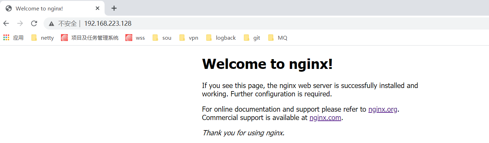

# Nginx 基础应用实战 01


## 课程大纲

1. Nginx基础
   1. 版本区别与安装
   2. 基础知识
      1. Nginx安装部署
      2. http协议基础
      3. 域名与dns
   3. 核心功能与应用场景
      1. 网站静态资源访问
      2. 虚拟主机
      3. 反向代理服务
      4. 负载均衡
      5. rewrite
      6. 软防火墙
      7. Tengine的扩展模块
   4. 实战：构建一个可供大家访问的静态网站
2. 高级使用
   1. 核心配置与调优
   2. 深入http1/2
   3. Squid
   4. 缓存服务
   5. 日志管理
   6. 高可用 keepalived
   7. 监控管理 zabbix prometheus
   8. kubernetes集群化管理
   9. lua语言基础
   10. openresty扩展模块
   11. Nginx二次开发
   12. 实战：构建高性能、高可用、高并发的亿级流量网关系统

## 版本区别

常用版本分为四大阵营

- Nginx开源版

http://nginx.org/

- Nginx plus 商业版

https://www.nginx.com
商业版本相比开源版本有服务支持。

- openresty

http://openresty.org/cn/
基于Ngnix和Lua的高性能web平台，内部集成了大量精良的Lua库，第三方模块以及大多数依赖项。用于方便地搭建能够处理超高并发、扩展性极高的WEB应用，WEBf服务和动态网关
lua在某些方面的表现优于php，lua直接内嵌在Ngnix内部，原生支持，性能好。openresty通过lua开发的组件可以连接mysql，kafka，redis等。还可以发http请求集成微服务


- Tengine

http://tengine.taobao.org/
淘宝网在Ngnix基础上使用C语言开发做了二次开发。
基于Ngnix和Lua的高性能web平台，内部集成了大量精良的Lua库，第三方模块以及大多数依赖项。用于方便地搭建能够处理超高并发、扩展性极高的WEB应用，WEBf服务和动态网关

其他web服务器
IIS（利用win的纯异步网络io，提供高性能访问。Ngnix开源社区大多数都是针对开源系统比如linux特性开发）
Apache Httpd 1/2（开源，目前使用最广泛的web服务器，1.0版本非常稳定。Apache的url的rewite比较高，Nginx没那么完善。）
lighttpd：目前活跃度不高


为什么不在docker安装nginx

docker--》基于容器化管理，

kvm---》虚拟化管理----没有办法完全利用主机资源的时候(cpu主机，磁盘，网络带宽)

主机（直接安装操作系统）


ngix主要作为应用服务器，lua脚本写了业务逻辑（），里面有缓存。作为应用服务器可以批量启停。

当没有办法完全利用主机资源的时候装到虚拟化的环境里，这种虚拟化可以充分利用主机资源

Nginx主要作为反向代理、访问网站，内存和cpu的资源利用率，磁盘利用率也不高，最占网络带宽。如果一台主机网络带宽有空余，想充分利用cpu和磁盘，可以使用kvm虚拟化技术把nginx装到虚拟机里或者vps。

如果是作为应用服务器，业务逻辑复杂，不会过分利用磁盘和带宽，cpu，内存的利用率稍微高一些，可以使用容器化技术安装Ngix

独立的主机，利用Nginx提高性能，让一台nginx响应极高的并发量，比如亿级流量的网关，主机的磁盘空间，网络带宽，cpu都想要得到极高的利用，这个时候没必要虚拟化和容器化。高性能的网关，需要独立安装到一台主机上，独占主机的资源。

tomcat可以通过docker安装，是因为主机的资源过剩，可以通过容器化，虚拟化技术来开多个tomacat供他们使用


## 准备

### 虚拟机中标准安装CentOS7.6

CentOS6.x升级到CentOS7.x的注意事项视频
1、虚拟机中标准安装CentOS7.6步骤
2、XShell远程连接CentOS7.6
3、CentOS7.6模板机封装步骤
4、VMware虚拟机链接克隆与完全克隆
5、VMware虚拟机创建快照和还原快照
6、CentOS7.6编译安装Redis-4.0.6例子
7、CentOS7.x与CentOS6.x本例中用到几个区别
8、CentOS7.6系统优化之SELinux永久关闭
9、CentOS7.6 yum安装软件以及Redis配置文件简介
10、CentOS7.6创建Redis.service服务实现开机自启动
链接: https://pan.baidu.com/s/1_M0ADqa8LeHrJJTCwTDUpA 提取码: yhfd


## Nginx安装

### 下载

https://nginx.org/en/download.html

传到虚拟机中并解压缩

```
[root@bogon ~]# tar -zxvf nginx-1.19.6.tar.gz
```

如果能连接网络，可以直接使用`wget http://nginx.org/download/nginx-1.19.6.tar.gz`

### 编译安装

`./configure --prefix=/usr/local/nginx`   :配置安装在哪个路径下

`make`  编译

`make install` 安装

```
[root@bogon ~]# cd nginx-1.19.6
[root@bogon nginx-1.19.6]# ls
auto  CHANGES  CHANGES.ru  conf  configure  contrib  html  LICENSE  man  README  src
[root@bogon nginx-1.19.6]# ./configure --prefix=/usr/local/nginx
checking for OS
 + Linux 3.10.0-1062.12.1.el7.x86_64 x86_64
checking for C compiler ... found
 + using GNU C compiler
 + gcc version: 4.8.5 20150623 (Red Hat 4.8.5-44) (GCC) 
checking for gcc -pipe switch ... found
checking for -Wl,-E switch ... found
....
  nginx path prefix: "/usr/local/nginx"
  nginx binary file: "/usr/local/nginx/sbin/nginx"
  nginx modules path: "/usr/local/nginx/modules"
  nginx configuration prefix: "/usr/local/nginx/conf"
  nginx configuration file: "/usr/local/nginx/conf/nginx.conf"
  nginx pid file: "/usr/local/nginx/logs/nginx.pid"
  nginx error log file: "/usr/local/nginx/logs/error.log"
  nginx http access log file: "/usr/local/nginx/logs/access.log"
  nginx http client request body temporary files: "client_body_temp"
  nginx http proxy temporary files: "proxy_temp"
  nginx http fastcgi temporary files: "fastcgi_temp"
  nginx http uwsgi temporary files: "uwsgi_temp"
  nginx http scgi temporary files: "scgi_temp"
安装成功后会显示配置的位置

[root@bogon nginx-1.19.6]# make
...
[root@bogon nginx-1.19.6]# make install
···
安装成功后进入安装目录
[root@bogon local]# cd /usr/local/nginx
[root@bogon nginx]# ls
conf  html  logs  sbin
[root@bogon nginx]# 
```

 

#### 安装报错，解决

##### 缺少C编译器

提示

```
checking for OS
 + Linux 3.10.0-1062.12.1.el7.x86_64 x86_64
checking for C compiler ... not found

./configure: error: C compiler cc is not found

[root@localhost nginx]# ./configure --prefix=/usr/local/nginx
checking for OS
 + Linux 3.10.0-1062.12.1.el7.x86_64 x86_64
checking for C compiler ... not found

./configure: error: C compiler cc is not found
```

缺C编译器，解决方法：

```
yum -y install gcc gcc-c++ autoconf automake make
```


##### 编译时，如果出现警告或报错

提示：

```
./configure: error: the HTTP rewrite module requires the PCRE library.
You can either disable the module by using --without-http_rewrite_module
option, or install the PCRE library into the system, or build the PCRE library
statically from the source with nginx by using --with-pcre=<path> option.
```

安装perl库

`yum install -y pcre pcre-devel`


提示：

```
./configure: error: the HTTP gzip module requires the zlib library.
You can either disable the module by using --without-http_gzip_module
option, or install the zlib library into the system, or build the zlib library
statically from the source with nginx by using --with-zlib=<path> option.

```

安装zlib库

`yum install -y zlib zlib-devel`


### 启动Nginx

进入安装好的目录`/usr/local/nginx/sbin`

```
./nginx 启动 
./nginx -s stop 快速停止
./nginx -s quit 优雅关闭，在退出前完成已经接受的连接请求
./nginx -s reload 重新加载配置
```

启动后，通过ps -ef 命令查看进程是否存在

```
[root@bogon nginx]# cd sbin
[root@bogon sbin]# ./nginx
[root@bogon sbin]# ps -ef|grep nginx
root       8268      1  0 23:10 ?        00:00:00 nginx: master process ./nginx
nobody     8269   8268  0 23:10 ?        00:00:00 nginx: worker process
root       8814   8712  0 23:27 pts/1    00:00:00 grep --color=auto nginx
[root@bogon sbin]# 

```

通过ip访问页面，能访问则nginx启动成功。如果无法访问，需要关闭防火墙



停止

```
[root@bogon sbin]# /usr/local/nginx/sbin/nginx  -s stop
[root@bogon sbin]# ps -ef|grep nginx 
root       8852   8712  0 23:31 pts/1    00:00:00 grep --color=auto nginx
[root@bogon sbin]# 
```


### 关于防火墙

#### 关闭防火墙

`systemctl stop firewalld.service`

#### 禁止防火墙开机启动

`systemctl disable firewalld.service`


#### 或者通过放行端口方式

`firewall-cmd --zone=public --add-port=80/tcp --permanent`

#### 重启防火墙

`firewall-cmd --reload`


### 安装成系统服务

可以将nginx配置成服务。

创建服务脚本

`vi /usr/lib/systemd/system/nginx.service`

服务脚本内容

```
[Unit]
Description=nginx -  web server
After=network.target remote-fs.target nss-lookup.target
  
[Service]
Type=forking
PIDFile=/usr/local/nginx/logs/nginx.pid
ExecStartPre=/usr/local/nginx/sbin/nginx -t -c /usr/local/nginx/conf/nginx.conf
ExecStart=/usr/local/nginx/sbin/nginx -c /usr/local/nginx/conf/nginx.conf
ExecReload=/usr/local/nginx/sbin/nginx -s reload
ExecStop=/usr/local/nginx/sbin/nginx -s stop
ExecQuit=/usr/local/nginx/sbin/nginx -s quit
PrivateTmp=true
  
[Install]
WantedBy=multi-user.target
```

重新加载系统服务

`systemctl daemon-reload`


启动服务

`systemctl start nginx.service`

查看服务状态

`systemctl status nginx.service`

```
[root@bogon sbin]# systemctl start nginx.service
[root@bogon sbin]# systemctl status nginx.service
● nginx.service - nginx -  web server
   Loaded: loaded (/usr/lib/systemd/system/nginx.service; disabled; vendor preset: disabled)
   Active: active (running) since 一 2021-01-18 23:32:27 CST; 34s ago
  Process: 8869 ExecStart=/usr/local/nginx/sbin/nginx -c /usr/local/nginx/conf/nginx.conf (code=exited, status=0/SUCCESS)
  Process: 8867 ExecStartPre=/usr/local/nginx/sbin/nginx -t -c /usr/local/nginx/conf/nginx.conf (code=exited, status=0/SUCCESS)
 Main PID: 8871 (nginx)
    Tasks: 2
   CGroup: /system.slice/nginx.service
           ├─8871 nginx: master process /usr/local/nginx/sbin/nginx -c /usr/local/nginx/conf/nginx.conf
           └─8872 nginx: worker process

1月 18 23:32:26 bogon systemd[1]: [/usr/lib/systemd/system/nginx.service:12] Unknown lvalue 'ExecQuit' in section 'Service'
1月 18 23:32:26 bogon systemd[1]: Starting nginx -  web server...
1月 18 23:32:27 bogon nginx[8867]: nginx: the configuration file /usr/local/nginx/conf/nginx.conf syntax is ok
1月 18 23:32:27 bogon nginx[8867]: nginx: configuration file /usr/local/nginx/conf/nginx.conf test is successful
1月 18 23:32:27 bogon systemd[1]: Failed to parse PID from file /usr/local/nginx/logs/nginx.pid: Invalid argument
1月 18 23:32:27 bogon systemd[1]: Started nginx -  web server.
[root@bogon sbin]# 
```


#### 开机启动

`systemctl enable nginx.service`