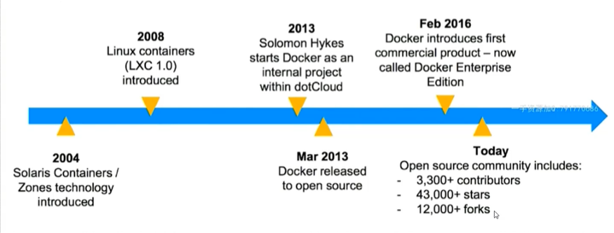
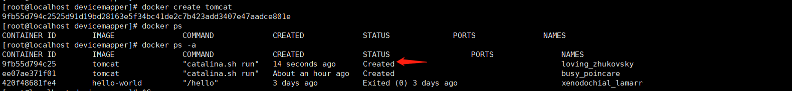
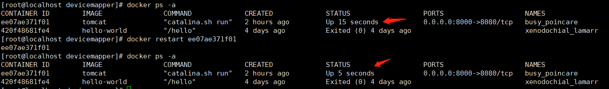
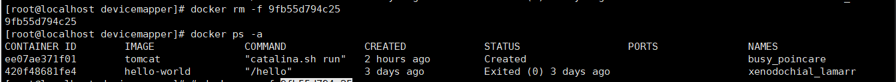

# Docker-第一部分
Docker的介绍及安装

## 容器化技术介绍

应用的部署演化分为3个阶段

物理机时代==》虚拟机时代==》容器化时代

###  物理机时代

  最早的程序部署形式，在单台物理机完成一系列应用程序的的部署安装，运行维护。

 缺点是

 ** 部署慢（在安装物理机时要对主机进行存放，运行tomcat，必须安装jvm等）

** 成本高 （一个外网的应用服务器，进行采购价格都很高）

** 资源浪费 (资源不平衡，比如一个应用是计算密集型的，那么对cpu的要求很高，对内存磁盘资源要求不高，这样闲置的内存和磁盘无法被其他应用使用)

** 难以扩展和迁移（要进行横向扩展，比如要进行win到linux平台的应用迁移，难以扩展）

** 受限于硬件：比如早期的solaris有自己的硬件配置，在sloris上开发的应用很难直接在window上使用，虽然JVM技术出现后，受制于硬件的情况减少了，但是JVM也有自己的局限性，要解决受制于硬件的问题，需要搭建立一套统一的标准，但是硬件依然很难解决。

### 虚拟化时代

在一台物理主机上通过硬件底层的虚拟化支持，虚拟出来很多个虚拟机，每个虚拟机都是一台独立的电脑，每个虚拟机都有自己独立的硬件，如cup，内存，硬盘，还有对应的操作系统，可以直接操作系统上安装软件。虚拟化技术出现，让主机资源可以得到充分的应用。桌面及应用，可以VMWare来创建运行Centos，Ubuntu这样的操作系统。

虚拟化的特点:

** 多部署: 在一台物理主机上可以创建多个虚拟机，每个虚拟机之间都有自己独立的资源，彼此独立，互不影响。

** 资源池: 虚拟化技术可以将主机的硬件资源看成一个池子。当前的物理机有自己的物理硬件，在硬件资源上有自己的操作系统，在操作系统上有一个组件Hypervisor,这个组件可看称是虚拟机和主机操作系统之前的桥梁，它可以对虚拟机资源进行分配，并对虚拟机进行管理。VMWAre就是典型的使用Hypervisor实现的一个产品。VMWare启动后Hypervisor,就会对主机上的所有资源进行统计，当创建新的虚拟机时，由Hypervisor为它分配资源。

** 资源隔离: 当Hypervisor为这个虚拟机分配了资源后，这个资源就是这个虚拟机独享的，其他的资源不会去抢占

** 很容易扩展: 当虚拟机的内存不够时，Hypervisor直接从资源池里直接分配就行。

但是，虚拟机也有自己的问题

VM需要安装操作系统： 比如一个很小的应用，可能只需要一个几百k的内存就行，但是为了支撑这个应用，需要安装操作系统，但是操作系统占用测内存和硬件资源比这个应用多得多，在操作系统层面也浪费了很多资源。


### 容器化时代

于是，在虚拟化的概念基础上，剥离操作系统，只安装应用程序，减少资源的浪费，就出现了容器化技术


​    右侧虚拟机中需要安装Guest Os（客户操作系统）才能构建应用，左侧容器化技术，Docker是容器化技术最典型的代表产品，应用直接通过Docker的沙箱机制构建在主操作系统上，应用程序的部署速度和占用资源都小得多。容器化技术比虚拟机更灵活，更小。

​    现在一般是虚拟化技术和容器化技术结合使用，因为它们解决的问题不同，虚拟机更多是物理资源层面的隔离，如分配多少内存等，而容器是App层面的隔离，底层的硬件资源是共享的。


### 容器化解决的问题


​    如上图，线上是开发人员所使用的技术和环境，如api节点，分析数据库，队列，用户数据库，静态网站等，下面是运维人员使用的环境，如服务器，各种中间间等。开发人员在开发完后，准备上线，需要将应用打包，数据库导出数据，各种配置文件整理后给运维，运维根据安装文档在各节点进行安装部署。假设有一个参数配置出错，都是导致整体的应用部署失败。

​    如果开发人员将所有内容和资源都打包成一个文件，运维直接将文件展开后就可以轻松部署，那就可以使用容器化技术了。容器化技术可以提供标准化的应用部署方案，通过容器编排工具可以自动将容器发布到集群各个节点上，自动运行，真正做到一间发布，容器编排工具还可以提供管理功能，当其中一个节点失败了，可以直接进行重新发布，减少运维人工成本。它不仅是一个技术的变化，还有软件开发流程中的一个根本性变化。

​       标准化的应用打包如何做到的?

容器是一个文件，也是一种标准化的部署方式，针对这个容器，它要做的事就是将所有软件运行的资源，比如数据库，队列信息等都放入容器中，运行这个程序的底层硬件资源也放入其中，也就是容器中包含了所有运行的必要条件，只要将这个容器在部署服务器直接展开就能运行。


### 容器化技术的应用场景

* 标准化的迁移方式 : 开发直接打包，运维直接展开使用

* 统一的参数配置: 与应用程序相关的参数配置，在开发打包时就已配置

* 自动化部署: 镜像还原过程自动完成

* 应用集群监控: Docker和K8s都有监控的职能呢个，可以及时监控应用的运行状况。

* 开发与运维之间的沟通桥梁

  ​

### 阿里和腾讯云的容器化技术

阿里和腾讯云采用的的是虚拟机+容器化的实现。

如果阿里云购买的es服务器，本质是一台虚拟机，在虚拟机内可以根据不同的应用安装不同的容器，如需使用mysql数据库，那么就安装Mysql的容器。


## Docker介绍

* Dokcer是开源的应用容器引擎，基于Go语言开发

* 容器完成使用沙箱机制，容器开销低。即系统的资源利用率是很高的

* Docker就是容器化技术的代名词

* Doker也具有一定的虚拟化职能。利用docker不仅可以创建容器，还可以向本地的物理机申请相应的资源。方便程序的迁移和扩展。

* 最主要的作用是提供了标准化的应用打包。它提供了一个镜像文件，其中包含了所有的资源，如数据库，队列，web应用服务器等，同时也包含了运行这些程序所需要的硬件上的资源，如需要多大的内存等。

  ​

  Docker的发展历史

  

​      容器化技术最早在2014年提出，在Solaris系统中提供了容器化技术。2008年Linux也提供了容器化的支持，代号为LXC1.0，是docker的前身。在2013年Docker的创始人Solomon Hykes开始在项目中使用Dcoker，同年进行了开源。2016年进行版本变更，拆分为ee（社区版，免费）和ce（企业版，收费）两个子版本。直到今天Docker成为了容器化技术的代名词。

​       Docker的官网了解详细:    <https://www.docker.com/>

​      Docker的官方文档:  <https://docs.docker.com/> 


## Docker安装

### 在Windows上安装Docker

官网windows安装说明: <https://docs.docker.com/docker-for-windows/install/>

#### 系统要求:

- Windows 10 64位：专业版，企业版或教育版（内部版本15063或更高版本）。

- 必须启用Hyper-V和Containers Windows功能。

- 要在Windows 10上成功运行Client Hyper-V，需要满足以下硬件先决条件：

  - 具有[二级地址转换（SLAT）的](http://en.wikipedia.org/wiki/Second_Level_Address_Translation) 64位处理器

  - 4GB系统内存

  - 必须在BIOS设置中启用BIOS级硬件虚拟化支持。有关更多信息，请参见 [虚拟化](https://docs.docker.com/docker-for-windows/troubleshoot/#virtualization-must-be-enabled)

#### 安装前准备:

 1.Hyper-v已安装并正常工作
 在开始菜单中，键入“ **启用或关闭Windows功能”**，然后按Enter。将Hyper-V前面勾选上
   
 2.启用虚拟化
 除Hyper-v启用外还必须启用虚拟化。桌面右键“**任务管理器**”，检查任务管理器上的“**性能**”选项卡：
   
 3.下载docker
  <https://hub.docker.com/editions/community/docker-ce-desktop-windows/> 下载类似“**exe4j_Downloader_3265010232.exe**”的文件


#### 安装Docker

  1. 双击**Docker Desktop Installer.exe**运行安装程序。
       如果尚未下载安装程序（`Docker Desktop Installer.exe`），则可以从 [**Docker Hub进行下载**](https://hub.docker.com/editions/community/docker-ce-desktop-windows/)。它通常下载到您的`Downloads`文件夹中，或者您可以从Web浏览器底部的最近下载栏中运行它。

  2. 按照安装向导上的说明接受许可证，授权安装程序，然后继续安装。
       出现提示时，请在安装过程中使用您的系统密码授权Docker Desktop Installer。需要特权访问才能安装网络组件，到Docker应用程序的链接以及管理Hyper-V VM。

  3. 在安装完成对话框上单击**完成**，然后启动Docker Desktop应用程序。

       ​

#### 运行Docker

Docker Desktop在安装后不会自动启动。要启动Docker Desktop，请搜索Docker，然后在搜索结果中选择Docker Desktop。
  


当状态栏中的鲸鱼图标保持稳定时，Docker桌面将启动并运行，并且可以从任何终端窗口(CMD)访问
  

在命令窗口输入"**docker version**"" ,可看到安装的docker版本，包含客户端和服务端。那么docker安装完成
  


#### 镜像加速

docker安装后可以从镜像仓库下载各种容器，由于镜像仓库是在国外，所以下载会很慢，可以配置阿里云的容器镜像服务，使用加速器可以提升获取Docker官方镜像的速度
获取阿里云的镜像服务可参考如下
注册一个账号或使用支付宝登陆阿里云，<https://www.aliyun.com>,搜索容器镜像服务
  

点击管理控制台，进入控制台页面，在控制台,找到阿里云的镜像加速器，复制地址
  

本机windows右键鲸鱼图标，打开setting
  

复制之前的镜像加速器地址填入Deamon中的Register mirrors，并Apply

   


### LinuxCentos7中安装Docker-ce

​    Docker v 19.03在Centos中的安装官网  <https://docs.docker.com/engine/install/centos/>

系统要求: 

要安装Docker Engine需要安装在Centos7版本中，其他版本不支持

该`centos-extras`库必须启用。默认情况下，此存储库是启用的，但是如果已禁用它，则需要 [重新启用它](https://wiki.centos.org/AdditionalResources/Repositories)。

`overlay2`建议使用存储驱动程序。

Docker Engine软件包现在称为`docker-ce`,是docker的社区版

Docker的安装方法有多种，下面使用存储库安装

### 使用存储库安装Docker

在新主机上首次安装Docker Engine之前，需要设置Docker存储库。之后，您可以从存储库安装和更新Docker。

#### 1.设置存储库

安装`yum-utils`软件包（提供`yum-config-manager` 实用程序）并设置**稳定的**存储库。

```
sudo yum install -y yum-utils device-mapper-persistent-data lvm2 
```

安装数据存储的数据包，通过device-mapper-persistent-data lvm2，在Docker内部容器需要用这两个驱动来完成存储。

yum-utils准备的简化工具，用于修改yum的安装源，-add-repo 设置新的安装源，因为国外的安装源很慢，可以替换使用阿里的镜像

````
yum-config-manager --add-repo http://mirrors.aliyun.com/docker-ce/linux/centos/docker-ce.repo
或者官网提供的国外安装源
yum-config-manager --add-repo https://download.docker.com/linux/centos/docker-ce.repo
````

#### 2.使用最快的安装源

自动检测那个安装源是最快的，优先使用

```
 yum makecache fast
```

#### 3.安装docker-ce

```
yum -y install docker-ce
```

#### 4.启动Dcoker

```
service docker start
//或者使用
systemctl start docker
//开机启动
systemctl enable docker.service
```

#### 5.查看docker版本

使用docker version查看docker版本号

````
docker version
````

可以看到docker安装了客户端和服务端，版本号是19.03.8

```
root@localhost ~]# service docker start
Redirecting to /bin/systemctl start  docker.service
[root@localhost ~]# docker version
Client: Docker Engine - Community
 Version:           19.03.8
 API version:       1.40
 Go version:        go1.12.17
 Git commit:        afacb8b
 Built:             Wed Mar 11 01:27:04 2020
 OS/Arch:           linux/amd64
 Experimental:      false

Server: Docker Engine - Community
 Engine:
  Version:          19.03.8
  API version:      1.40 (minimum version 1.12)
  Go version:       go1.12.17
  Git commit:       afacb8b
  Built:            Wed Mar 11 01:25:42 2020
  OS/Arch:          linux/amd64
  Experimental:     false
 containerd:
  Version:          1.2.13
  GitCommit:        7ad184331fa3e55e52b890ea95e65ba581ae3429
 runc:
  Version:          1.0.0-rc10
  GitCommit:        dc9208a3303feef5b3839f4323d9beb36df0a9dd
 docker-init:
  Version:          0.18.0
  GitCommit:        fec3683
```

#### 6.验证是否正确安装 

 通过运行`hello-world` 镜像来创建容器验证是否正确安装了Docker Engine

从国外的远程仓库中抽取hello-world的镜像,如果拉取过程中拉去超时或失败，那么可以转到步骤7来配置阿里云镜像加速

````
docker pull hello-world
````

```
[root@localhost ~]# docker pull hello-world
Using default tag: latest
latest: Pulling from library/hello-world
1b930d010525: Pull complete 
Digest: sha256:f9dfddf63636d84ef479d645ab5885156ae030f611a56f3a7ac7f2fdd86d7e4e
Status: Downloaded newer image for hello-world:latest
docker.io/library/hello-world:latest
```

基于hello-world的镜像来创建容器并运行

```
docker run hello-world
```

当输入一下信息时，说明docker正确安装

```
[root@localhost ~]# docker run hello-world

Hello from Docker!
This message shows that your installation appears to be working correctly.

To generate this message, Docker took the following steps:
 1. The Docker client contacted the Docker daemon.
 2. The Docker daemon pulled the "hello-world" image from the Docker Hub.
    (amd64)
 3. The Docker daemon created a new container from that image which runs the
    executable that produces the output you are currently reading.
 4. The Docker daemon streamed that output to the Docker client, which sent it
    to your terminal.

To try something more ambitious, you can run an Ubuntu container with:
 $ docker run -it ubuntu bash

Share images, automate workflows, and more with a free Docker ID:
 https://hub.docker.com/

For more examples and ideas, visit:
 https://docs.docker.com/get-started/
```

#### 7.阿里云加速服务

因为Docker的镜像仓库在国外，网络有可能慢或超时导致无法拉取镜像，可以配置国内的阿里云镜像加速

登陆阿里云的官网<<https://www.aliyun.com/>>

搜索"**容器镜像服务**"--》”**立即开通**"


在控制台找到"**镜像加速器**"==>"Centos"==》复制镜像加速器到Centos中执行


```
sudo mkdir -p /etc/docker
sudo tee /etc/docker/daemon.json <<-'EOF'
{
  "registry-mirrors": ["https:自己的镜像服务地址.com"]
}
EOF
sudo systemctl daemon-reload
sudo systemctl restart docker
```

以上配置说明一下，第一条命令创建/etc/docker目录，

第二条命令以json字符串的格式在/etc/docker/daemon.json文件中追加注册中心，即镜像加速地址，daemon.json是docker的默认配置文件，docker在启动时会自动加载这个文件

systemctl daemon-reload 对/etc/docker/daemon.json这个文件进行重新加载

systemctl restart docker会重启docker

测试拉取tomcat镜像，可以很快拉取到镜像

```
docker pull tomcat
```


#### 8.安装指定版本的Docker

上面的例子使用“**yum -y install docker-ce**”时会安装最新的docker-ce版本，要安装*特定版本*的Docker Engine，请在存储库中列出可用版本，然后选择并安装：

```
yum list docker-ce --showduplicates | sort -r
```

列出版本如下:

```
root@localhost ~]# yum list docker-ce --showduplicates | sort -r
已加载插件：fastestmirror, langpacks
已安装的软件包
可安装的软件包
 * updates: mirrors.aliyun.com
Loading mirror speeds from cached hostfile
 * extras: mirrors.tuna.tsinghua.edu.cn
docker-ce.x86_64            3:19.03.8-3.el7                    docker-ce-stable 
docker-ce.x86_64            3:19.03.8-3.el7                    @docker-ce-stable
docker-ce.x86_64            3:19.03.7-3.el7                    docker-ce-stable 
docker-ce.x86_64            3:19.03.6-3.el7                    docker-ce-stable 
docker-ce.x86_64            3:19.03.5-3.el7                    docker-ce-stable 
docker-ce.x86_64            3:19.03.4-3.el7                    docker-ce-stable 
docker-ce.x86_64            3:19.03.3-3.el7                    docker-ce-stable 
docker-ce.x86_64            3:19.03.2-3.el7                    docker-ce-stable 
docker-ce.x86_64            3:19.03.1-3.el7                    docker-ce-stable 
docker-ce.x86_64            3:19.03.0-3.el7                    docker-ce-stable 
docker-ce.x86_64            3:18.09.9-3.el7                    docker-ce-stable 
docker-ce.x86_64            3:18.09.8-3.el7                    docker-ce-stable 
docker-ce.x86_64            3:18.09.7-3.el7                    docker-ce-stable 
docker-ce.x86_64            3:18.09.6-3.el7                    docker-ce-stable 
docker-ce.x86_64            3:18.09.5-3.el7                    docker-ce-stable 
docker-ce.x86_64            3:18.09.4-3.el7                    docker-ce-stable 
docker-ce.x86_64            3:18.09.3-3.el7                    docker-ce-stable 
docker-ce.x86_64            3:18.09.2-3.el7                    docker-ce-stable 
docker-ce.x86_64            3:18.09.1-3.el7                    docker-ce-stable 
docker-ce.x86_64            3:18.09.0-3.el7                    docker-ce-stable 
docker-ce.x86_64            18.06.3.ce-3.el7                   docker-ce-stable 
docker-ce.x86_64            18.06.2.ce-3.el7                   docker-ce-stable 
docker-ce.x86_64            18.06.1.ce-3.el7                   docker-ce-stable 
docker-ce.x86_64            18.06.0.ce-3.el7                   docker-ce-stable 
docker-ce.x86_64            18.03.1.ce-1.el7.centos            docker-ce-stable 
docker-ce.x86_64            18.03.0.ce-1.el7.centos            docker-ce-stable 
docker-ce.x86_64            17.12.1.ce-1.el7.centos            docker-ce-stable 
docker-ce.x86_64            17.12.0.ce-1.el7.centos            docker-ce-stable 
docker-ce.x86_64            17.09.1.ce-1.el7.centos            docker-ce-stable 
docker-ce.x86_64            17.09.0.ce-1.el7.centos            docker-ce-stable 
docker-ce.x86_64            17.06.2.ce-1.el7.centos            docker-ce-stable 
docker-ce.x86_64            17.06.1.ce-1.el7.centos            docker-ce-stable 
docker-ce.x86_64            17.06.0.ce-1.el7.centos            docker-ce-stable 
docker-ce.x86_64            17.03.3.ce-1.el7                   docker-ce-stable 
docker-ce.x86_64            17.03.2.ce-1.el7.centos            docker-ce-stable 
docker-ce.x86_64            17.03.1.ce-1.el7.centos            docker-ce-stable 
docker-ce.x86_64            17.03.0.ce-1.el7.centos            docker-ce-stable 
 * base: mirrors.aliyun.com
```

返回的列表取决于启用了哪些存储库，并且特定于您的CentOS版本（`.el7`在本示例中以后缀表示）。

通过软件包名称安装特定版本，该软件包名称是软件包名称（`docker-ce`）加上版本字符串（第二列），从第一个冒号（`:`）一直到第一个连字符，并用连字符（`-`）分隔。例如，`docker-ce-18.09.1`。

```
//如安装18.09.1版本
sudo yum install docker-ce-18.09.1 
//语法
sudo yum install docker-ce-<VERSION_STRING> docker-ce-cli-<VERSION_STRING> containerd.io
```


#### Docker的默认安装目录

docker 安装后，默认在宿主机的"**/var/lib/docker**" 目录是下，容器默认在containers目录下，镜像默认在image目录下

```
[root@localhost ~]# cd /var/lib/docker
[root@localhost docker]# ll
总用量 4
drwx------. 2 root root   23 4月   8 00:24 builder
drwx--x--x. 4 root root   87 4月   8 00:24 buildkit
drwx------. 5 root root 4096 4月  11 21:58 containers
drwx------. 5 root root   50 4月   8 00:30 devicemapper
drwx------. 3 root root   25 4月   8 00:24 image
drwxr-x---. 3 root root   18 4月   8 00:24 network
drwx------. 4 root root   30 4月   8 00:24 plugins
drwx------. 2 root root    6 4月  11 09:00 runtimes
drwx------. 2 root root    6 4月   8 00:24 swarm
drwx------. 2 root root    6 4月  11 09:01 tmp
drwx------. 2 root root    6 4月   8 00:24 trust
drwx------. 2 root root   24 4月   8 00:24 volumes
```


## Docker基本概念

Docker 服务器(docker daemon),REST API,客户端

Docker服务器种有一个进程docker daemon，

容器与镜像

镜像: 镜像是文件，是只读的，提供了运行程序完整的软硬件资源，是应用程序的“集装箱”，是静态资源

容器:是镜像的实例，由Docker负责创建，容器之间彼此隔离，是动态资源。

## Docker执行流程

Docker客户端向Docker服务端发送命令，Docker服务端分三部分，Docker Daemon(守护进程），由守护进程来管理镜像（images）和容器（Containers），还包含一个注册中心，也称远程仓库，用来存储镜像文件。

举例:docker快速部署一个redis的过程:

客户端发送一个docker pull的命令，Docker Daemon接受到命令后会从本地仓库(主机Images)种寻找是否有redis的镜像文件，若没有，Docker Daemon会从远程仓库中下载镜像文件到本地Images中。Docker Pull命令下载的镜像文件是只读的，相当于一个安装文件，如果需要运行，客户端发送Docker run命令，Daemon接受到命令后，本地若有镜像，会创建对应的容器并且启动服务。


## Docker常用命令

* docker pull 镜像名<:tags>: 从远程仓库抽取镜像 tags是镜像的版本，若没有填写，会下载最新版（lasted）

* docker images : 查看本地镜像

* docker run 镜像名<:tags>:创建容器，启动应用。若本地镜像还没有抽取远程仓库抽取，那么会先从远程仓库抽取pull镜像，然后再运行，启动应用。

    可以组合-d，-p等命令使用

   -d:  应用在后台运行

​        -p 宿主机端口:镜像应用端口 : 对宿主机和容器端口进行映射

* docker ps：查看正在运行中的镜像

   docker ps -a:查看所有镜像，包含未运行的

* docker rm <-f> 容器id: 删除指定容器，若当前容器还在运行，可以使用 -f 强制删除

* docker rmi  <-f> 镜像名:<tags>： 删除指定版本的镜像，-f强制删除，即使镜像有对应的容器也会被强制删除


#### Docker部署Tomcat实例

下面以安装tomcat为例，说明如何使用这些命令

可以到Docker的中央仓库<https://hub.docker.com/>  搜索需要拉取的镜像， 它保存了已知的所有镜像仓库，可以直接从这里搜索并下载镜像Docker部署
   docker中央仓库搜索tomcat,一般选择官方发布的版本，右侧有tomcat的版本，可以根据自己的需求选择版本，这里我们选择Linux-x86-64(latest)版本，在中部可以看到docker提供了很多不同的tag版本，
   以9.0.33-jdk8-openjdk 为例，它表示容器创建后内部启动的tomcat版本是9.0.33，同时jdk是基于oracle开源的openjdk的jdk8版本来构建的。
   在官网下方有介绍如何使用tomcat的镜像   

   ##### 1.docker pull 拉取

tomcat的镜像，默认拉取latest版本的（latest可能不是最新的，可能是使用最多的版本）

```
docker pull tomcat
```

执行后效果如下

```
[root@localhost module]# docker pull tomcat
Using default tag: latest
latest: Pulling from library/tomcat
f15005b0235f: Pull complete 
41ebfd3d2fd0: Pull complete 
b998346ba308: Pull complete 
f01ec562c947: Pull complete 
74c11ae3efe8: Pull complete 
3a7e595a3ef5: Pull complete 
208407758d73: Downloading [============================>                      ]   58.8MB/104.2MB
208407758d73: Pull complete 
b5238120a381: Pull complete 
1716556aae46: Pull complete 
1336a11b2bd2: Pull complete 
Digest: sha256:c0ba286d9903006423ff4e2818845f1cc4046aa829bbfbc9b96f887423cd9f47
Status: Downloaded newer image for tomcat:latest
docker.io/library/tomcat:latest
```

若想要拉取指定版本，如9.0.33-jdk8-openjdk ，可以使用pull 镜像名:版本方式拉取

```
docker pull tomcat:9.0.33-jdk8-openjdk 
```

执行效果如下,可以看到由于9.0.33-jdk8-openjdk版本和之前下载的latest 版本重叠的部分f15005b0235f等，所有不会重新下载，而d17aa789515f，c69e3b69a1c9需要重新下载。

```
[root@localhost module]# docker pull tomcat:9.0.33-jdk8-openjdk 
9.0.33-jdk8-openjdk: Pulling from library/tomcat
f15005b0235f: Already exists 
41ebfd3d2fd0: Already exists 
b998346ba308: Already exists 
f01ec562c947: Already exists 
74c11ae3efe8: Already exists 
3a7e595a3ef5: Already exists 
208407758d73: Already exists 
b5238120a381: Already exists 
d17aa789515f: Pull complete 
c69e3b69a1c9: Pull complete 
Digest: sha256:fa33ec8d2c120e896421ef1223d61cf37af7a7ea3e9d9134c71e743d4c7abeeb
Status: Downloaded newer image for tomcat:9.0.33-jdk8-openjdk
docker.io/library/tomcat:9.0.33-jdk8-openjdk
```

##### 2.docker images 查看镜像

```
docker images 
```

执行效果,可以看到目前有三个镜像，其中tomcat对应2个镜像，可以通过IMAGE ID 来区分不同镜像

```
[root@localhost module]# docker images
REPOSITORY          TAG                   IMAGE ID            CREATED             SIZE
tomcat              latest                e36064f7c6f0        7 days ago          528MB
tomcat              9.0.33-jdk8-openjdk   1e33b6115c9a        7 days ago          529MB
hello-world         latest                fce289e99eb9        15 months ago       1.84kB
```

##### 3.docker run 创建容器

创建并运行容器

```
docker run tomcat
```

执行效果

```
[root@localhost module]# docker run tomcat
08-Apr-2020 16:13:53.719 INFO [main] org.apache.catalina.startup.VersionLoggerListener.log Server version name:   Apache Tomcat/8.5.53
08-Apr-2020 16:13:53.752 INFO [main] org.apache.catalina.startup.VersionLoggerListener.log Server built:          Mar 11 2020 10:01:39 UTC
08-Apr-2020 16:13:53.752 INFO [main] org.apache.catalina.startup.VersionLoggerListener.log Server version number: 8.5.53.0
08-Apr-2020 16:13:53.753 INFO [main] org.apache.catalina.startup.VersionLoggerListener.log OS Name:               Linux
08-Apr-2020 16:13:53.753 INFO [main] org.apache.catalina.startup.VersionLoggerListener.log OS Version:            3.10.0-1062.12.1.el7.x86_64
08-Apr-2020 16:13:53.753 INFO [main] org.apache.catalina.startup.VersionLoggerListener.log Architecture:          amd64
08-Apr-2020 16:13:53.753 INFO [main] org.apache.catalina.startup.VersionLoggerListener.log Java Home:             /usr/local/openjdk-8/jre
08-Apr-2020 16:13:53.753 INFO [main] org.apache.catalina.startup.VersionLoggerListener.log JVM Version:           1.8.0_242-b08
08-Apr-2020 16:13:53.753 INFO [main] org.apache.catalina.startup.VersionLoggerListener.log JVM Vendor:            Oracle Corporation
08-Apr-2020 16:13:53.753 INFO [main] org.apache.catalina.startup.VersionLoggerListener.log CATALINA_BASE:         /usr/local/tomcat
08-Apr-2020 16:13:53.753 INFO [main] org.apache.catalina.startup.VersionLoggerListener.log CATALINA_HOME:         /usr/local/tomcat
08-Apr-2020 16:13:53.760 INFO [main] org.apache.catalina.startup.VersionLoggerListener.log Command line argument: -Djava.util.logging.config.file=/usr/local/tomcat/conf/logging.properties
08-Apr-2020 16:13:53.760 INFO [main] org.apache.catalina.startup.VersionLoggerListener.log Command line argument: -Djava.util.logging.manager=org.apache.juli.ClassLoaderLogManager
08-Apr-2020 16:13:53.761 INFO [main] org.apache.catalina.startup.VersionLoggerListener.log Command line argument: -Djdk.tls.ephemeralDHKeySize=2048
08-Apr-2020 16:13:53.761 INFO [main] org.apache.catalina.startup.VersionLoggerListener.log Command line argument: -Djava.protocol.handler.pkgs=org.apache.catalina.webresources
08-Apr-2020 16:13:53.761 INFO [main] org.apache.catalina.startup.VersionLoggerListener.log Command line argument: -Dorg.apache.catalina.security.SecurityListener.UMASK=0027
08-Apr-2020 16:13:53.761 INFO [main] org.apache.catalina.startup.VersionLoggerListener.log Command line argument: -Dignore.endorsed.dirs=
08-Apr-2020 16:13:53.761 INFO [main] org.apache.catalina.startup.VersionLoggerListener.log Command line argument: -Dcatalina.base=/usr/local/tomcat
08-Apr-2020 16:13:53.762 INFO [main] org.apache.catalina.startup.VersionLoggerListener.log Command line argument: -Dcatalina.home=/usr/local/tomcat
08-Apr-2020 16:13:53.762 INFO [main] org.apache.catalina.startup.VersionLoggerListener.log Command line argument: -Djava.io.tmpdir=/usr/local/tomcat/temp
08-Apr-2020 16:13:53.762 INFO [main] org.apache.catalina.core.AprLifecycleListener.lifecycleEvent Loaded APR based Apache Tomcat Native library [1.2.23] using APR version [1.6.5].
08-Apr-2020 16:13:53.762 INFO [main] org.apache.catalina.core.AprLifecycleListener.lifecycleEvent APR capabilities: IPv6 [true], sendfile [true], accept filters [false], random [true].
08-Apr-2020 16:13:53.763 INFO [main] org.apache.catalina.core.AprLifecycleListener.lifecycleEvent APR/OpenSSL configuration: useAprConnector [false], useOpenSSL [true]
08-Apr-2020 16:13:53.779 INFO [main] org.apache.catalina.core.AprLifecycleListener.initializeSSL OpenSSL successfully initialized [OpenSSL 1.1.1d  10 Sep 2019]
08-Apr-2020 16:13:54.383 INFO [main] org.apache.coyote.AbstractProtocol.init Initializing ProtocolHandler ["http-nio-8080"]
08-Apr-2020 16:13:54.529 INFO [main] org.apache.tomcat.util.net.NioSelectorPool.getSharedSelector Using a shared selector for servlet write/read
08-Apr-2020 16:13:54.599 INFO [main] org.apache.catalina.startup.Catalina.load Initialization processed in 3279 ms
08-Apr-2020 16:13:54.702 INFO [main] org.apache.catalina.core.StandardService.startInternal Starting service [Catalina]
08-Apr-2020 16:13:54.702 INFO [main] org.apache.catalina.core.StandardEngine.startInternal Starting Servlet Engine: Apache Tomcat/8.5.53
08-Apr-2020 16:13:54.737 INFO [main] org.apache.coyote.AbstractProtocol.start Starting ProtocolHandler ["http-nio-8080"]
08-Apr-2020 16:13:54.779 INFO [main] org.apache.catalina.startup.Catalina.start Server startup in 179 ms
```

可以看到tomcat的latest的容器已创建并运行，且在容器内端口默认是“**8080**”端口。

###### 3.1 docker宿主机和容器通信

需要注意的当我们从浏览器中输入“http://主机ip:8080”时并不能访问到tomcat。用于容纳docker的宿主机和docker容器并不能直接进行通信，需要进行宿主机和容器的端口映射才能访问。

上面的tomcat按“**ctl+C**”结束运行，使用端口映射方式运行。

使用”**docker run -p 宿主机端口:容器端口**”，进行端口映射

```
docker run -p 8000:8080 tomcat
```

这样启动项目后，可以通过访问主机的8000端口进行访问，当访问主机的8000端口时，会将请求转发给容器的8080端口服务进行处理。

可以打开另外的窗口，用一下"*netstat -tulpn***"命令查看端口情况

```
netstat -tulpn
```

可以看到8000端口的监听状态,是由docker-proxy (docker代理)来完成的。主机端口和容器端口不一样，这样设计的好处是，当我们不想用tomcat提供服务，想使用其他的容器比如jetty等时，只要替换容器，容器的端口不变，宿主机通过原来的端口还能进行访问，不用关心内部使用的容器。

```
[root@localhost ~]# netstat -tulpn
Active Internet connections (only servers)
Proto Recv-Q Send-Q Local Address           Foreign Address         State       PID/Program nam  tcp6       0      0 :::8000                 :::*                    LISTEN      3579/docker-proxy   
```

###### 3.2 docker run -d容器后台运行

上面的演示中，当我们结束当前会话，正在运行的tomcat也会结束运行，为了让容器能在后台运行

可以使用“**-d**“命令

```
 docker run -p 8000:8080 -d tomcat
```

##### 4.docker ps 运行中的容器 

docker ps列出当前运行中的容器信息,

```
docker ps
```

可以看到当前正在运行的容器,容器id，镜像名，最后执行的命令，创建时间，本地和容器端口映射，容器名等


docker ps -a 可以列出所有容器信息，包含没有运行的

```
docker ps -a
```


##### 5.docker rm 移除容器

使用docker ps查看到运行容器后，可以使用 docker rm 容器编号来移除容器

```
docker rm 容器id
```

运行后会提示,无法进行移除，因为容器正在运行

```
[root@localhost module]# docker rm 5d4fab33243b
Error response from daemon: You cannot remove a running container 5d4fab33243bb5e691c03239d35adee07386b1c05ec6a279d3a3e4972f277425. Stop the container before attempting removal or force remove
```

使用”**docker stop 容器id** “停止容器后，再移除容器，也可以使用强制移除"**docker rm -f 容器id**"

```
docker rm -f 容器id
```

执行效果

```
[root@localhost module]# docker rm -f 5d4fab33243b
5d4fab33243b
[root@localhost module]# 
```


#####  6.docker start 运行容器

```
docker start 容器id
```

执行效果


##### 7.docker stop 停止运行 

可以使用”**docker stop 容器id**“来停止正在运行的容器

```
docker stop 容器id
```

停止后，查看正在运行的容器

```
[root@localhost module]# docker stop 5d4fab33243b
5d4fab33243b
[root@localhost module]# docker ps 
CONTAINER ID        IMAGE               COMMAND             CREATED             STATUS              PORTS               NAMES
```

#####  8.docker rmi  删除镜像

当整个镜像都不想要时，可以直接删除镜像"**docker rmi 镜像名:版本**",如移除tomcat的9.0.33-jdk8-openjdk版本镜像

```
docker rmi tomcat:9.0.33-jdk8-openjdk
```

执行效果


当容器正在运行时，直接移除会失败，可以使用 ”**docker rm -f  镜像名:版本**“来强制移除

```
docker rm -f tomcat
```

演示过程

```
[root@localhost module]# docker run -p 8000:8080 -d tomcat
731c491d8d38b3668c9b28a9d89ec24b09aa4a639255e970666bc55eed928584at
[root@localhost module]# docker rmi tomcat
Error response from daemon: conflict: unable to remove repository reference "tomcat" (must force) - container fd54e66cf661 is using its referenced image e36064f7c6f0
[root@localhost module]# docker rmi -f tomcat
Untagged: tomcat:latest
Untagged: tomcat@sha256:c0ba286d9903006423ff4e2818845f1cc4046aa829bbfbc9b96f887423cd9f47
[root@localhost module]# docker images
REPOSITORY          TAG                 IMAGE ID            CREATED             SIZE
<none>              <none>              e36064f7c6f0        7 days ago          528MB
hello-world         latest              fce289e99eb9        15 months ago       1.84kB
```


## Docker容器内部结构

格式: docker exec [-it] 容器id 命令: 在容器中执行命令

 exec : 在对应的容器中执行命令; -it: 采用交互方式执行命令，比如需要进入容器中，在容器中进行操作

#### docker exec [-it] 容器id /bin/bash 

进入Tomcat容器内部实例：

先使用docker ps查看Tomcat是否启动，若没又启动，先启动docker

```
docker run -d -p 8000:8080 tomcat
```

查看运行docker的容器id

```
docker ps
```

执行结果如下:

```
[root@localhost ~]# clear
[root@localhost ~]# docker ps 
CONTAINER ID        IMAGE               COMMAND             CREATED             STATUS              PORTS                    NAMES
0d0ef83f7bd8        tomcat              "catalina.sh run"   2 minutes ago       Up 54 seconds       0.0.0.0:8000->8080/tcp   jovial_newton
```

然后执行以下命令进入容器内部 :  docker exec -it 容器id  /bin/bash

```
docker exec -it 0d0ef83f7bd8 /bin/bash
```

执行后,可进入容器内部，进入容器内部后，可用linux命令进行操作

```
[root@localhost ~]# docker exec -it 0d0ef83f7bd8 /bin/bash
root@0d0ef83f7bd8:/usr/local/tomcat# 
root@0d0ef83f7bd8:/usr/local/tomcat# ls
BUILDING.txt  CONTRIBUTING.md  LICENSE	NOTICE	README.md  RELEASE-NOTES  RUNNING.txt  bin  conf  include  lib	logs  native-jni-lib  temp  webapps  webapps.dist  work
```

但是有些命令可能无作用（比如ll），因为容器安装时使用的只会安装Tomcat的最小尺寸的linux,

```
root@0d0ef83f7bd8:/usr/local/tomcat# ll
bash: ll: command not found
```

使用cat /proc/verison可查看操作系统版本,可看到tomcat容器内部安装了Linux版本信息

```
root@0d0ef83f7bd8:/usr/local/tomcat# cat /proc/version
Linux version 3.10.0-1062.12.1.el7.x86_64 (mockbuild@kbuilder.bsys.centos.org) (gcc version 4.8.5 20150623 (Red Hat 4.8.5-39) (GCC) ) #1 SMP Tue Feb 4 23:02:59 UTC 2020
```

使用java -version可查看容器的java版本，在安装完容器Tpmcat后自动配置环境变量

```
root@0d0ef83f7bd8:/usr/local/tomcat# java -version
openjdk version "1.8.0_242"
OpenJDK Runtime Environment (build 1.8.0_242-b08)
OpenJDK 64-Bit Server VM (build 25.242-b08, mixed mode)
```

要退出当前容器，可以使用 “**exit**”，可退回宿主机

```
root@0d0ef83f7bd8:/usr/local/tomcat# exit
exit
[root@localhost ~]# 
```


## Docker容器生命周期


圆形代表容器的状态、方形代表执行命令后容器状态变化过程中产生的事件

- stopped：停止状态

- running：运行状态

- paused： 暂停状态

- deleted：删除状态

  "**docker run**" 命令执行后会立即创建容器并立即运行容器，会产生2个事件，首先是create事件，其次是start事件，然后容器状态位running。

  "**docker creat**“命令，执行此命令后容器被create，但是容器并没有运行是Stopped状态，和dokcer run的区别是是否执行了”**docker start**“命令启动容器。

  ”**dokcer kill**“和"**dokcer stop**"命令执行后都会将容器Running状态变为Stopped，kill代表会杀掉容器正在运行的进程，当使用”**docker start**“ 会创建新的进程。而stop命令只是停止容器，当使用”**docker start**“ 会恢复原先的进程。

  ”**docker restart**“，将当前容器置为不可用状态die，然后使用start和restart两个事件重启应用

  ”**docker pause**“可以让容器通过pause事件变为Paused暂停状态。Paused状态可以通过"**docker unpause**"命令恢复为Running状态。

  容器遇到异常情况，如内存溢出时oom（out-of-memory）时，会经过die事件变为不可用，由dokcer是否重启的策略决定是否重启，若重启，当前容器触发start事件，进入Running状态。若不重启，进入Stopped状态。

  演示过程如下:

  docker create tomcat：创建tomcat容器，

  docker ps:查看可以看到没有正在运行中的容器

  docker ps -a:查看容器状态,可看到刚创建的容器为Create状态，在docker中会包含几个分支的状态，Created本质就是Stopped状态

  

  docker start 容器id: 启动,可看到容器为Up，即Running状态

  

  docker pause 容器id: 让在运行中的容器变为paused状态

  

  docker unpause 容器id: 让暂停的容器恢复为running状态

  

  docker restart 容器id: 可通过时间来看是否重启

  

  docker stop 容器id: 停止容器后，可看到状态变为Exited，Exited时Stopped状态的一个分支

  

  docker rm -f 容器id: 命令执行后，容器被删除，再使用docker ps -a在容器列表中也无法找到。此时即为deteted状态

  