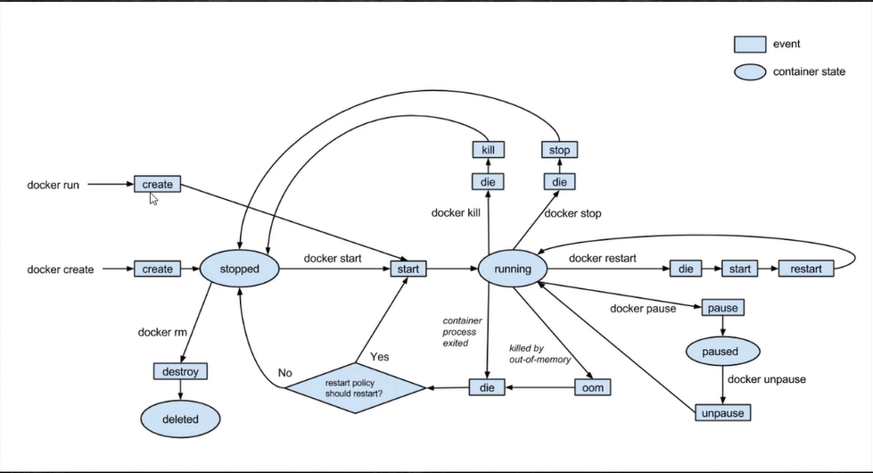
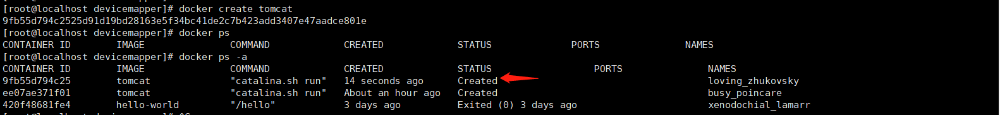
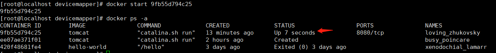
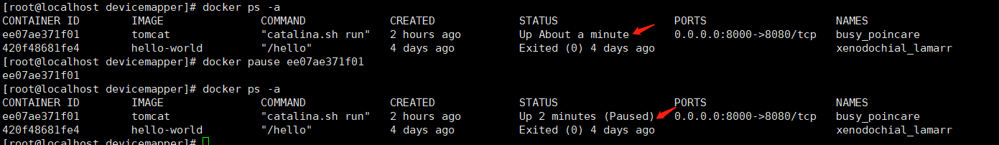
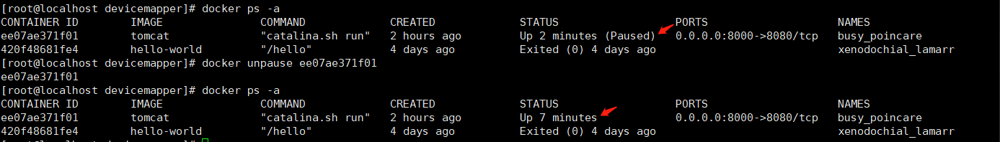
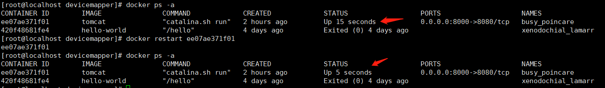
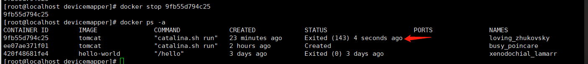
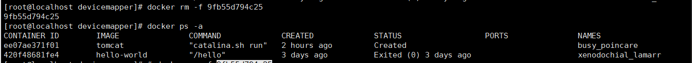
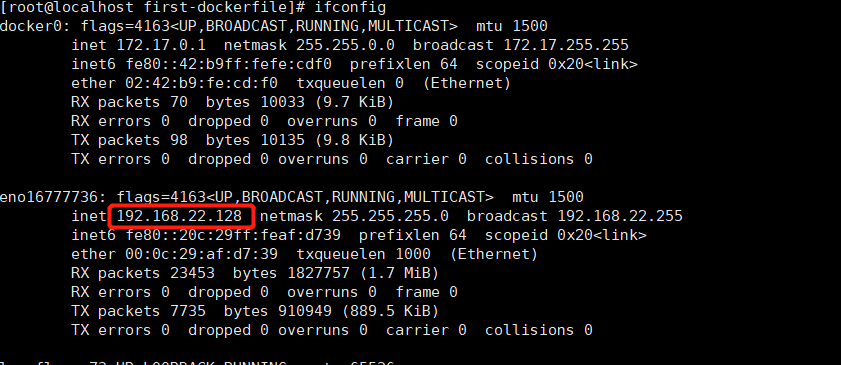
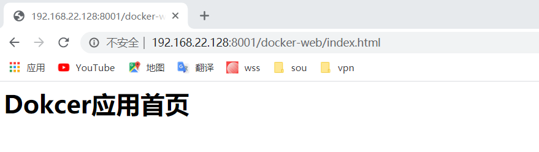

# Docker-第二部分
Docker容器内部结构及Dockerfile文件的使用

## Docker容器内部结构

格式: docker exec [-it] 容器id 命令: 在容器中执行命令

 exec : 在对应的容器中执行命令; -it: 采用交互方式执行命令，比如需要进入容器中，在容器中进行操作

#### docker exec [-it] 容器id /bin/bash

进入Tomcat容器内部实例：

先使用docker ps查看Tomcat是否启动，若没又启动，先启动docker

```
docker run -d -p 8000:8080 tomcat
```

查看运行docker的容器id

```
docker ps
```

执行结果如下:

```
[root@localhost ~]# clear
[root@localhost ~]# docker ps 
CONTAINER ID        IMAGE               COMMAND             CREATED             STATUS              PORTS                    NAMES
0d0ef83f7bd8        tomcat              "catalina.sh run"   2 minutes ago       Up 54 seconds       0.0.0.0:8000->8080/tcp   jovial_newton
```

然后执行以下命令进入容器内部 :  docker exec -it 容器id  /bin/bash

```
docker exec -it 0d0ef83f7bd8 /bin/bash
```

执行后,可进入容器内部，进入容器内部后，可用linux命令进行操作

```
[root@localhost ~]# docker exec -it 0d0ef83f7bd8 /bin/bash
root@0d0ef83f7bd8:/usr/local/tomcat# 
root@0d0ef83f7bd8:/usr/local/tomcat# ls
BUILDING.txt  CONTRIBUTING.md  LICENSE	NOTICE	README.md  RELEASE-NOTES  RUNNING.txt  bin  conf  include  lib	logs  native-jni-lib  temp  webapps  webapps.dist  work
```

但是有些命令可能无作用（比如ll），因为容器安装时使用的只会安装Tomcat的最小尺寸的linux,

```
root@0d0ef83f7bd8:/usr/local/tomcat# ll
bash: ll: command not found
```

使用cat /proc/verison可查看操作系统版本,可看到tomcat容器内部安装了Linux版本信息

```
root@0d0ef83f7bd8:/usr/local/tomcat# cat /proc/version
Linux version 3.10.0-1062.12.1.el7.x86_64 (mockbuild@kbuilder.bsys.centos.org) (gcc version 4.8.5 20150623 (Red Hat 4.8.5-39) (GCC) ) #1 SMP Tue Feb 4 23:02:59 UTC 2020
```

使用java -version可查看容器的java版本，在安装完容器Tpmcat后自动配置环境变量

```
root@0d0ef83f7bd8:/usr/local/tomcat# java -version
openjdk version "1.8.0_242"
OpenJDK Runtime Environment (build 1.8.0_242-b08)
OpenJDK 64-Bit Server VM (build 25.242-b08, mixed mode)
```

要退出当前容器，可以使用 “**exit**”，可退回宿主机

```
root@0d0ef83f7bd8:/usr/local/tomcat# exit
exit
[root@localhost ~]# 
```


## Docker容器生命周期




圆形代表容器的状态、方形代表执行命令后容器状态变化过程中产生的事件

- stopped：停止状态

- running：运行状态

- paused： 暂停状态

- deleted：删除状态

  "**docker run**" 命令执行后会立即创建容器并立即运行容器，会产生2个事件，首先是create事件，其次是start事件，然后容器状态位running。

  "**docker creat**“命令，执行此命令后容器被create，但是容器并没有运行是Stopped状态，和dokcer run的区别是是否执行了”**docker start**“命令启动容器。

  ”**dokcer kill**“和"**dokcer stop**"命令执行后都会将容器Running状态变为Stopped，kill代表会杀掉容器正在运行的进程，当使用”**docker start**“ 会创建新的进程。而stop命令只是停止容器，当使用”**docker start**“ 会恢复原先的进程。

  ”**docker restart**“，将当前容器置为不可用状态die，然后使用start和restart两个事件重启应用

  ”**docker pause**“可以让容器通过pause事件变为Paused暂停状态。Paused状态可以通过"**docker unpause**"命令恢复为Running状态。

  容器遇到异常情况，如内存溢出时oom（out-of-memory）时，会经过die事件变为不可用，由dokcer是否重启的策略决定是否重启，若重启，当前容器触发start事件，进入Running状态。若不重启，进入Stopped状态。

  演示过程如下:

  docker create tomcat：创建tomcat容器，

  docker ps:查看可以看到没有正在运行中的容器

  docker ps -a:查看容器状态,可看到刚创建的容器为Create状态，在docker中会包含几个分支的状态，Created本质就是Stopped状态

  

  docker start 容器id: 启动,可看到容器为Up，即Running状态

  

  docker pause 容器id: 让在运行中的容器变为paused状态

  

  docker unpause 容器id: 让暂停的容器恢复为running状态

  

  docker restart 容器id: 可通过时间来看是否重启

  

  docker stop 容器id: 停止容器后，可看到状态变为Exited，Exited时Stopped状态的一个分支

  

  docker rm -f 容器id: 命令执行后，容器被删除，再使用docker ps -a在容器列表中也无法找到。此时即为deteted状态

  

​       


## DockerFile镜像描述文件

* Dockerfile是一个包含用于组合镜像的命令的文本文件
* Docker通过读取Dokcerfile中的指令按步自动生成镜像
* Docker build -t 机构/镜像名 <:tags> dokcerfile目录: 对指定目录下的dockerfile进行构建


### Dockerfile自动部署tomcat应用

Form ：设置基准镜像及其版本，dockefile文件在基准镜像中进行扩展。

MAINTAINER :用于说明镜像由某个人或某个机构维护

WORKDIR:用于切换工作目录,即linux中的cd 切换到某个目录，若目录不存在则创建

ADD: 将指定文件或目录复制到指定的目录或文件下，相当于cp命令，但是指定的目的目录不存在时会自动创建目录

```
From tomcat:laster  
MAINTAINER yumaoying
WORKDIR /usr/local/tomcat/webapps
ADD docker-web ./docker-web
```

准备环境

在linux上可以在/usr/下创建一个目录image，用于保存本地应用，在整个目录下创创建一个目录first-dockerfile，在first-dockerfile目录下创建一个docker-web应用，里面创建一个文件index.html，即为一个简单的web应用。我们的目的是构建一个自定义镜像，在原有tomcat安装的基础上，自动将docker-web的项目发布到tomcat进行中，也就是任何由有这个dockerfile的人，都可以快速部署这个应用

index.html中简单输出几句用于测试

````
<html>
<h1>Dokcer应用首页</h1>
</html>
````

在first-dockerfile的docker-web同级目录下编写一个名为”**Dockerfile**“的文件,内容如下

```
#基准镜像
From tomcat:latest 
#说明信息，个人或机构
MAINTAINER yumaoying
#cd /usr/local/tomcat/webapps
#切换工作目录，不存在则创建
WORKDIR /usr/local/tomcat/webapps
#复制目录下的所有文件到容器目录
ADD docker-web ./docker-web
```

```
[root@localhost first-dockerfile]# pwd
/usr/image/first-dockerfile
[root@localhost first-dockerfile]# ll
总用量 4
-rw-r--r--. 1 root root 251 4月  12 01:58 Dockerfile
drwxr-xr-x. 2 root root  23 4月  12 01:45 docker-web
[root@localhost first-dockerfile]# cat Dockerfile
FROM tomcat:latest 
#说明信息，个人或机构
MAINTAINER yumaoying
#cd /usr/local/tomcat/webapps
#切换工作目录，不存在则创建
WORKDIR /usr/local/tomcat/webapps
#复制目录下的所有文件到容器目录
ADD docker-web ./docker-web
[root@localhost first-dockerfile]# 
```

切换到first-dockefile目录，执行构建命令，-t为镜像赋予一个名字，格式 机构名/应用名:版本号 

```
docker build -t yumaoying/mywebapp:1.0 /usr/image/first-dockerfile/
```

执行结果,经过4个步骤执行成功

```
[root@localhost first-dockerfile]# docker build -t yumaoying/myweb:1.0 /usr/image/first-dockerfile/
Sending build context to Docker daemon  3.584kB
Step 1/4 : FROM tomcat:latest
 ---> 6ab907c973d2
Step 2/4 : MAINTAINER yumaoying
 ---> Running in 6659047ec793
Removing intermediate container 6659047ec793
 ---> 7bd146cc2a93
Step 3/4 : WORKDIR /usr/local/tomcat/webapps
 ---> Running in 19dd268be905
Removing intermediate container 19dd268be905
 ---> 36e47eab8338
Step 4/4 : ADD docker-web ./docker-web
 ---> b97cab0b1e08
Successfully built b97cab0b1e08
Successfully tagged yumaoying/myweb:1.0
```

使用docker images可以查看到创建的名为yumaoying/myweb镜像

```
[root@localhost first-dockerfile]# docker images
REPOSITORY          TAG                 IMAGE ID            CREATED              SIZE
yumaoying/myweb     1.0                 b97cab0b1e08        About a minute ago   528MB
tomcat              latest              6ab907c973d2        42 hours ago         528MB
```

接下来，可以创建容器并运行了

```
 docker run -d -p 8001:8080 yumaoying/myweb:1.0
```

执行效果,yumaoying/myweb:1.0的运行状态为Up

```
[root@localhost first-dockerfile]# docker run -d -p 8001:8080 yumaoying/myweb:1.0
abe9df1902003c8713832314f10f9643675db7c87392550b56f44bbe167dfa99
[root@localhost first-dockerfile]# docker ps
CONTAINER ID        IMAGE                 COMMAND             CREATED             STATUS              PORTS                    NAMES
abe9df190200        yumaoying/myweb:1.0   "catalina.sh run"   8 seconds ago       Up 5 seconds        0.0.0.0:8001->8080/tcp   sharp_golick
```

通过**ifConfig**获取本机ip地址



通过访问: <http://192.168.22.128:8001/docker-web/index.html>,发现已经可以访问到部署的应用程序



​

​

执行”**docker exec -it ** 容器id“进入容器内部，默认当前指定的目录是”**/usr/local/tomcat**“，

其中/usr/local是当前工作目录，/usr/local/tomcat是tomcat安装的目录。进入容器内部后，可以看到在webapps下有部署的应用程序

```
[root@localhost first-dockerfile]# docker ps
CONTAINER ID        IMAGE                 COMMAND             CREATED             STATUS              PORTS                    NAMES
abe9df190200        yumaoying/myweb:1.0   "catalina.sh run"   26 minutes ago      Up 26 minutes       0.0.0.0:8001->8080/tcp   sharp_golick
[root@localhost first-dockerfile]# docker exec -it abe9df190200 /bin/bash
root@abe9df190200:/usr/local/tomcat/webapps# ls
docker-web
root@abe9df190200:/usr/local/tomcat/webapps# cd docker-web/
root@abe9df190200:/usr/local/tomcat/webapps# cd docker-web/
root@abe9df190200:/usr/local/tomcat/webapps/docker-web# ls
index.html
```


### 镜像分层

   Docker有2大组成部分，镜像和容器。镜像时一个静态文件，类似于一个安装光盘，提供了安装文件，只有把镜像创建为一个容器后才能正常运行。Docker分层也只要分为镜像层，容器层。

  对于镜像来说，构建了之后就是只读的，让容器层，在容器创建了之后，所有的读写都在容器中。

   以上一节中的部署到tomcat中的myweb应用为例，说明一下执行过程，其实就是镜像分层。

```
[root@localhost first-dockerfile]# docker build -t yumaoying/myweb:1.0 /usr/image/first-dockerfile/
Sending build context to Docker daemon  3.584kB
Step 1/4 : FROM tomcat:latest
 ---> 6ab907c973d2
Step 2/4 : MAINTAINER yumaoying
 ---> Running in 6659047ec793
Removing intermediate container 6659047ec793
 ---> 7bd146cc2a93
Step 3/4 : WORKDIR /usr/local/tomcat/webapps
 ---> Running in 19dd268be905
Removing intermediate container 19dd268be905
 ---> 36e47eab8338
Step 4/4 : ADD docker-web ./docker-web
 ---> b97cab0b1e08
Successfully built b97cab0b1e08
Successfully tagged yumaoying/myweb:1.0
```

第一步: FROM tomcat:latest  作用是从远程获取Tomcat后，创建一个临时容器，这个容器专用于镜像的构建，id是6ab907c973d2。在构建容器过程中产生的容器叫临时容器，它只用于构建，无法直接使用。

第二步：说明所属的机构，此时又提供了一个容器Running in 6659047ec793，在每一步执行完后，docker都会以临时容器的方式对当前的系统环境提供一个快照。临时容器就是构建过程做的存档。

当这四步全部完成后，容器构建成功。

这个过程体现了docker特别重要的2个特点: 按层堆叠、系统快照。

按层堆叠:每一步都是在之前的基础上构建。

系统快照：以临时容器方式形成快照，进行存档，这个临时容器在构建过程中是可重用的。比如再构建一个容器，前三步都是一样的，只有第四步不同，那再构建过程中，前三步无需重新构建，对不同的第四步进行构建，就可以完成整个容器的构建。

演示一下过程

在之前创建的/usr/image下创建一个docker_layer的目录，切换到docker_layer目录下创建一个DockerFfile文件，编辑内容

```
# docker官方提供的一个基准镜像，可以创建一个centos的容器
FROM centos
#在容器时会输出aaa
RUN ["echo","aaa"]
RUN ["echo","bbb"]
RUN ["echo","ccc"]
RUN ["echo","ddd"]
```

基于centos的镜像构建一个个简单的容器，然后在当前目录构建一个名为docker_layder的1.0版本容器，构建后可使用docker image查看镜像，过程如下

```
[root@localhost ~]# cd /usr/image/
[root@localhost image]# ls
first-dockerfile
[root@localhost image]# mkdir docker_layer
[root@localhost image]# cd docker_layer/
[root@localhost docker_layer]# vi Dockerfile
[root@localhost docker_layer]# cat Dockerfile
# docker官方提供的一个基准镜像，可以创建一个centos的容器
FROM centos
#在容器时会输出aaa
RUN ["echo","aaa"]
RUN ["echo","bbb"]
RUN ["echo","ccc"]
RUN ["echo","ddd"]

[root@localhost docker_layer]# docker build -t yumaoying/docker_layder:1.0 .
Sending build context to Docker daemon  2.048kB
Step 1/5 : FROM centos
latest: Pulling from library/centos
8a29a15cefae: Pull complete 
Digest: sha256:fe8d824220415eed5477b63addf40fb06c3b049404242b31982106ac204f6700
Status: Downloaded newer image for centos:latest
 ---> 470671670cac
Step 2/5 : RUN ["echo","aaa"]
 ---> Running in 6b486b636573
aaa
Removing intermediate container 6b486b636573
 ---> 524ac2ecf9de
Step 3/5 : RUN ["echo","bbb"]
 ---> Running in 9d8556b59a77
bbb
Removing intermediate container 9d8556b59a77
 ---> 9558d6adb6b0
Step 4/5 : RUN ["echo","ccc"]
 ---> Running in e152fe2c25ed
ccc
Removing intermediate container e152fe2c25ed
 ---> 641a2e8ffd80
Step 5/5 : RUN ["echo","ddd"]
 ---> Running in 59bb3c3c1bc2
ddd
Removing intermediate container 59bb3c3c1bc2
 ---> 652ee9b84c97
Successfully built 652ee9b84c97
Successfully tagged yumaoying/docker_layder:1.0
[root@localhost docker_layer]# docker images
REPOSITORY                TAG                 IMAGE ID            CREATED             SIZE
yumaoying/docker_layder   1.0                 652ee9b84c97        3 minutes ago       237MB
yumaoying/myweb           1.0                 b97cab0b1e08        9 hours ago         528MB
```

可以看到上述过程，构建了一个docker_layder的容器，在构建过程中可看到中间的临时容器和

接下来，对Dockerfile进行重新编辑，将最后的输出字符串改为其他的

```
# docker官方提供的一个基准镜像，可以创建一个centos的容器
FROM centos
#在容器时会输出aaa
RUN ["echo","aaa"]
RUN ["echo","bbb"]
RUN ["echo","eee"]
RUN ["echo","fff"]
```

然后使用这个Dockerfile再构建一个docker_layder容器，版本为1.1

```
[root@localhost docker_layer]# vi Dockerfile 
[root@localhost docker_layer]# cat Dockerfile
# docker官方提供的一个基准镜像，可以创建一个centos的容器
FROM centos
#在容器时会输出aaa
RUN ["echo","aaa"]
RUN ["echo","bbb"]
RUN ["echo","eee"]
RUN ["echo","fff"]

[root@localhost docker_layer]# docker build -t yumaoying/docker_layder:1.1 .
Sending build context to Docker daemon  2.048kB
Step 1/5 : FROM centos
 ---> 470671670cac
Step 2/5 : RUN ["echo","aaa"]
 ---> Using cache
 ---> 524ac2ecf9de
Step 3/5 : RUN ["echo","bbb"]
 ---> Using cache
 ---> 9558d6adb6b0
Step 4/5 : RUN ["echo","eee"]
 ---> Running in 252159c13118
eee
Removing intermediate container 252159c13118
 ---> e324d000b048
Step 5/5 : RUN ["echo","fff"]
 ---> Running in eee1294fbf83
fff
Removing intermediate container eee1294fbf83
 ---> 51f4d577766d
Successfully built 51f4d577766d
Successfully tagged yumaoying/docker_layder:1.1
[root@localhost docker_layer]# 
[root@localhost docker_layer]# docker images
REPOSITORY                TAG                 IMAGE ID            CREATED             SIZE
yumaoying/docker_layder   1.1                 51f4d577766d        2 minutes ago       237MB
yumaoying/docker_layder   1.0                 652ee9b84c97        12 minutes ago      237MB
yumaoying/myweb           1.0                 b97cab0b1e08        10 hours ago        528MB
```

观察1.1版本的构建步骤和1.0版本的构建步骤，可知，1.1版本在前三个步骤并没有进行输出aaa，bbb，而是直接只用1.0时构建的缓存，使用已有容器。从第4步开始容器创建出现了变化，重新构建容器。


## Dockefile基本命令

### 1. From-基于基准镜像

--FROM centos-制作基准镜像，基于centos:lastest

--FROM scratch-不依赖于任何基准镜像（base image）进行构建

--FROM tomcat:9.0.22-jdk-openjdk-基于tomcat的9.0.22-jdk-openjdk版本构建镜像


### 2. LABLE & MAINTAINER-说明信息

--MAINTAINER xx.com -维护这个dockerfile的个人或机构

  --LABLE version="1.0"-维护版本

  --LABLE description="xx机构"-对这个镜像的说明


### 3. WORKDIR-设置工作目录

--WORKDIR /usr/local -工作目录存直接切换

--WORKDIR /usr/local/newdir  -工作目录不存在时创建目录并切换

  这个路径可使用绝对路径，也可用相对路径，尽量使用绝对路劲


### 4. ADD & COPY-复制文件

--ADD hello  / -将hello这个文件复制到容器路径的根路径下

--ADD test.tar.gz  /-在容器根路径下会对这个文件进行解压缩

--ADD和COPY基本可以互换,ADD 除了复制，还具备抓取远程文件功能。如将某个网址的内容添加到容器


### 5. ENV -设置环境常量

--ENV JAVA_HOME /usr/local/openjdk8-使用这个 JAVA_HOME指代 /usr/local/openjdk8这个路径

--RUN ${JAVA_HOME}/bin/java -jar test.jar-使用之前设置的环境常量代替来运行java程序

尽量使用环境常量，可提高程序维护性


### 6. RUN & CMD & ENTRYPOINT -执行

--RUN-在Build构建时执行命令，docker build创建镜像时构建镜像内部文件

--ENTRYPOINT-容器启动时执行的命令，在docker run创建容器时执行

--CMD:容器启动后默认的命令或参数，在docker run创建容器时执行 


#### 6.1 RUN-构建时运行

--RUN yum install -y vim :shell命令格式，如安装vim

--RUN ["yum","install","-y","vim"] :Exec命令格式

Shell运行方式:  使用shell执行时，当前shell是父进程，生成一个子shell进程，在子shell中执行脚本，脚本执行完后，退出子shell，回到当前shell。

EXec运行方式: 使用Exec方式，会用Exec进程替换当前进程，并且保持PID不变，执行完毕，直接退出，并不会退回到之前的进程环境。

一般使用Exec来执行


#### 6.2 ENTRYPOINT启动命令

--ENTRYPOINT :（入口点）用于在容启动时执行命令

--Dockerfile :只有最后一个ENTRYPOINT会被执行

--ENTRYPOINT ["ps"] :推荐使用Exec格式


#### 6.3 CMD 默认命令

--CMD用于设置默认执行的命令

 --如过Dockerfile中出现了多个CMD，则只有最后一个被执行

--若容器启动时附加执行，则CMDD被忽略

--推荐使用Exec格式，和ENTRYPOINT的区别，ENTRYPOINT一定会被执行，CMD不一定会执行。


### 7. 命令演示过程

在/usr/imge下创建docker_run目录，在这个目录下创建"**Dockerfile**"文件，编辑内容

```
FROM centos
RUN ["echo","image building..."]
CMD ["echo","container starting..."]
```

然后"**docker build**"创建容器，" **docker run**"启动容器

```
[root@localhost image]# cd /usr/image/
[root@localhost image]# mkdir docker_run
[root@localhost image]# vi Dockerfile
[root@localhost image]# cat Dockerfile 
FROM centos
RUN ["echo","image building..."]
CMD ["echo","container starting..."]

[root@localhost image]# docker build -t yumaoying/docker_run .
Sending build context to Docker daemon  7.168kB
Step 1/3 : FROM centos
 ---> 470671670cac
Step 2/3 : RUN ["echo","image building..."]
 ---> Running in 013e9cb68560
image building...
Removing intermediate container 013e9cb68560
 ---> f7a003b2202c
Step 3/3 : CMD ["echo","container starting..."]
 ---> Running in e506820f4dce
Removing intermediate container e506820f4dce
 ---> b94780308149
Successfully built b94780308149
Successfully tagged yumaoying/docker_run:latest
[root@localhost image]# docker run yumaoying/docker_run
container starting...
[root@localhost image]# 
```

由上面输出结果可以看出docker build构建过程中有输出“image building...”信息，而“container starting...”是在执行docker run时输出的，说明**RUN**命令实在创建过程中执行，**CMD**命令是在容器启动时执行。

下面演示不执行默认CMD命令,在运行容器时带参数

```
[root@localhost image]# docker run yumaoying/docker_run ls 
bin
dev
etc
home
lib
lib64
lost+found
media
mnt
opt
proc
root
run
sbin
srv
sys
tmp
usr
var
[root@localhost image]# 
```

上面带参数执行时，没有输出“container starting...”，说明命令ls会取代CMD的命令执行。

下面演示**ENTRYPOINT**的执行：

编辑Dockfile文件，组合使用ENTRYPOINT 、CMD 

```
FROM centos
RUN ["echo","image building..."]
ENTRYPOINT ["ps"]
CMD ["-ef"]
```

编辑完后构建，执行

```
[root@localhost image]# vi Dockerfile 
[root@localhost image]# cat Dockerfile 
FROM centos
RUN ["echo","image building..."]
ENTRYPOINT ["ps"]
CMD ["-ef"]
[root@localhost image]# docker build -t yumaoying/docker_run .
Sending build context to Docker daemon  7.168kB
Step 1/4 : FROM centos
 ---> 470671670cac
Step 2/4 : RUN ["echo","image building..."]
 ---> Using cache
 ---> f7a003b2202c
Step 3/4 : ENTRYPOINT ["ps"]
 ---> Running in 4eeee3db059e
Removing intermediate container 4eeee3db059e
 ---> ce4a83470604
Step 4/4 : CMD ["-ef"]
 ---> Running in 5cfdc3708cfa
Removing intermediate container 5cfdc3708cfa
 ---> 9a84030b7929
Successfully built 9a84030b7929
Successfully tagged yumaoying/docker_run:latest
[root@localhost image]# docker run yumaoying/docker_run
UID         PID   PPID  C STIME TTY          TIME CMD
root          1      0  0 04:57 ?        00:00:00 ps -ef
[root@localhost image]# 
```

从中可以观察到ENTRYPOINT和CMD组合 ps -ef 可以查看进程信息。ENTRYPOINT和CMD组合使用可以达到很多的功能。CMD命令可以传入参数，以达到更加丰富的效果

```
[root@localhost image]# docker run yumaoying/docker_run -aux
USER        PID %CPU %MEM    VSZ   RSS TTY      STAT START   TIME COMMAND
root          1  0.0  0.1  46340  1696 ?        Rs   05:02   0:00 ps -aux
[root@localhost image]# 
```

如图，在启动时传入参数aux，可以替换参数，此时看看进程可以以BSD格式显示，更加完整。

```
[root@localhost image]# vi Dockerfile 
[root@localhost image]# cat Dockerfile 
FROM centos
RUN ["echo","image building..."]
ENTRYPOINT ["echo","containg run..."]
ENTRYPOINT ["ps"]
CMD ["-ef"]
[root@localhost image]# docker build yumaoying/docker_run .
"docker build" requires exactly 1 argument.
See 'docker build --help'.

Usage:  docker build [OPTIONS] PATH | URL | -

Build an image from a Dockerfile
[root@localhost image]# docker build -t yumaoying/docker_run .
Sending build context to Docker daemon  7.168kB
Step 1/5 : FROM centos
 ---> 470671670cac
Step 2/5 : RUN ["echo","image building..."]
 ---> Using cache
 ---> f7a003b2202c
Step 3/5 : ENTRYPOINT ["echo","containg run..."]
 ---> Running in 32c1ac665809
Removing intermediate container 32c1ac665809
 ---> 0409b347a8c2
Step 4/5 : ENTRYPOINT ["ps"]
 ---> Running in 9a06fdb1fbd3
Removing intermediate container 9a06fdb1fbd3
 ---> 4920a62709f2
Step 5/5 : CMD ["-ef"]
 ---> Running in 6d3648a06524
Removing intermediate container 6d3648a06524
 ---> c3b8eb1ae82a
Successfully built c3b8eb1ae82a
Successfully tagged yumaoying/docker_run:latest
[root@localhost image]# docker run yumaoying/docker_run
UID         PID   PPID  C STIME TTY          TIME CMD
root          1      0  4 05:11 ?        00:00:00 ps -ef
[root@localhost image]# 
```

上图中演示了，Dockefile文件中有多个ENTRYPOINT 命令的情况，但是只有最后一个ENTRYPOINT被执行。


## Dokcerfile应用-构建Redis镜像

```
wget http://download.redis.io/releases/redis-4.0.14.tar.gz
```

首先在/usr/image目录下创建一个docker_reids目录，切换到docker_reids目录下，将下载redis的安装包放到这个目录下,

```
[root@localhost docker_redis]# ll
总用量 1704
-rw-r--r--. 1 root root 1740967 3月  19 2019 redis-4.0.14.tar.gz
[root@localhost docker_redis]# 
```

在这个目录下创建一个Dockerfile文件，编辑内容

```
#设置基准镜像
FROM centos
#安装需要的工具
RUN ["yum","intall","-y","gcc","gcc-c++","net-tools","make"]
#切换到工作目录
WORKDIR /usr/local
#复制文件到工作目录并解压
ADD redis-4.0.14.tar.gz .
#切换到解压后的redis的src目录下
WORKDIR /usr/local/redis-4.0.14/src
#编译并安装
RUN make && make install
#切换到redis目录
WORKDIR /usr/local/redis-4.0.14
#默认加载redis-config启动
CMD ["redis-server","redis.conf"]
```

构建容器

```
docker build -t yumaoying/docker_redis .
```

查看容器id

```
[root@localhost docker_redis]# docker images
REPOSITORY                TAG                 IMAGE ID            CREATED              SIZE
yumaoying/docker_redis    latest              50910793e4b7        About a minute ago   523MB
```

启动容器

```
docker run -d -p 6379:6479 yumaoying/docker_redis
```

可以使用命令**netstat -tulpn**查看网端口监听情况。可以看到监听端口是6379 

```
[root@localhost docker_redis]# netstat -tulpn
Active Internet connections (only servers)
Proto Recv-Q Send-Q Local Address           Foreign Address         State       PID/Program name 
tcp6       0      0 :::6379                 :::*                    LISTEN      16021/docker-proxy   
```

使用docker ps查看运行进程

```
[root@localhost docker_redis]# docker run -d -p 6379:6479 yumaoying/docker_redis
d58e928b43c7cc9fdb3f6f73e3284eb56c4ceac7722a9aa8733eddbfdeecea07
[root@localhost docker_redis]# docker ps
CONTAINER ID        IMAGE                    COMMAND                  CREATED             STATUS              PORTS                    NAMES
d58e928b43c7        yumaoying/docker_redis   "redis-server redis.…"   12 seconds ago      Up 10 seconds       0.0.0.0:6379->6479/tcp   festive_poincare
[root@localhost docker_redis]# 
```

进入容器内部 docker exec -it 容器id /bin/bash

```
docker exec -it d58e928b43c7 /bin/bash
```

可以使用ls查看容器内文件

```
[root@d58e928b43c7 redis-4.0.14]# ls
00-RELEASENOTES  CONTRIBUTING  INSTALL	  Makefile   deps	 runtest	  runtest-sentinel  src    utils
BUGS		 COPYING       MANIFESTO  README.md  redis.conf  runtest-cluster  sentinel.conf     tests
[root@d58e928b43c7 redis-4.0.14]# 
```

这样使用Dockerfile自定义的redis镜像就完成了.实际不需要这么麻烦，Docker官网已经提供了redis的镜像，可以直接下载。这里只是展示Dockerfile如何构建镜像的一个实例。

直接到 <https://hub.docker.com/search?q=redis&type=image>搜索redis就可获取

<https://hub.docker.com/r/redislabs/redismod/dockerfile> 可查看官网dockerfile的构建过程