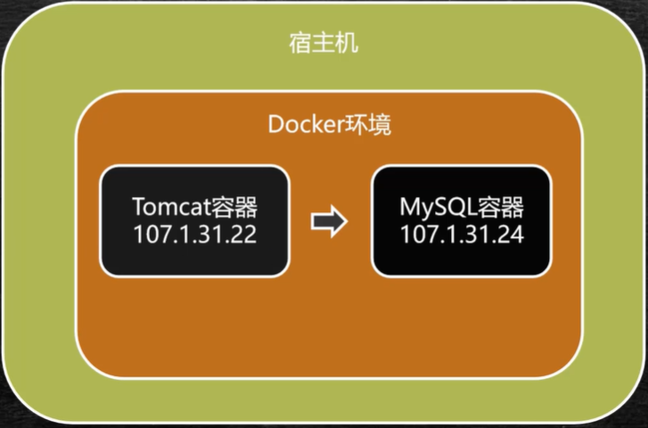

# Docker-第三部分
Docker容器间的通信

## 容器间Link单项通信
单项通信: 在Docker环境下如果有2个容器，由容器A向容器B建立单项的网络连接
比如开发的web应用是在tomcat下，但是需要连接的数据库mysql是在另外一个容器中。tomcat需要连接mysql，但是mysql并不需要知道tomcat的存在，那么就可以建立单项连接进行访问
  

  

### docker容器下的虚拟ip

