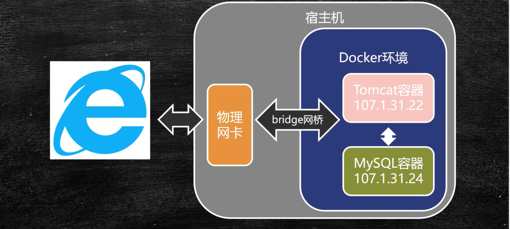
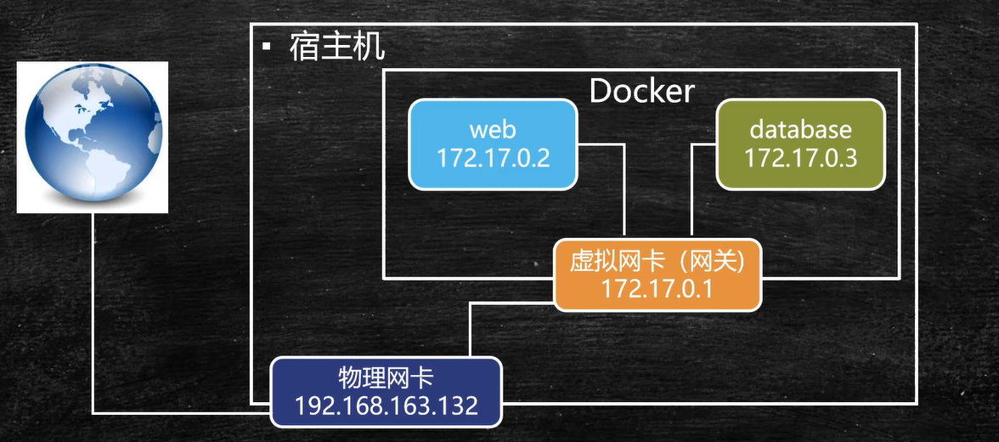
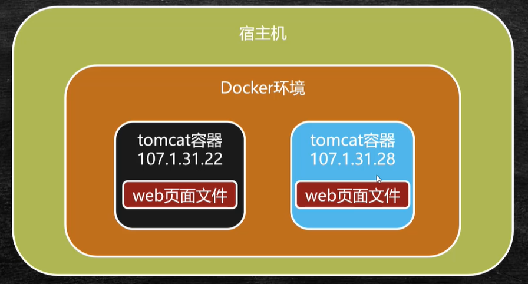

# Docker-第三部分
Docker容器间的通信及容器间数据共享

## 容器间Link单项通信
单项通信: 在Docker环境下如果有2个容器，由容器A向容器B建立单项的网络连接
比如开发的web应用是在tomcat下，但是需要连接的数据库mysql是在另外一个容器中。tomcat需要连接mysql，但是mysql并不需要知道tomcat的存在，那么就可以建立单项连接进行访问
  

  

### docker容器下的虚拟ip

   在每个docker环境下，创建容器后，会给创建的容器创建一个虚拟ip，这个ip在外部无法访问，但是在docker容器之间可以互通。但是通过虚拟ip来进行容器访问，有很大的局限性，因为docker run创建容器很容易，每次创建这个容器ip都会发生变化，例如mysql这个容器不用了，新创建一个mysql容器，重新分配了地址，如果tomcat使用虚拟需要修改为新建的mysql的ip才能访问。在大集群环境下，需要修改所有的tomcat配置才能重新访问。所以在容器间进行通信时，一般不使用虚拟ip进行通信，而是通过容器名称进行通信。当新创建的mysql容器和原有的容器同名，不用重启tomcat就可以访问。

###  **--link 容器名**容器间的单项通信

启动容器时添加参数 **--link 容器名**可进行容器间的单项通信，

命令: docker  run -d --name 容器自定义名  --link 要连接的容器名 要启动的镜像

#### 演示过程:

1. 通过 docker run -d  --name web   为tomcat创建一个名为web的容器并运行

```
docker run -d --name web tomcat 
```

2. 创建一个基础的centos系统容器，名称为database，-it使用交互模式，使用交互模式是因为centos创建后默认是退出状态。

```
docker run -d --name database -it centos /bin/bash
```

3. docker ps 查询容器运行状态获取容器id

```
[root@localhost ~]# docker ps
CONTAINER ID        IMAGE               COMMAND             CREATED              STATUS              PORTS               NAMES
d0c7e53e5a72        centos              "/bin/bash"         About a minute ago   Up About a minute                       database
b6a4632b9878        tomcat              "catalina.sh run"   12 minutes ago       Up 12 minutes       8080/tcp            web
[root@localhost ~]# 
```

4. ** docker inspect 容器id **查询对应容器的原始数据

```
docker inspect b6a4632b9878
```

定位到NetworkSettings,在这里可以找到"IPAddress": "172.17.0.2",说明tomcat的虚拟ip是172.17.0.2

```
        "NetworkSettings": {
            "Bridge": "",
            "SandboxID": "a74b8c72d78a205b014d9a297eb5124484829658756ddde492990d783a7ac1e2",
            "HairpinMode": false,
            "LinkLocalIPv6Address": "",
            "LinkLocalIPv6PrefixLen": 0,
            "Ports": {
                "8080/tcp": null
            },
            "SandboxKey": "/var/run/docker/netns/a74b8c72d78a",
            "SecondaryIPAddresses": null,
            "SecondaryIPv6Addresses": null,
            "EndpointID": "f7e3aab383d0563fe10349a4147c8f9392740c66aed623ad51c5c137f78d3b4e",
            "Gateway": "172.17.0.1",
            "GlobalIPv6Address": "",
            "GlobalIPv6PrefixLen": 0,
            "IPAddress": "172.17.0.2",
            "IPPrefixLen": 16,
            "IPv6Gateway": "",
            "MacAddress": "02:42:ac:11:00:02",
            "Networks": {
                "bridge": {
                    "IPAMConfig": null,
                    "Links": null,
                    "Aliases": null,
                    "NetworkID": "0f79cf34aedbb7a61eaaccf6134f82bb7d63c3d33583808def2f0293f9e10abd",
                    "EndpointID": "f7e3aab383d0563fe10349a4147c8f9392740c66aed623ad51c5c137f78d3b4e",
                    "Gateway": "172.17.0.1",
                    "IPAddress": "172.17.0.2",
                    "IPPrefixLen": 16,
                    "IPv6Gateway": "",
                    "GlobalIPv6Address": "",
                    "GlobalIPv6PrefixLen": 0,
                    "MacAddress": "02:42:ac:11:00:02",
                    "DriverOpts": null
                }
            }
        }
```

同样可以查看database的虚拟ip，可以看到daatabase的虚拟ip是"172.17.0.3"
```
        "NetworkSettings": {
            "Bridge": "",
            "SandboxID": "6ca06aa6c00a2b9e83e7d781eef7b20e37deef81ce0e48e49bd54ee5b21e851c",
            "HairpinMode": false,
            "LinkLocalIPv6Address": "",
            "LinkLocalIPv6PrefixLen": 0,
            "Ports": {},
            "SandboxKey": "/var/run/docker/netns/6ca06aa6c00a",
            "SecondaryIPAddresses": null,
            "SecondaryIPv6Addresses": null,
            "EndpointID": "1459ee53c8aa71725f79509904b5246a7b48a6b01e77fe8e78e5d632d5706748",
            "Gateway": "172.17.0.1",
            "GlobalIPv6Address": "",
            "GlobalIPv6PrefixLen": 0,
            "IPAddress": "172.17.0.3",
            "IPPrefixLen": 16,
            "IPv6Gateway": "",
            "MacAddress": "02:42:ac:11:00:03",
            "Networks": {
                "bridge": {
                    "IPAMConfig": null,
                    "Links": null,
                    "Aliases": null,
                    "NetworkID": "0f79cf34aedbb7a61eaaccf6134f82bb7d63c3d33583808def2f0293f9e10abd",
                    "EndpointID": "1459ee53c8aa71725f79509904b5246a7b48a6b01e77fe8e78e5d632d5706748",
                    "Gateway": "172.17.0.1",
                    "IPAddress": "172.17.0.3",
                    "IPPrefixLen": 16,
                    "IPv6Gateway": "",
                    "GlobalIPv6Address": "",
                    "GlobalIPv6PrefixLen": 0,
                    "MacAddress": "02:42:ac:11:00:03",
                    "DriverOpts": null
                }
            }
        }
```

5. 进入tomcat容器内部  **docker exec -it  tomcat容器id /bin/bash** ，并使用**ping centos另一个容器的虚拟ip**,可以看到可以连接

```
[root@localhost ~]# docker exec -it b6a4632b9878 /bin/bash
root@b6a4632b9878:/usr/local/tomcat# ping  172.17.0.3
PING 172.17.0.3 (172.17.0.3) 56(84) bytes of data.
64 bytes from 172.17.0.3: icmp_seq=1 ttl=64 time=1.06 ms
64 bytes from 172.17.0.3: icmp_seq=2 ttl=64 time=0.084 ms
64 bytes from 172.17.0.3: icmp_seq=3 ttl=64 time=0.060 ms
64 bytes from 172.17.0.3: icmp_seq=4 ttl=64 time=0.093 ms
...
```

6.当使用容器名ping时，发现无法连接

```
root@b6a4632b9878:/usr/local/tomcat# ping database
ping: database: Name or service not known
root@b6a4632b9878:/usr/local/tomcat# 
```

7. **exit**  退出tomcat容器内部，回到宿主机

```
root@b6a4632b9878:/usr/local/tomcat# exit
[root@localhost ~]# 
```

8. 移除tomcat容器，重新创建容器，重新创建运行容器时添加参数**--link 连接的容器名** 来和其他容器建立连接

```
[root@localhost ~]# docker ps
CONTAINER ID        IMAGE               COMMAND             CREATED             STATUS              PORTS               NAMES
d0c7e53e5a72        centos              "/bin/bash"         23 minutes ago      Up 23 minutes                           database
b6a4632b9878        tomcat              "catalina.sh run"   33 minutes ago      Up 33 minutes       8080/tcp            web
[root@localhost ~]# docker rm -f b6a4632b9878
b6a4632b9878
[root@localhost ~]# docker ps
CONTAINER ID        IMAGE               COMMAND             CREATED             STATUS              PORTS               NAMES
d0c7e53e5a72        centos              "/bin/bash"         25 minutes ago      Up 25 minutes                           database
[root@localhost ~]# docker run -d --name web --link database tomcat
3e6d1162bd5204510b6f5d466ff4213b9e6cde8bc045f85288f3b54b6afbff92
[root@localhost ~]# 

```

9. 进入容器内部，使用**ping  容器名** 发现tomcat可以ping通centos的容器名，连接已建立

```
[root@localhost ~]# docker ps
CONTAINER ID        IMAGE               COMMAND             CREATED              STATUS              PORTS               NAMES
3e6d1162bd52        tomcat              "catalina.sh run"   About a minute ago   Up About a minute   8080/tcp            web
d0c7e53e5a72        centos              "/bin/bash"         28 minutes ago       Up 28 minutes                           database
[root@localhost ~]# docker exec -it 3e6d1162bd52 /bin/bash
root@3e6d1162bd52:/usr/local/tomcat# ping database
PING database (172.17.0.3) 56(84) bytes of data.
64 bytes from database (172.17.0.3): icmp_seq=1 ttl=64 time=0.173 ms
64 bytes from database (172.17.0.3): icmp_seq=2 ttl=64 time=0.057 ms
64 bytes from database (172.17.0.3): icmp_seq=3 ttl=64 time=0.103 ms
```


## Bridge网桥双向通信



​    通过link进行容器间的单项通信，2边的容器彼此也可以进行双向通信，但是比较麻烦，为了解决这个问题，Docker提供了Bridge（网桥）来进行多组容器间的双向通信。网桥是Dcoker于外部环境之间通信必不可少的组件，但是它是完全虚拟出来的组件，它的作用是Docker内部和外部环境进行通信。比如在docker容器内部ping 百度，是可以连通的，因为网桥可以把容器发出的数据包通过外部物理网卡，通过物理网卡与外部进行交互，物理网卡获取响应后，也会通过网桥传给容器。

   网桥除了宿主机和docker容器进行通信外，还可以对容器从网络层面上进行分组，可以理解为将指定的容器绑定到网桥上后，容器之间就可以相互进行访问。

#### 演示过程:

**docker rm  -f 容器id**移除之前的容器，重新创建容器演示

```
[root@localhost ~]# docker ps
CONTAINER ID        IMAGE               COMMAND             CREATED             STATUS              PORTS               NAMES
3e6d1162bd52        tomcat              "catalina.sh run"   37 minutes ago      Up 37 minutes       8080/tcp            web
d0c7e53e5a72        centos              "/bin/bash"         About an hour ago   Up About an hour                        database
[root@localhost ~]# docker rm -f 3e6d1162bd52
3e6d1162bd52
[root@localhost ~]# docker rm -f d0c7e53e5a72 
d0c7e53e5a72
[root@localhost ~]# 

```

1. --name 指定容器名来创建tomcat和centos的容器

```
   [root@localhost ~]# docker run -d --name web tomcat
   f10a9ee4f1be5765983ad3feb20d59efeae42c536d2fef61bc0f6d0fe73f8aa8
   [root@localhost ~]# docker run -d -it --name database centos
   e6ed9dd8e4da47e12c673e437a8ef8f441cba93fbbae3329eec37fb65595a982
   [root@localhost ~]# docker ps
   CONTAINER ID        IMAGE               COMMAND             CREATED             STATUS              PORTS               NAMES
   e6ed9dd8e4da        centos              "/bin/bash"         10 seconds ago      Up 8 seconds                            database
   f10a9ee4f1be        tomcat              "catalina.sh run"   34 seconds ago      Up 32 seconds       8080/tcp            web
```


2. **docker netwok ls** 列出当前网络服务

```
   [root@localhost ~]# docker network ls
   NETWORK ID          NAME                DRIVER              SCOPE
   0f79cf34aedb        bridge              bridge              local
   8bacfa91dae4        host                host                local
   29361521a78d        none                null                local
   [root@localhost ~]# 
```
   在docker 默认会有名为bridge的网桥，用于容器和外部宿主机之间进行通信。如果想容器之间网络互通，需要建立的网桥

3. **docker netwok ls** 列出当前网络服务

```
   [root@localhost ~]# docker network create -d bridge my-bridge
   8847e7ed764dc311473e9607bf24607ffa08ddc6759d7411ae394d9d39e871db
   [root@localhost ~]# docker network ls
   NETWORK ID          NAME                DRIVER              SCOPE
   0f79cf34aedb        bridge              bridge              local
   8bacfa91dae4        host                host                local
   8847e7ed764d        my-bridge           bridge              local
   29361521a78d        none                null                local
   [root@localhost ~]# 
```
只要通过my-bridge的容器都可以进行互联互通

4. **docker network connect  网桥名 容器名** 将容器和网桥绑定

```
      [root@localhost ~]# docker network connect my-bridge web
      [root@localhost ~]# docker network connect my-bridge database
```

5. 当两个容器和my-bridge绑定后，可以进行通信了
   进入tomcat web连接database
```
      [root@localhost ~]# docker ps
      CONTAINER ID        IMAGE               COMMAND             CREATED             STATUS              PORTS               NAMES
      e6ed9dd8e4da        centos              "/bin/bash"         20 minutes ago      Up 20 minutes                           database
      f10a9ee4f1be        tomcat              "catalina.sh run"   20 minutes ago      Up 20 minutes       8080/tcp            web
      [root@localhost ~]# docker exec -it f10a9ee4f1be /bin/bash
      root@f10a9ee4f1be:/usr/local/tomcat# ping database
      PING database (172.19.0.3) 56(84) bytes of data.
      64 bytes from database.my-bridge (172.19.0.3): icmp_seq=1 ttl=64 time=0.616 ms
      64 bytes from database.my-bridge (172.19.0.3): icmp_seq=2 ttl=64 time=0.144 ms
      64 bytes from database.my-bridge (172.19.0.3): icmp_seq=3 ttl=64 time=0.112 ms
      ^Z
      [1]+  Stopped                 ping database
      root@f10a9ee4f1be:/usr/local/tomcat# exit
      exit
      There are stopped jobs.
      root@f10a9ee4f1be:/usr/local/tomcat# exit
      exit
```
进入centos内部连接tomcat
​      
```
      [root@localhost ~]# docker exec -it e6ed9dd8e4da /bin/bash
      [root@e6ed9dd8e4da /]# ping web
      PING web (172.19.0.2) 56(84) bytes of data.
      64 bytes from web.my-bridge (172.19.0.2): icmp_seq=1 ttl=64 time=0.126 ms
      64 bytes from web.my-bridge (172.19.0.2): icmp_seq=2 ttl=64 time=0.051 ms
      64 bytes from web.my-bridge (172.19.0.2): icmp_seq=3 ttl=64 time=0.098 ms
      ^Z
      [1]+  Stopped                 ping web
      [root@e6ed9dd8e4da /]# 
```

   #### 网桥实现原理


Docker每创建一个网桥都会在宿主机上安装一个虚拟网卡，这个虚拟网卡也承担了网关的作用，在创建的web和database容器，通过与虚拟网卡绑定，就可以实现容器之间的访问。
虚拟网卡与容器就构成了一个内部网路，只要容器绑定到虚拟网卡上，就能相互访问。但是虚拟网卡是虚拟的,ip地址也是虚拟的，和外部进行通信，还必须和宿主机的物理网卡进行地址转换，
容器中发送的数据包会通过虚拟网卡地址转换转换为物理网卡，然后和外部通信，同样，外部环境和容器间通信，需要物理网卡转换为虚拟网卡，由虚拟网卡进行网络分发。

#### Docker网络命令

* docker network create : 创建一个网络
   docker network create -d bridge 网桥名:创建一个网络
      --docker network create -d bridge my-bridge

* docker network ls : 列出网络

  --docker network ls

* docker network connect  网桥名 容器名: 将容器连接到网络
   --docker network disconnect my-bridge database

* docker network disconnect 网桥名 容器名:断开容器与网络的连接
  --docker network disconnect my-bridge web

* docker network inspect 网桥名:在一个或多个网络上显示详细信息
    --docker network inspect my-bridge

* docker network rm 网桥名:删除指定名称的网络
   -- docker network rm my-bridge

* docker network prune：删除所有未使用的网络

    -- docker network prune my-bridge


   ```
   [root@localhost ~]# docker network create -d bdidge my-bridge2
   Error response from daemon: plugin "bdidge" not found
   [root@localhost ~]# docker network create -d bridge my-bridge2
   f84d4855f16f628ba93774858527869de999c782785ad2233af2f269d76d0130
   [root@localhost ~]# docker network ls
   NETWORK ID          NAME                DRIVER              SCOPE
   0f79cf34aedb        bridge              bridge              local
   8bacfa91dae4        host                host                local
   8847e7ed764d        my-bridge           bridge              local
   f84d4855f16f        my-bridge2          bridge              local
   29361521a78d        none                null                local
   [root@localhost ~]# docker network connect my-bridge2 web
   [root@localhost ~]# docker network inspect my-bridge2
   [
       {
           "Name": "my-bridge2",
           "Id": "f84d4855f16f628ba93774858527869de999c782785ad2233af2f269d76d0130",
           "Created": "2020-04-16T23:46:48.772280214+08:00",
           "Scope": "local",
           "Driver": "bridge",
           "EnableIPv6": false,
           "IPAM": {
               "Driver": "default",
               "Options": {},
               "Config": [
                   {
                       "Subnet": "172.20.0.0/16",
                       "Gateway": "172.20.0.1"
                   }
               ]
           },
           "Internal": false,
           "Attachable": false,
           "Ingress": false,
           "ConfigFrom": {
               "Network": ""
           },
           "ConfigOnly": false,
           "Containers": {
               "f10a9ee4f1be5765983ad3feb20d59efeae42c536d2fef61bc0f6d0fe73f8aa8": {
                   "Name": "web",
                   "EndpointID": "a1387b2d3a0685462e1ae0097e4d8dd81a5bc86957b5f332d7eac9a3631bd144",
                   "MacAddress": "02:42:ac:14:00:02",
                   "IPv4Address": "172.20.0.2/16",
                   "IPv6Address": ""
               }
           },
           "Options": {},
           "Labels": {}
       }
   ]
   [root@localhost ~]# docker network disconnect my-bridge2 web
   [root@localhost ~]# docker network inspect my-bridge2
   [
       {
           "Name": "my-bridge2",
           "Id": "f84d4855f16f628ba93774858527869de999c782785ad2233af2f269d76d0130",
           "Created": "2020-04-16T23:46:48.772280214+08:00",
           "Scope": "local",
           "Driver": "bridge",
           "EnableIPv6": false,
           "IPAM": {
               "Driver": "default",
               "Options": {},
               "Config": [
                   {
                       "Subnet": "172.20.0.0/16",
                       "Gateway": "172.20.0.1"
                   }
               ]
           },
           "Internal": false,
           "Attachable": false,
           "Ingress": false,
           "ConfigFrom": {
               "Network": ""
           },
           "ConfigOnly": false,
           "Containers": {},
           "Options": {},
           "Labels": {}
       }
   ]
   [root@localhost ~]# docker network  rm my-bridge2
   [root@localhost ~]# docker network  prune
   WARNING! This will remove all networks not used by at least one container.
   Are you sure you want to continue? [y/N] y
   Deleted Networks:
   my-bridge2
   [root@localhost ~]# docker network ls
   NETWORK ID          NAME                DRIVER              SCOPE
   0f79cf34aedb        bridge              bridge              local
   8bacfa91dae4        host                host                local
   8847e7ed764d        my-bridge           bridge              local
   29361521a78d        none                null                local
   [root@localhost ~]# docker network rm my-bridge
   [root@localhost ~]# docker network ls
   NETWORK ID          NAME                DRIVER              SCOPE
   0f79cf34aedb        bridge              bridge              local
   8bacfa91dae4        host                host                local
   29361521a78d        none                null                local
   ```

   

   ## Volume容器间共享数据



​    在Docker中由2个web容器，在2个tomcat容器中的应用是相同的，若其中一个web页面更新了，另一个web应用也需要更新。如果这个web应用部署在多个容器中，每个容器都要进行应用的替换很麻烦，所以提供了新的共享数据的方式，来进行容器间的数据共享。数据共享的核心原理是在宿主机上开辟一个空间，这个空间可以被多个容器共享，即web页面文件不放到容器内部，而是放到宿主机的某个磁盘上，当web文件更新了,通过Docker环境读取同一份个文件，即可在多个容器中实现共享。

Volume(数据卷)通过设置来进行数据共享，有2种方式

    ### 通过设置-v 挂载宿主机目录

格式: docker run --name 容器名 -v 宿主机路径:容器内挂载路径  镜像名

实例: 宿主机的/usr/webapps 目录挂载到/usr/local/tomcat/webapps目录，这样/usr/webapps下的文件就会映射到容器内的目录下

```
dokcer run --name t1 -v /usr/webapps:/usr/local/tomcat/webapps tomcat
```

### 通过--volumes-from共享容器内挂载点

1. 创建共享容器 :

      docker create --name  webpage -v /webapps:/tomact/webapps tomcat /bin/true

   ​    只是创建名为 webpage的容器，并不运行，在创建的过程中用-v将 /webapps 挂载到容器/tomact/webapps

2. 共享容器挂载点 docker run --volumes-from  webpage --name t1  -d tomcat

   ​    运行时使用  --volumes-from 共享容器的名字 ，就可以i使用之前的共享容器

   ​

   #### 演示一-通过设置-v 挂载宿主机目录

   准备web项目

   创建/webapps目录,在这个目录下创建volumn-test目录，并在volumn-test目录下创建一个index.html文件,作为一个简单的web应用

   ```
   [root@localhost image]# mkdir webapps
   [root@localhost image]# cd webapps
   [root@localhost webapps]# mkdir volumn-test
   [root@localhost webapps]# cd volumn-test/
   [root@localhost volumn-test]# vi index.html
   [root@localhost volumn-test]# cat index.html
   <html>
   <p>测试首页</p>
   </html>
   [root@localhost volumn-test]# cd ..

   ```

   回到webapps目录，在运行容器时，挂载宿主机目录到容器

   ```
   [root@localhost webapps]# docker run --name docker_t1 -p 8000:8080 -d -v /usr/image/webapps/:/usr/local/tomcat/wepapps tomcat
   ```

   可以查看容器是否运行

   ```
   [root@localhost webapps]# docker ps
   92774b17a9de        tomcat              "catalina.sh run"   9 minutes ago       Up 9 minutes        0.0.0.0:8000->8080/tcp   docker_t1
   ```

   通过浏览器访问可以访问项目首页成功 <http://宿主机ip:8000/volumn-test/index.html>


​      进入容器内部，再容器的/usr/local/tomcat/webapps下可以查看项目

```
[root@localhost webapps]# docker exec -it 92774b17a9de /bin/bash
root@92774b17a9de:/usr/local/tomcat# cd webapps
root@92774b17a9de:/usr/local/tomcat/webapps# ls
volumn-test
```

启动一个名为docker_t2的容器,端口为8001，web还是之前的文件

```
[root@localhost webapps]# docker run --name docker_t2 -p 8001:8080 -d -v /usr/image/webapps/:/usr/local/tomcat/webapps tomcat

0d861e51094eba9356b2c921c96b7889c232066bed59350276636c7f685381e8
[root@localhost webapps]# docker ps
CONTAINER ID        IMAGE               COMMAND             CREATED             STATUS              PORTS                    NAMES
0d861e51094e        tomcat              "catalina.sh run"   7 seconds ago       Up 5 seconds        0.0.0.0:8001->8080/tcp   docker_t2
92774b17a9de        tomcat              "catalina.sh run"   9 minutes ago       Up 9 minutes        0.0.0.0:8000->8080/tcp   docker_t1

```

启动后使用8001端口访问，http://宿主机ip:8001/volumn-test2/index.html，能访问成功，说明共享宿主机的目录

验证: 修改宿主机的index.html的内容，再此访问网页，发现网页内容变更为修改的内容


演示二：通过创建共享容器来共享数据

第一步创建共享容器: docker create --name webpages -v /usr/image/webapps:/usr/local/tomcat/webapps tomcat /bin/true

webpages时共享容器的名称，/bin/true用于占位，没有实际含义

第二步挂载共享容器启动项目:docker run -p 8002:8080 --volumes-from webpages --name docker_t3 -d tomcat

--volumes-from 指定挂载容器

```
[root@localhost webapps]# docker create --name webpages -v /usr/image/webapps:/usr/local/tomcat/webapps tomcat /bin/true
7f039581aed5e7e5c655f4770d4219d1d1dfa860e1f06b9e756ecbbab8fc5936
[root@localhost webapps]# docker run -p 8002:8080 --volumes-from webpages --name docker_t3 -d tomcat
b261a0d7ba19b1c3dad83d4e0c86e9b5fe3c0d566a905055b5dae95fcad23fcf
```

之后创建容器直接执行第二步设置容器名和端口就可以了。


   


