# Docker-第四部分

## 容器编排工具Docker Compose

​    Compose是用于定义和运行多容器Docker应用程序的工具。通过Compose，您可以使用YAML文件来配置应用程序的服务。然后，使用一个命令，就可以从配置中创建并启动所有服务。

  在宿主机中安装Nginx，Apache Tomcat,Msql.Nginx web应用服务，对Tomcat提供负载均衡和反向代理支持。Tomcat通过内部的web程序访问Mysql数据库。每个应用都有自己的配置文件，如果这组应用需要上线，需要提供很多docker 命令和配置文件给运维，才能正确部署应用。这样做是比较麻烦的，所以Dcoker提供了容器编排工具Docker compose 来解决这个问题。Docker compose 通过一个脚本，可以先安装MySql容器，再安装Tomcat，然后安装Nginx，并把几个容器形成依赖，每个容器所需的配置文件只需要绑定就可以了。这样只需要一个文件就能完成一件部署和发布应用。


### Docker Compose特点

* Docker Compose单机多容器部署工具（集群环境中使用k8s进行编排）
* 通过yml文件定义多容器如何部署
* WIN/MAC默认在安装Dcoker时提供Docker Compose 无需单独安装，Linux需要安装


###  Docker Compose安装

官网介绍地址: <https://docs.docker.com/compose/install/>

获取并自动安装Docker comppose,当前版本为1.25.5，r若要安装其他版本，版本即可,，默认安装路径是

/usr/local/bin/docker-compose（如果下载失败，多试几次，因为连接国外网，可能会超时）

```
sudo curl -L "https://github.com/docker/compose/releases/download/1.24.1/docker-compose-$(uname -s)-$(uname -m)" -o /usr/local/bin/docker-compose
```

对docker-compose赋可执行权限

```
sudo chmod +x /usr/local/bin/docker-compose
```

查看docker-compose的版本

```
docker-compose -version
```

显示如下，docker-composean安装成功: 

```
[root@localhost ~]# docker-compose -version
docker-compose version 1.24.1, build 4667896b
```


### Docker-compose 命令

docker-compose操作命令，<https://docs.docker.com/engine/reference/commandline/docker/>

下面列出本例中使用

docker-compose up : 启动，解析docker-compose.yml 的内容并执行，会构建镜像并运行容器

docker-compose logs [服务名] :查看日志，后面加服务名，可查看具体的服务日志

docker-compose down: 停止容器，容器会被停止并移除，但是构建的镜像不会移除

docker logs 容器id或容器名:可以查看容器的运行日志


### Docker Compose完整部署应用程序实例

#### 准备:安装Dcoker，Docker Compose，下载程序jar包等 

现在有一个使用spring boot+spring data jpa搭建的一个web应用，应用连接mysql数据库

项目git地址: <https://github.com/yumaoying/spring-jpa-demon.git>，

使用maven打包编译后,把项目上传到linux上/usr/image/app  目录中，

同时将程序所需的初始化sql文件也下载上传到db目录

```
[root@localhost app]# ll
总用量 0
drwxr-xr-x. 2 root root 21 4月  18 18:13 db
drwxr-xr-x. 3 root root 88 4月  18 18:11 spring-jpa-demon
[root@localhost app]#
```

spring-jpa-demon中包含如下文件:

application.yml是项目运行的一些配置，

其中lib目录中包含项目运行所依赖jar包

spring-jpa-demon.jar是程序运行的jar包

```
[root@localhost spring-jpa-demon]# ll
总用量 28
-rw-r--r--. 1 root root  507 4月  18 18:02 application.yml
drwxr-xr-x. 2 root root 8192 4月  18 13:29 lib
-rw-r--r--. 1 root root 9152 4月  18 13:29 spring-jpa-demon.jar
[root@localhost spring-jpa-demon]# 
```

db目录中的init.sql文件是程序需要的建表的初始化sql语句

```
[root@localhost app]# cd db
[root@localhost db]# ls
init.sql
```

init.sql的内容如下

```sql
-- 建库
CREATE DATABASE IF NOT EXISTS test default charset utf8 COLLATE utf8_general_ci;

-- 切换到数据库
use test;

-- 如果表存在先删除表
DROP TABLE IF EXISTS `tb_user`;


-- 创建表
CREATE TABLE `tb_user`(
  `id` VARCHAR(32),
  `username`       VARCHAR(64),
  `password`     VARCHAR(64),
  `email`    VARCHAR(64),
  PRIMARY KEY (`id`)
)ENGINE=InnoDB DEFAULT CHARSET=utf8;


-- 初始化数据
insert into `tb_user`(id,username,password,email) values('1','admin','123456','test@xx.com');
commit;
```

其中application.yml的配置如下，应用端口是8010，数据库使用mysql

```java
server:
  port: 8010
  servlet:
    context-path: /
spring:
  thymeleaf:
    cache: false
  datasource:
    driver-class-name: com.mysql.jdbc.Driver
    url: jdbc:mysql://localhost:3306/test?useUnicode=true&characterEncoding=UTF-8&zeroDateTimeBehavior=convertToNull&allowMultiQueries=true&useSSL=false
    username: root
    password: 123456
  jpa:
    database: MySQL
    database-platform: org.hibernate.dialect.MySQL5InnoDBDialect
    show-sql: true
    hibernate:
      ddl-auto: none
```

由于项目使用java开发的可以到<https://hub.docker.com/> 搜索java的运行jdk环境，

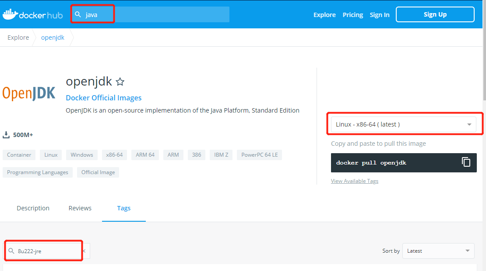

在tag位置找到与开发时匹配的环境（在tag中搜索8u222，可以找到）,使用openjdk:8u222-jre构建Dockerfile文件

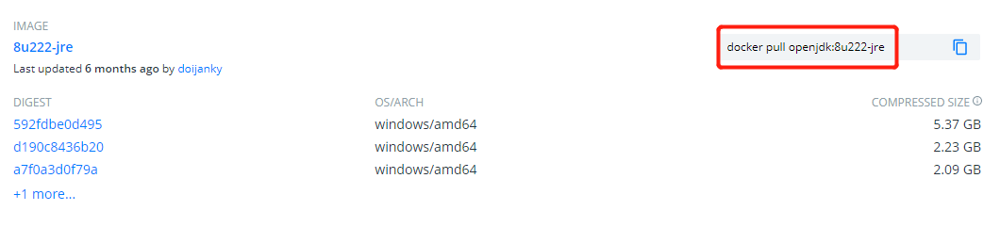

#### 编辑应用Dockerfile

1. 切换到spring-jpa-demon目录，编辑文件 vim Dockerfile

```
FROM openjdk:8u222-jre
#切换工作目录(不存在时会创建)
WORKDIR /usr/local/spring-jpa-demon
#复制项目到当前目录
ADD application.yml .
ADD spring-jpa-demon.jar .
ADD lib/ ./lib/
#对外暴露端口
EXPOSE 8010
#运行容器时默认执行命令
CMD ["java","-jar","spring-jpa-demon.jar"]
```

2.使用当前Dockerfile构建应用镜像

镜像名spring-jpa-demon

```
docker build -t spring-jpa-demon .
```

过程如下

```
[root@localhost spring-jpa-demon]# vi Dockerfile 
[root@localhost spring-jpa-demon]# docker build -t spring-jpa-demon .
Sending build context to Docker daemon   52.8MB
Step 1/7 : FROM openjdk:8u222-jre
 ---> 25073ded58d2
Step 2/7 : WORKDIR /usr/local/spring-jpa-demon
 ---> Running in 7f49bdae7e09
Removing intermediate container 7f49bdae7e09
 ---> 46da6f207d2d
Step 3/7 : ADD application.yml .
 ---> 1a572155fcb0
Step 4/7 : ADD spring-jpa-demon.jar .
 ---> 885855b35646
Step 5/7 : ADD lib/ ./lib/
 ---> 9e35538a9235
Step 6/7 : EXPOSE 8010
 ---> Running in e49a667e8aee
Removing intermediate container e49a667e8aee
 ---> 5b4fe8273074
Step 7/7 : CMD ["java","-jar","spring-jpa-demon.jar"]
 ---> Running in bdf07bd274ad
Removing intermediate container bdf07bd274ad
 ---> 1a64e429bdbc
Successfully built 1a64e429bdbc
Successfully tagged spring-jpa-demon:latest
```

显示Successfully 说明镜像构建成功，运行测试

3.使用docker images 查看镜像

```
[root@localhost spring-jpa-demon]# docker images
REPOSITORY          TAG                 IMAGE ID            CREATED             SIZE
spring-jpa-demon    latest              1a64e429bdbc        14 seconds ago      299MB
openjdk             8u222-jre           25073ded58d2        6 months ago        246MB
```

运行容器

```
docker run spring-jpa-demon
```

由于没有安装mysql，无法和mysql建立连接，所以项目运行失败

#### 编辑自定义MYsql的Dockerfile

4.切换到db目录，编辑Dockerfile文件

docker-entrypoint-initdb.d 是Docker 官方定义初始化数据库脚本的目录，还有其他参数配置可参考<https://hub.docker.com/_/mysql>

```
FROM mysql:5.7
#Docker 官方定义初始化数据库脚本的目录
WORKDIR /docker-entrypoint-initdb.d
#拷贝sql文件
ADD init.sql .
```

5.构建mysql镜像

```
docker build -t my_db .
```

执行如下,docker images查看镜像

```
[root@localhost db]# docker build -t my_db .
Sending build context to Docker daemon  3.072kB
Step 1/3 : FROM mysql:5.7
 ---> 273c7fcf9499
Step 2/3 : WORKDIR /docker-entrypoint-initdb.d
 ---> Running in 4b83d6306b30
Removing intermediate container 4b83d6306b30
 ---> 164890d28b86
Step 3/3 : ADD init.sql .
 ---> 0fb0bb5709c4
Successfully built 0fb0bb5709c4
Successfully tagged my_db:latest
[root@localhost db]# docker images
REPOSITORY          TAG                 IMAGE ID            CREATED             SIZE
my_db               latest              0fb0bb5709c4        43 seconds ago      455MB
spring-jpa-demon    latest              1a64e429bdbc        4 hours ago         299MB
mysql               5.7                 273c7fcf9499        22 hours ago        455MB
tomcat              latest              f43f44c16fb0        2 days ago          529MB
centos              latest              470671670cac        3 months ago        237MB
openjdk             8u222-jre           25073ded58d2        6 months ago        246MB
[root@localhost db]# 
```


6.运行容器,设置mysql数据库的root的密码为123456

```
docker run -d  -e MYSQL_ROOT_PASSWORD=123456 my_db 
```

docker ps查看是否运行，如果没有运行，可以使用docker ps -a查看容器是否在运行，然后使用docker start 容器id 启动

```
[root@localhost db]# docker run --name mysql_db -p 3306:3306 -e MYSQL_ROOT_PASSWORD=123456 -d my_db
f04354787d24fd45f782f1f14a2093c190f4c9c405440f20e548a94e30e66896
[root@localhost db]# docker ps
CONTAINER ID        IMAGE               COMMAND                  CREATED             STATUS              PORTS                               NAMES
f04354787d24        my_db               "docker-entrypoint.s…"   12 seconds ago      Up 6 seconds        0.0.0.0:3306->3306/tcp, 33060/tcp   mysql_db
[root@localhost db]# docker start a62fd18fee87
a62fd18fee87
[root@localhost db]# docker ps
CONTAINER ID        IMAGE               COMMAND                  CREATED             STATUS              PORTS                 NAMES
2095ff272efb        my_db               "docker-entrypoint.s…"   49 seconds ago      Up 46 seconds       3306/tcp, 33060/tcp   vigilant_merkle
```

docker exec -it 容器名或id  /bin/bash 进入容器内部，可以看到init.sql

```
[root@localhost db]# docker exec -it 2095ff272efb  /bin/bash
root@2095ff272efb:/docker-entrypoint-initdb.d# ls
init.sql
```

mysql -u用户，-p密码，可进入mysql，创建数据库database并查看是否创建数据库

对数据库进行操作,**SHOW DATABASES**查看数据库mysql的database，

```
root@2095ff272efb:/docker-entrypoint-initdb.d# mysql -uroot -p123456
mysql> SHOW DATABASES;
+--------------------+
| Database           |
+--------------------+
| information_schema |
| mysql              |
| performance_schema |
| sys                |
| test               |
+--------------------+
5 rows in set (0.12 sec)

mysql> use test
Reading table information for completion of table and column names
You can turn off this feature to get a quicker startup with -A

Database changed
mysql> show tables;
+----------------+
| Tables_in_test |
+----------------+
| tb_user        |
+----------------+
1 row in set (0.00 sec)

mysql> select * from tb_user;
+----+----------+----------+-------------+
| id | username | password | email       |
+----+----------+----------+-------------+
| 1  | admin    | 123456   | test@xx.com |
+----+----------+----------+-------------+
1 row in set (0.00 sec)

mysql> 

```

可以看到test数据库已经创建了，**use 数据库** 切换到这个数据库，查看表数据，此时自定义的mysql数据库波u见运行

#### 编辑docker-compose.yml文件

切换到app目录，编辑docker-compose.yml文件

```
#Dcoker-compose文件的解析规则为3.3版本
version: '3.3'
#用于描述部署容器及容器信息
services:
  #db服务名，创建的容器为数据库，多个容器之间互通，也是容器的主机名
  db:
    #对指定目录中的Dockerfile进行解析并构建镜像
    build: ./db/
    #容错机制，如果镜像对应的容器错误或退出，会自动重启
    restart: always
    #环境变量，设置容器的属性
    environment:
      #设置mysql数据库root的密码
      MYSQL_ROOT_PASSWORD: 123456
  app:
    build: ./spring-jpa-demon/
    #设置依赖，程序依赖于db及mysql数据库,这只这个之后两个程序可以互连
    depends_on:
      - db
    #宿主机端口和容器端口映射
    ports: 
      - "8010:8010"
    restart: always
    
```

#### docker-compose up 启动

自动读取docker-compose.yml的内容创建镜像并运行容器

```
docker-compose up 
```

执行过程如下:

在屏幕上可看到会先创建镜像，再启动容器

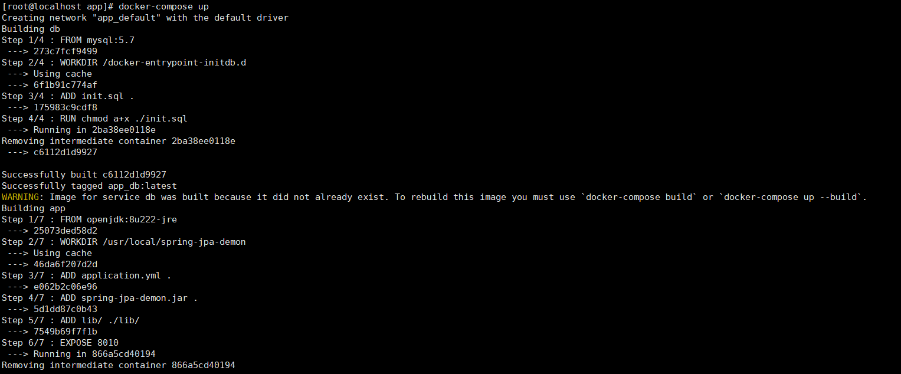

镜像创建后关联容器，启动容器

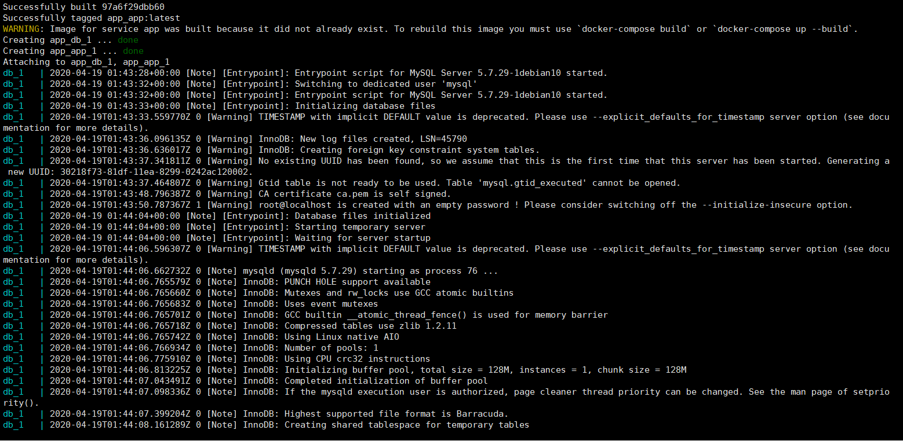

启动app

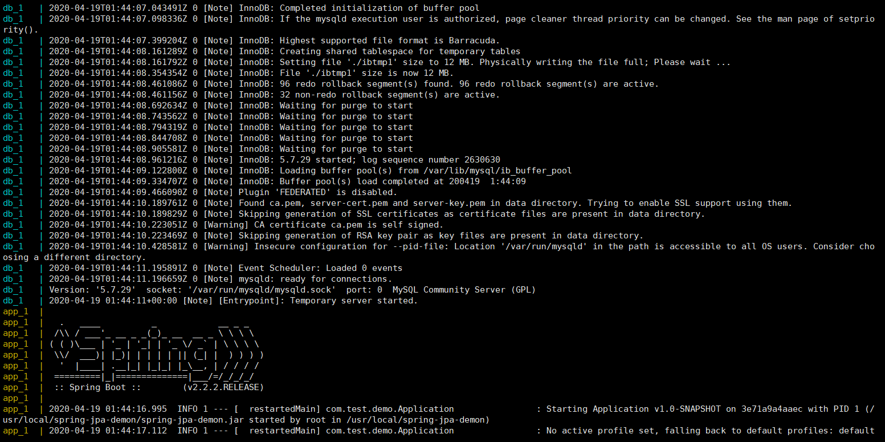

但是启动应用的过程中报错了，无法和数据库建立连接（这里是因为应用的application.yml中和数据库连接的参数没有修改，无法和mysql建立连接，后面步骤修正）

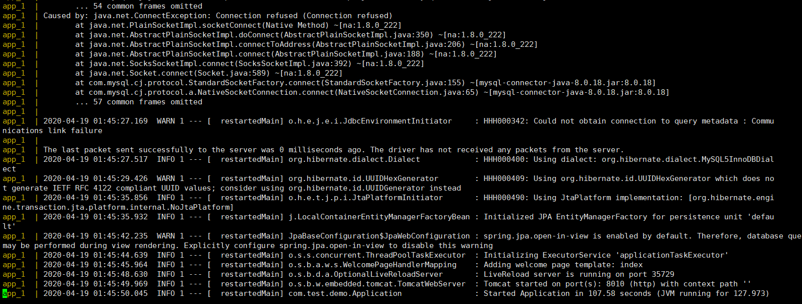

注:**因为**docker-compose up 默认在前台运行，如果在执行过程中按ctl+z或关闭会话，进程就会结束，可以使用-d参数来让命令在后台执行，即**docker-compose up -d** 

打开另一个会话，docker ps查看运行容器,可以看到容器是正在运行的

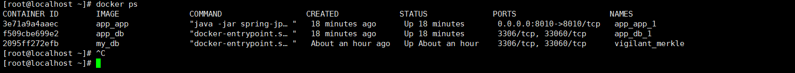

在浏览器输入虚拟机地址访问 <http://192.168.22.128:8010/>，访问主页能成功，但是查看用户，由于需要连接数据库所以会报错。


####  docker-compose down 停止应用

```
docker-compose down
```

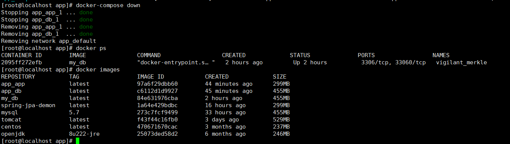

可以看到docker-compose down执行后会先停止容器，然后再移除，使用docker ps查看运行容器时容器已移除，但是镜像未移除。

#### 解决无法连接数据库的问题

修改application.yml文件中的数据库连接地址,因为外部无法和容器内部建立连接，所以将原有的localhost替换为docker-compose中定义的数据库服务名db，保存后重新执行。

```
   url: jdbc:mysql://db:3306/test?useUnicode=true&characterEncoding=UTF-8&zeroDateTimeBehavior=convertToNull&allowMultiQueries=true&useSSL=false
```

```
[root@localhost spring-jpa-demon]# vi application.yml 
[root@localhost spring-jpa-demon]# cat application.yml 
server:
  port: 8010
  servlet:
    context-path: /
spring:
  thymeleaf:
    cache: false
  datasource:
    driver-class-name: com.mysql.jdbc.Driver
    url: jdbc:mysql://db:3306/test?useUnicode=true&characterEncoding=UTF-8&zeroDateTimeBehavior=convertToNull&allowMultiQueries=true&useSSL=false
    username: root
    password: 123456
  jpa:
    database: MySQL
    database-platform: org.hibernate.dialect.MySQL5InnoDBDialect
    show-sql: true
    hibernate:
      ddl-auto: none
[root@localhost spring-jpa-demon]#
```

使用docker images查看镜像，然后docker rmi 命令把原有镜像删除重新构建（这一步可不执行，不执行时docker-compose up -d会直接启动容器，不会重新构建容器）

```
docker rmi -f 容器id
```

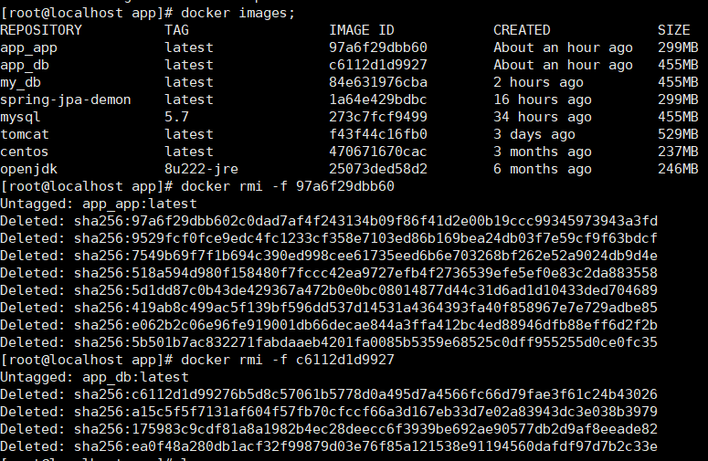

重新执行

```
docker-compose up -d
```

执行过程如下，由于删除了镜像，这一步会创建并运行容器

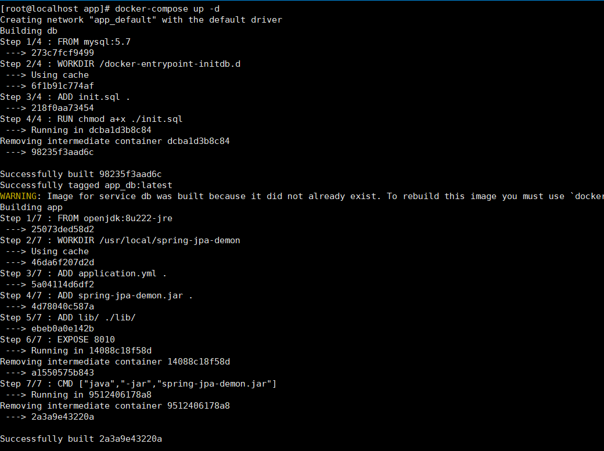

docker-compose logs查看日志

```
docker-compose logs
```

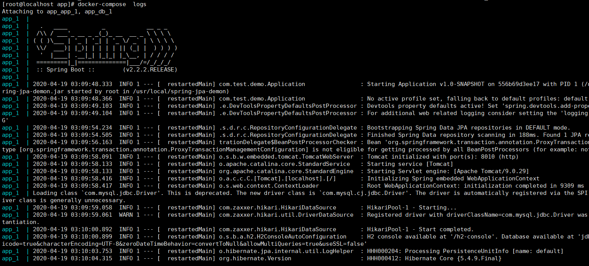

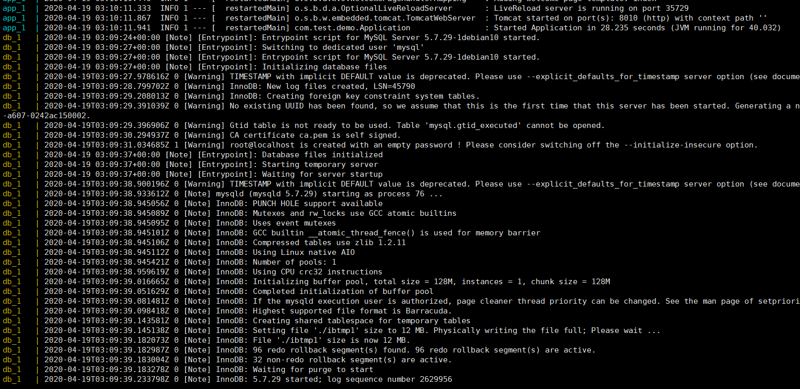

docker-compose logs 会将两个服务的日志都进行输出，如果想看某个服务的日志，可以加上服务名,这个服务名是在docker-compose中定义的服务名，如本例中的app和db

```
docker-compose logs app
```

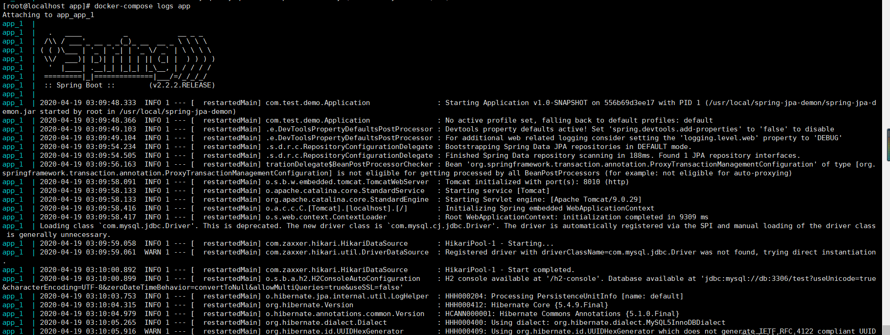

也可以查看容器日志

```
docker logs 容器id或容器名称
```

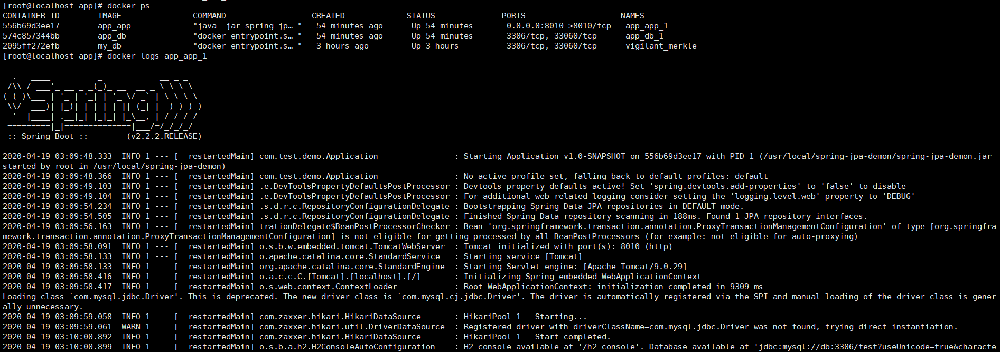

容器已正常启动，此时访问网页

点击查看用户，已经能从从数据库查询数据显示

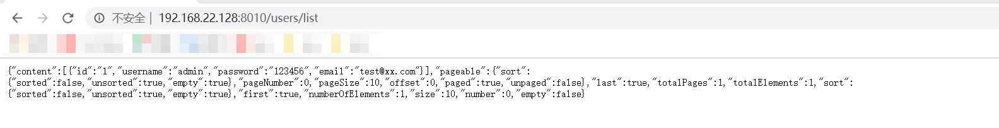


