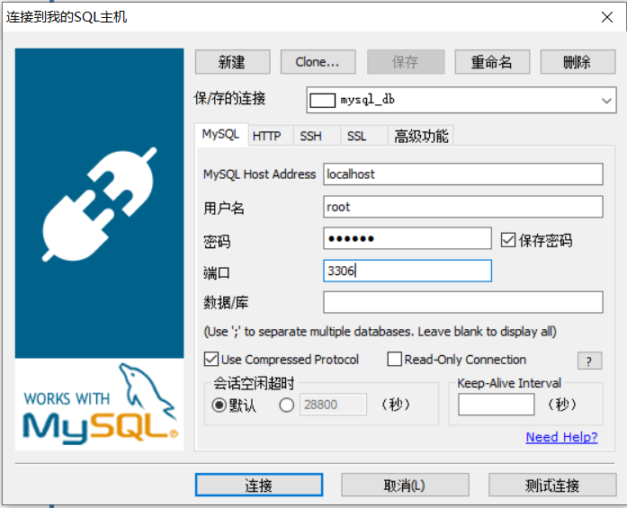
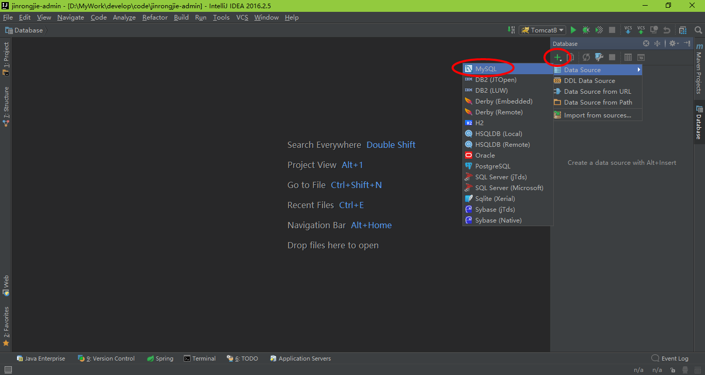
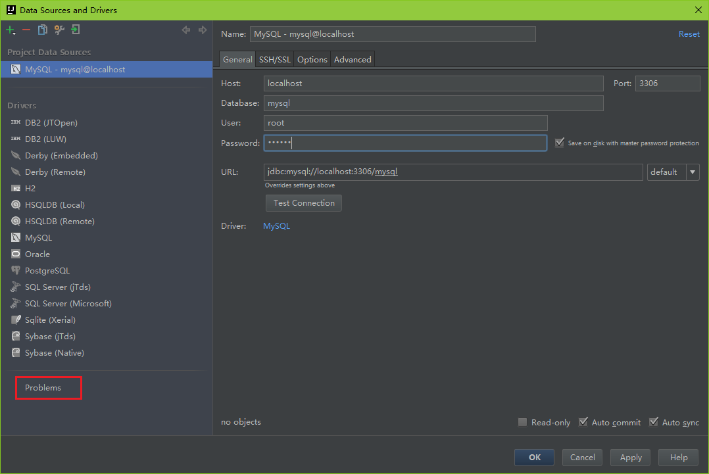
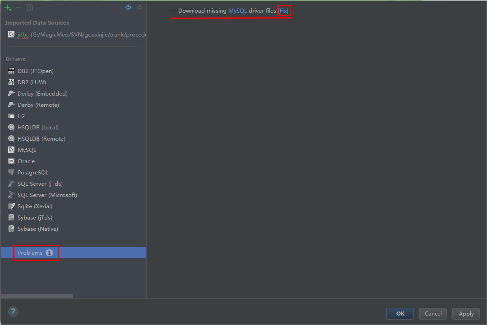
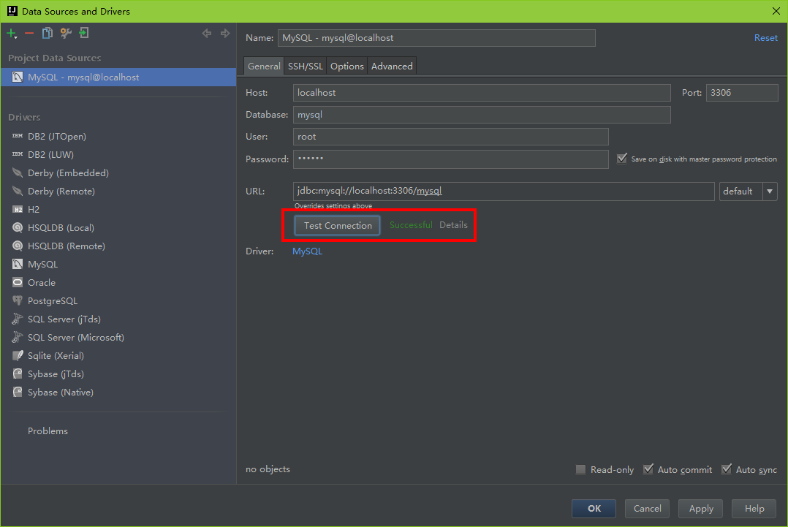

#windows中使用Docker安装mysql，并使用客户连接到mysql

1.使用**docker run --name mysql_db -p 3306:3306 -e MYSQL_ROOT_PASSWORD=123456 -d mysql**
在windows中安装mysql，并运行
```text
C:\Users\maomao>docker run --name mysql_db -p 3306:3306 -e MYSQL_ROOT_PASSWORD=123456 -d mysql
Unable to find image 'mysql:latest' locally
latest: Pulling from library/mysql
bf5952930446: Pull complete                                                                                             8254623a9871: Pull complete                                                                                             938e3e06dac4: Pull complete                                                                                             ea28ebf28884: Pull complete                                                                                             f3cef38785c2: Pull complete                                                                                             894f9792565a: Pull complete                                                                                             1d8a57523420: Pull complete                                                                                             6c676912929f: Pull complete                                                                                             ff39fdb566b4: Pull complete                                                                                             fff872988aba: Pull complete                                                                                             4d34e365ae68: Pull complete                                                                                             7886ee20621e: Pull complete                                                                                             Digest: sha256:c358e72e100ab493a0304bda35e6f239db2ec8c9bb836d8a427ac34307d074ed
Status: Downloaded newer image for mysql:latest
1ecf0e808ed8b0ec9f2068528280598b6e246797d2b82f96cbc2e69f3ff84ae0
```

--name: 指定mysql容器的名称
-p: 容器内mysql启动端口和宿主机端口哦映射
-e MYSQL_ROOT_PASSWORD=xx： 设置root用户的初始密码
-d：后台运行
mysql： 安装的mysql，不指定tag时拉取最新的版本（mysql:tag）


2.使用docker ps 查看容器镜像
```text
C:\Users\maomao>docker ps
CONTAINER ID        IMAGE               COMMAND                  CREATED             STATUS              PORTS                               NAMES
1ecf0e808ed8        mysql               "docker-entrypoint.s…"   7 seconds ago       Up 6 seconds        0.0.0.0:3306->3306/tcp, 33060/tcp   mysql_db
```

3.**docker exec -it mysql_db bash**进入mysql内部

4.**mysql -u用户名 -p密码**并使用root用户登录mysql数据库
```text
C:\Users\maomao>docker exec -it mysql_db bash
root@1ecf0e808ed8:/# mysql -uroot -p123456
mysql: [Warning] Using a password on the command line interface can be insecure.
Welcome to the MySQL monitor.  Commands end with ; or \g.
Your MySQL connection id is 8
Server version: 8.0.21 MySQL Community Server - GPL

Copyright (c) 2000, 2020, Oracle and/or its affiliates. All rights reserved.

Oracle is a registered trademark of Oracle Corporation and/or its
affiliates. Other names may be trademarks of their respective
owners.

Type 'help;' or '\h' for help. Type '\c' to clear the current input statement.

mysql>
```

可以通过mysql看到现在按住哪个的mysql版本是8.0.21

5.执行一下sql解决客户端无法连接到数据库的问题
** ALTER USER 'root'@'%' IDENTIFIED WITH mysql_native_password BY '密码';** 
```
mysql> ALTER USER 'root'@'%' IDENTIFIED WITH mysql_native_password BY '123456';
Query OK, 0 rows affected (0.01 sec)

mysql>
```
mysql8.0 引入了新特性 caching_sha2_password；这种密码加密方式客户端不支持；客户端支持的是mysql_native_password 这种加密方式；所以设置mysql_native_password的密码用来给客户端进行登录。
以上就是解决sqlyog等客户端无法登录虚拟机远程数据库的解决方式。

6.使用客户端连接到mysql


# idea使用Database连接到mysql

step1：先从菜单View→Tool Windows→Database打开数据库工具窗口，如下图所示：


step2：点击Database工具窗口左上角添加按钮“+”，选择数据库类型，这里以MySQL为例，如下图所示：


step3：填写数据库连接的主机名、数据库名、用户名和密码，如下图所示：


step4：点击Test Connection按钮进行测试数据库连接是否正常（可能有人会说按钮点击不了，解决办法：点击上一步中的“problems”,然后里面有个“fix”点击进行下载修复就可以了）

 
step5: 正常连接

