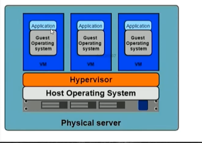
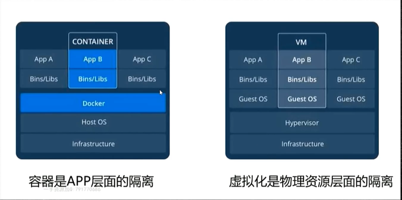
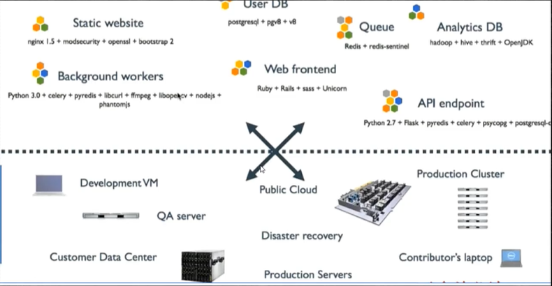

# Docker

Docker的原理与执行命令

Docker-Compose快速部署Docker应用

Kubernetes(k8s)的安装和使用

## 容器化技术介绍

应用的部署演化分为3个阶段

物理机时代==》虚拟机时代==》容器化时代

###  物理机时代

  最早的程序部署形式，在单台物理机完成一系列应用程序的的部署安装，运行维护。

 缺点是

 ** 部署慢（在安装物理机时要对主机进行存放，运行tomcat，必须安装jvm等）

** 成本高 （一个外网的应用服务器，进行采购价格都很高）

** 资源浪费 (资源不平衡，比如一个应用是计算密集型的，那么对cpu的要求很高，对内存磁盘资源要求不高，这样闲置的内存和磁盘无法被其他应用使用)

** 难以扩展和迁移（要进行横向扩展，比如要进行win到linux平台的应用迁移，难以扩展）

** 受限于硬件：比如早期的solaris有自己的硬件配置，在sloris上开发的应用很难直接在window上使用，虽然JVM技术出现后，受制于硬件的情况减少了，但是JVM也有自己的局限性，要解决受制于硬件的问题，需要搭建立一套统一的标准，但是硬件依然很难解决。

### 虚拟化时代

在一台物理主机上通过硬件底层的虚拟化支持，虚拟出来很多个虚拟机，每个虚拟机都是一台独立的电脑，每个虚拟机都有自己独立的硬件，如cup，内存，硬盘，还有对应的操作系统，可以直接操作系统上安装软件。虚拟化技术出现，让主机资源可以得到充分的应用。桌面及应用，可以VMWare来创建运行Centos，Ubuntu这样的操作系统。

虚拟化的特点:

** 多部署: 在一台物理主机上可以创建多个虚拟机，每个虚拟机之间都有自己独立的资源，彼此独立，互不影响。

** 资源池: 虚拟化技术可以将主机的硬件资源看成一个池子。当前的物理机有自己的物理硬件，在硬件资源上有自己的操作系统，在操作系统上有一个组件Hypervisor,这个组件可看称是虚拟机和主机操作系统之前的桥梁，它可以对虚拟机资源进行分配，并对虚拟机进行管理。VMWAre就是典型的使用Hypervisor实现的一个产品。VMWare启动后Hypervisor,就会对主机上的所有资源进行统计，当创建新的虚拟机时，由Hypervisor为它分配资源。

** 资源隔离: 当Hypervisor为这个虚拟机分配了资源后，这个资源就是这个虚拟机独享的，其他的资源不会去抢占

** 很容易扩展: 当虚拟机的内存不够时，Hypervisor直接从资源池里直接分配就行。

但是，虚拟机也有自己的问题

VM需要安装操作系统： 比如一个很小的应用，可能只需要一个几百k的内存就行，但是为了支撑这个应用，需要安装操作系统，但是操作系统占用测内存和硬件资源比这个应用多得多，在操作系统层面也浪费了很多资源。

### 容器化时代

于是，在虚拟化的概念基础上，剥离操作系统，只安装应用程序，减少资源的浪费，就出现了容器化技术

​    右侧虚拟机中需要安装Guest Os（客户操作系统）才能构建应用，左侧容器化技术，Docker是容器化技术最典型的代表产品，应用直接通过Docker的沙箱机制构建在主操作系统上，应用程序的部署速度和占用资源都小得多。容器化技术比虚拟机更灵活，更小。

​    现在一般是虚拟化技术和容器化技术结合使用，因为它们解决的问题不同，虚拟机更多是物理资源层面的隔离，如分配多少内存等，而容器是App层面的隔离，底层的硬件资源是共享的。

### 容器化解决的问题

​    如上图，线上是开发人员所使用的技术和环境，如api节点，分析数据库，队列，用户数据库，静态网站等，下面是运维人员使用的环境，如服务器，各种中间间等。开发人员在开发完后，准备上线，需要将应用打包，数据库导出数据，各种配置文件整理后给运维，运维根据安装文档在各节点进行安装部署。假设有一个参数配置出错，都是导致整体的应用部署失败。

​    如果开发人员将所有内容和资源都打包成一个文件，运维直接将文件展开后就可以轻松部署，那就可以使用容器化技术了。容器化技术可以提供标准化的应用部署方案，通过容器编排工具可以自动将容器发布到集群各个节点上，自动运行，真正做到一间发布，容器编排工具还可以提供管理功能，当其中一个节点失败了，可以直接进行重新发布，减少运维人工成本。它不仅是一个技术的变化，还有软件开发流程中的一个根本性变化。

​       标准化的应用打包如何做到的?

容器是一个文件，也是一种标准化的部署方式，针对这个容器，它要做的事就是将所有软件运行的资源，比如数据库，队列信息等都放入容器中，运行这个程序的底层硬件资源也放入其中，也就是容器中包含了所有运行的必要条件，只要将这个容器在部署服务器直接展开就能运行。

### 容器化技术的应用场景

* 标准化的迁移方式 : 开发直接打包，运维直接展开使用

* 统一的参数配置: 与应用程序相关的参数配置，在开发打包时就已配置

* 自动化部署: 镜像还原过程自动完成

* 应用集群监控: Docker和K8s都有监控的职能呢个，可以及时监控应用的运行状况。

* 开发与运维之间的沟通桥梁

  ​

### 阿里和腾讯云的容器化技术

阿里和腾讯云采用的的是虚拟机+容器化的实现。

如果阿里云购买的es服务器，本质是一台虚拟机，在虚拟机内可以根据不同的应用安装不同的容器，如需使用mysql数据库，那么就安装Mysql的容器。

## Docker介绍

* Dokcer是开源的应用容器引擎，基于Go语言开发

* 容器完成使用沙箱机制，容器开销低。即系统的资源利用率是很高的

* Docker就是容器化技术的代名词

* Doker也具有一定的虚拟化职能。利用docker不仅可以创建容器，还可以向本地的物理机申请相应的资源。方便程序的迁移和扩展。

* 最主要的作用是提供了标准化的应用打包。它提供了一个镜像文件，其中包含了所有的资源，如数据库，队列，web应用服务器等，同时也包含了运行这些程序所需要的硬件上的资源，如需要多大的内存等。

  ​

  Docker的发展历史

  

​      容器化技术最早在2014年提出，在Solaris系统中提供了容器化技术。2008年Linux也提供了容器化的支持，代号为LXC1.0，是docker的前身。在2013年Docker的创始人Solomon Hykes开始在项目中使用Dcoker，同年进行了开源。2016年进行版本变更，拆分为ee（社区版，免费）和ce（企业版，收费）两个子版本。直到今天Docker成为了容器化技术的代名词。

​       Docker的官网了解详细:    <https://www.docker.com/>

​      Docker的官方文档:  <https://docs.docker.com/> 

## Docker安装

Linux系统Centos中安装

​    Docker v 19.03在Centos中的安装官网  https://docs.docker.com/install/linux/docker-ce/cento

Docker基本概念

Docker 服务器(docker daemon),REST API,客户端

Docker服务器种有一个进程docker daemon，

容器与镜像

镜像: 镜像是文件，是只读的，提供了运行程序完整的软硬件资源，是应用程序的“集装箱”，是静态资源

容器:是镜像的实例，由Docker负责创建，容器之间彼此隔离，是动态资源。

Docker执行流程

Docker客户端向Docker服务端发送命令，Docker服务端分三部分，Docker Daemon(守护进程），由守护进程来管理镜像（images）和容器（Containers），还包含一个注册中心，也称远程仓库，用来存储镜像文件。

举例:docker快速部署一个redis的过程:

客户端发送一个docker pull的命令，Docker Daemon接受到命令后会从本地仓库(主机Images)种寻找是否有redis的镜像文件，若没有，Docker Daemon会从远程仓库中下载镜像文件到本地Images中。Docker Pull命令下载的镜像文件是只读的，相当于一个安装文件，如果需要运行，客户端发送Docker run命令，Daemon接受到命令后，本地若有镜像，会创建对应的容器并且启动服务。

## Docker常用命令

* docker pull 镜像名<:tags>: 从远程仓库抽取镜像 tags是镜像的版本，若没有填写，会下载最新版

* docker images : 查看本地镜像

* docker run 镜像名<:tags>:创建容器，启动应用。若本地镜像还没有抽取远程仓库抽取，那么会先从远程仓库抽取镜像，然后再运行，启动应用。

   -d:  应用在后台运行

  -p 宿主机端口:镜像应用端口 : 对宿主机和容器端口进行映射

* docker ps：查看正在运行中的镜像

* docker rm <-f> 容器id: 删除指定容器，若当前容器还在运行，可以使用 -f 强制删除

* docker rmi  <-f> 镜像名:<tags>： 删除指定版本的镜像，-f强制删除，即使镜像有对应的容器也会被强制删除

<https://hub.docker.com/>        保存了已知的所有镜像仓库，可以直接从这里搜索并下载镜像Docker部署

Docker 部署Tomacat

docker    pull 

docker 

在容器中执行命令:

格式: docker exec [-it] 容器id: exec : 在对应的容器中执行命令; -it: 采用交互方式执行命令

实例： docker exec -it  容器id  /bin/bash

