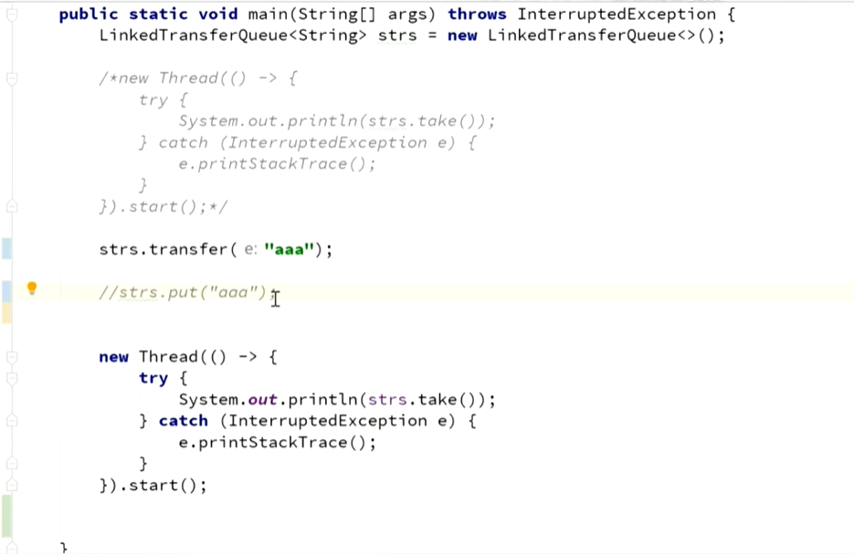
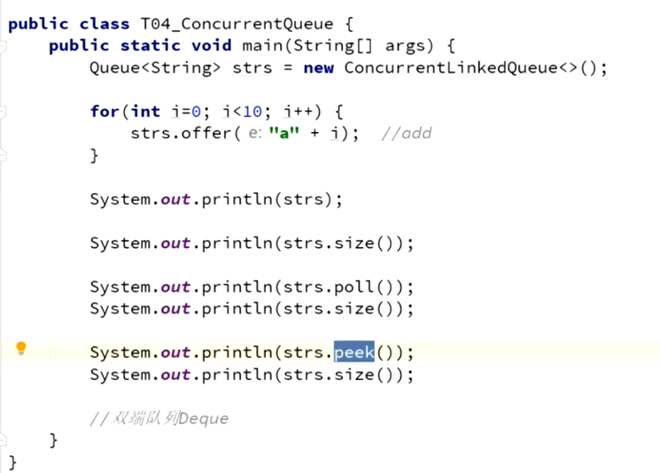

## 容器

发展历程:

Map的发展过程
HashTable=>HashMap=>Collects.synchronized(HashMap)=>ConcurrentHashMap
ConcurrentSkipListMap 

java1.0版本的容器有Vector和HashTable，都是自带锁的。
后来设计了HashMap，但是HashMap没有加锁(synchronized),所以提供了Collects.synchronized 方法可以给HashMap加锁(加了一个对象，对HashMap的方法加了对这个对象的锁)，后来提供了ConcurrentHashMap，它的读效率会高一些。

### ConcurrentSkipListMap:

跳表，高并发并且排序，在ConcurrentHashMap的基础上对关键元素加了索引，提高了查找元素的消息。同时使用使用CAS，比TreeMap加锁容易。

### SynchronizedArrayList：

### CopyOnWriteArrayList:

写时复制，需要往list里面面添加元素时，写的时候在原来的基础上copy一份出来，并添加一个位置，加入元素后将原有的引用指向它。写的时候需要加锁，读的时候不加锁。适用于写很多，读很少的操作。对比SynchronizedList加锁，读写都有锁

### SynchronusQueue：

### BlockingQueque: 

阻塞队列，提供一些方法，可以对队列阻塞，有一下几种实现：
LinkedBlockingQueue: 无界阻塞队列，put和get方法添加或者获取元素。put如果满了会阻塞住，get元素为空会阻塞。天然的实现了生产者消费者模型。
AyyayBlockingQueque: 有界阻塞队列。如果满了，put满了就是等待，程序阻塞。和LinkedBlockingQueue不同的是可以提供了在多线程情况下友好的api，peek，add，poll，offer等方法
DelayQueue: 是时间排序的队列，队列中的任务需要实现Delayed接口，实现compareTo方法定义排序方法.一般用于按时间进行任务调度。
  PriorityQueue: 优先级队列，内部会使用二叉树排列。
SynchronousQueue: 同步Queue。给线程传递任务，容量为0。只能用于put阻塞调用。两个线程，一个take取，一个put放，一个线程给另一个线程任务。
TransferQueue: 传递Queue。几种Queue的组合，也可用于传递任务。添加了tranfer方法,和put的区别是来一个就阻塞等线程取走然后继续执行，put是装满才阻塞。一般用于等待结果完成才能继续执行。

#### LinkedBlockingQueue的使用

#### ArrayBlockingQueue的使用

#### DelayQueue的使用

####  PriorityQueue的使用

#### SynchronusQueue.png

TransferQueue.png

多线程的Queue
ConcurrentLinkedQueue
offer():添加元素，添加元素成功返回true，添加失败返回false，和add()添加失败会抛异常
peek(): 取元素但是不会remove
poll()： 取元素并remove

