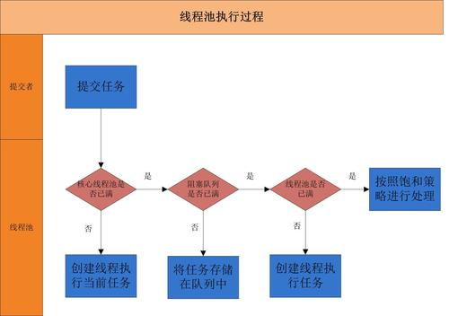
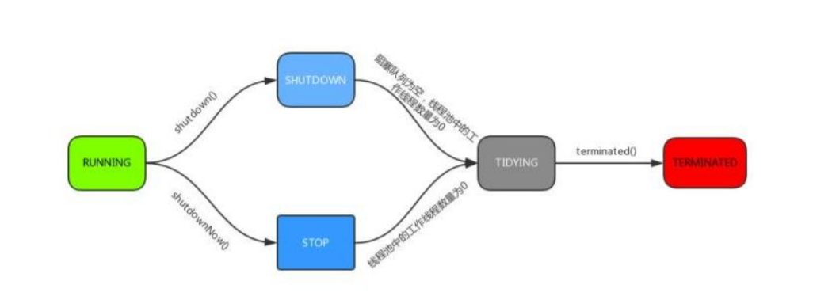

# 线程池
## 为什么需要线程池
在实际使用中，线程是很占用系统资源的，如果对线程管理不善很容易导致系统问题。因此，在大多数并发框架中都会使用线程池来管理线程。
使用线程池管理线程有如下好处:
* 1、使用线程池可以重复利用已有的线程继续执行任务，避免线程在创建和销毁时造成的消耗

* 2、由于没有线程创建和销毁时的消耗，可以提高系统的响应速度

* 3、通过线程可以对线程进行合理的管理，根据系统的承受能力调整可运行的线程数量的大小等。

  ​

## 线程池的工作原理


​          

线程池执行所提交的任务过程：

* 1、先判断线程池中核心线程池所有的线程是否都在执行任务。
  如果不是，则新创建一个线程执行刚提交的任务，
  否则，核心线程池中所有的线程都在执行任务，则进入第2步；

* 2、判断当前阻塞队列是否已满，如果未满，则将提交的任务放
  置在阻塞队列中；否则，则进入第3步；

* 3、判断线程池中所有的线程（最大线程数）是否都在执行任务，如果没有，则
  创建一个新的线程来执行任务，否则，则交给饱和策略进行处理。


### 线程池的分类


线程池的体系结构：

java.util.concurrent.Executor 负责线程的使用和调度的根接口

​                 |--ExecutorService子接口： 线程池的主要接口

​                                   |--ThreadPoolExecutor线程池的实现类

​                                   |--ScheduledExceutorService子接口： 负责线程的调度

​                                            |--ScheduledThreadPoolExecutor: 继承ThreadPoolExecutor，实现了ScheduledExecutorService


Executor提供了异步任务的策略分为两种:ForkJoinPool,ThreadPool

| **线程池**              | **描述**                                   |
| -------------------- | ---------------------------------------- |
| thread-pool-executor | 有一个工作队列，队列中包含了分配给各个队列的工作，线程空闲时就从队列中认领工作，允许线程重用，减少线程分配和销毁的开销 |
| fork-join-executor   | 使用一种分治算法，递归地将任务分隔为更小地子任务，然后把子任务分配给不同地线程运行，最后将运行结果组合起来。当某线程的任务队列没有任务时，会主动从其它线程的队列中获取任务，fork-join性能更佳，Akka的默认选项 |


####   newCachedThreadPool

创建了一个根据需要创建新线程的线程池,但是在以前构造的线程可用时会重用。并在需要时使用提供的ThreadFactory 创建新线程
这些池通常会提高程序的性能,适用于短暂的异步任务执行（执行时间比较短的任务）。

  newCachedThreadPool特点
  1.线程池中数量没有固定，可达到最大值 Integer.MAX_VALUE
  2.线程池中的线程可进行缓存重复利用并回收（回收时间默认为1分钟）
  3.当线程池中，没有可用线程，会创建一个线程

```
 public static ExecutorService newCachedThreadPool() {
        return new ThreadPoolExecutor(0, Integer.MAX_VALUE,
                                      60L, TimeUnit.SECONDS,
                                      new SynchronousQueue<Runnable>());
    }
  
  //使用ThreadFactory 创建新线程
  public static ExecutorService newCachedThreadPool(ThreadFactory threadFactory) {
        return new ThreadPoolExecutor(0, Integer.MAX_VALUE,
                                      60L, TimeUnit.SECONDS,
                                      new SynchronousQueue<Runnable>(),
                                      threadFactory);
    }   
```


   ####   newFixedThreadPool

创建一个可重用固定线程数的线程池，以共享的无界队列方式来运行这些线程。在任意点，在大多数nThread 线程
会处于处理任务的活动状态。如果在所有的线程处于活动状态时提交附加任务，在有可用线程之前，附加任务将在队列中等待。
如果在关闭前的执行期间由于失败而导致任何线程终止，那么一个新线程将代替它执行后续的任务。在某个线程被显示关闭之前，池中的线程将一直存在
1.线程池中的线程处于一定的量，可以很好的控制线程的并发量
2.线程可以重复被使用，在显示关闭之前，将一直存在
3.超出一定量的线程被提交时需要在队列中等待

```
    public static ExecutorService newFixedThreadPool(int nThreads) {
        return new ThreadPoolExecutor(nThreads, nThreads,
                                      0L, TimeUnit.MILLISECONDS,
                                      new LinkedBlockingQueue<Runnable>());
    }
```


####  newSingleThreadExecutor

创建一个使用单个worker线程的Executor，以无界队列方式来运行该线程
（注意： 如果因为在关闭前的执行期间出现失败而终止了了单个线程，那么如果需要，一个新线程将代替它执行后续任务）
可保证顺序地执行各个任务，并且在任意给定的时间不会有多个线程是活动的。
特点:
1.线程池中最多一个线程，之后提交的线程活动将会排列在队列中等待执行

```
  public static ExecutorService newSingleThreadExecutor() {
        return new FinalizableDelegatedExecutorService
            (new ThreadPoolExecutor(1, 1,
                                    0L, TimeUnit.MILLISECONDS,
                                    new LinkedBlockingQueue<Runnable>()));
    }
```


####  newScheduledThreadPool

创建一个线程池，它可以安排在给定延迟后运行命令或者定时执行
特点:
1.线程池中具有数量的线程，即使是空线程将保留
2.可定时或延迟执行线程活动

```
    public static ScheduledExecutorService newScheduledThreadPool(int corePoolSize) {
        return new ScheduledThreadPoolExecutor(corePoolSize);
    }

    public static ScheduledExecutorService newScheduledThreadPool(
            int corePoolSize, ThreadFactory threadFactory) {
        return new ScheduledThreadPoolExecutor(corePoolSize, threadFactory);
    }
```


####  newSingleThreadScheduledExecutor

创建一个单执行线程执行程序，它可安排在给定延迟后运行命令或定期地执行
特点:
1.线程池中最多执行1个线程，之后提交的线程活动将会排在队列中等待执行
2.可定时或延迟执行线程活动

```
  public static ScheduledExecutorService newSingleThreadScheduledExecutor() {
        return new DelegatedScheduledExecutorService
            (new ScheduledThreadPoolExecutor(1));
    }
    
    
  public static ScheduledExecutorService newSingleThreadScheduledExecutor(ThreadFactory threadFactory) {
        return new DelegatedScheduledExecutorService
            (new ScheduledThreadPoolExecutor(1, threadFactory));
    }    
```


####  ForkJoinPool

创建一个带有并行级别的线程池，并行级别决定了同一时刻最多有多少个线程在执行，如不传并行参数，默认为cup个数


### 线程池的生命周期

▪ RUNNING ：能接受新提交的任务，并且也能处理阻塞队列中的任务；

▪ SHUTDOWN：关闭状态，不再接受新提交的任务，但却可以继续处理阻
塞队列中已保存的任务。
▪ STOP：不能接受新任务，也不处理队列中的任务，会中断正在处理任务的
线程。
▪ TIDYING：如果所有的任务都已终止了，workerCount (有效线程数) 为0，
线程池进入该状态后会调用 terminated() 方法进入TERMINATED 状态。
▪ TERMINATED：在terminated() 方法执行完后进入该状态，默认terminated()方法中什么也没有做。





### 线程池的创建

```
    public ThreadPoolExecutor(int corePoolSize,
                              int maximumPoolSize,
                              long keepAliveTime,
                              TimeUnit unit,
                              BlockingQueue<Runnable> workQueue,
                              ThreadFactory threadFactory,
                              RejectedExecutionHandler handler) {
        if (corePoolSize < 0 ||
            maximumPoolSize <= 0 ||
            maximumPoolSize < corePoolSize ||
            keepAliveTime < 0)
            throw new IllegalArgumentException();
        if (workQueue == null || threadFactory == null || handler == null)
            throw new NullPointerException();
        this.corePoolSize = corePoolSize;
        this.maximumPoolSize = maximumPoolSize;
        this.workQueue = workQueue;
        this.keepAliveTime = unit.toNanos(keepAliveTime);
        this.threadFactory = threadFactory;
        this.handler = handler;
    }
```

参数说明:

* corePoolSize：核心线程池的大小
* maximumPoolSize：线程池能创建线程的最大个数
* keepAliveTime：空闲线程存活时间
* unit：时间单位，为keepAliveTime指定时间单位
* workQueue：阻塞队列，用于保存任务的阻塞队列
* threadFactory：创建线程的工程类
* handler：饱和策略（拒绝策略）


### 阻塞队列

* ArrayBlockingQueue

* LinkedBlockingQueue

* DelayQueue

* PriorityBlockingQueue

* SynchronousQueue

  

  ​

### 饱和策略（拒绝策略）

- ThreadPoolExecutor.AbortPolicy:丢弃任务并抛出RejectedExecutionException异常。


- ThreadPoolExecutor.DiscardPolicy：也是丢弃任务，但是不抛出异常。


- ThreadPoolExecutor.DiscardOldestPolicy：丢弃队列最前面的任务，然后重新尝试执行任务（重复此过程）


- ThreadPoolExecutor.CallerRunsPolicy：由调用线程处理该任务

  ​

### execute方法的执行逻辑

如果当前运行的线程少于corePoolSize，则会创建新的线程来执
行新的任务；
▪ 如果运行的线程个数等于或者大于corePoolSize，则会将提交的
任务存放到阻塞队列workQueue中；
▪ 如果当前workQueue队列已满的话，则会创建新的线程来执行
任务；
▪ 如果线程个数已经超过了maximumPoolSize，则会使用饱和策
略RejectedExecutionHandler来进行处理。


###  Executor和Submit

submit是基方法Executor.execute(Runnable)的延伸，通过创建并返回一个Future类对象可用于取消执行和/或等待完成。


### 线程池的关闭

关闭线程池，可以通过shutdown和shutdownNow两个方法
▪ 原理：遍历线程池中的所有线程，然后依次中断
▪ 1、shutdownNow首先将线程池的状态设置为STOP,然后尝试停
止所有的正在执行和未执行任务的线程，并返回等待执行任务的
列表；
▪ 2、shutdown只是将线程池的状态设置为SHUTDOWN状态，然
后中断所有没有正在执行任务的线程

