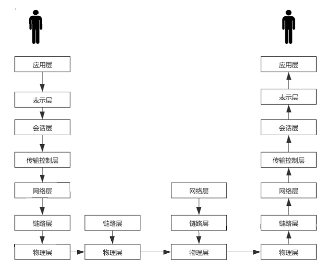
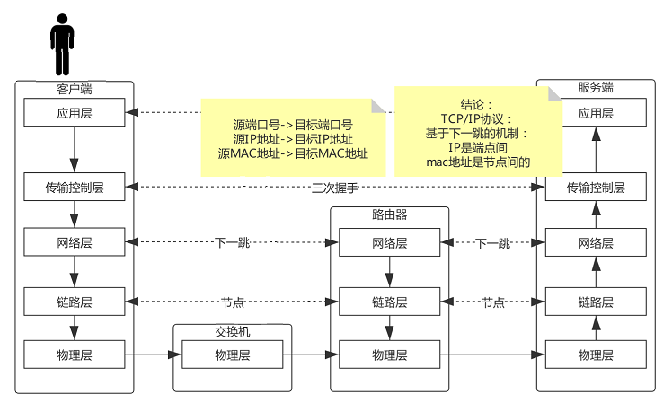
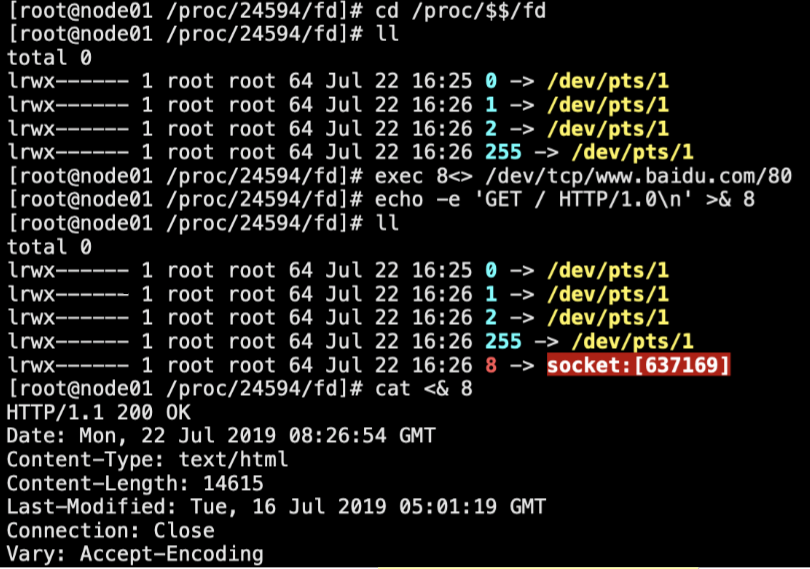
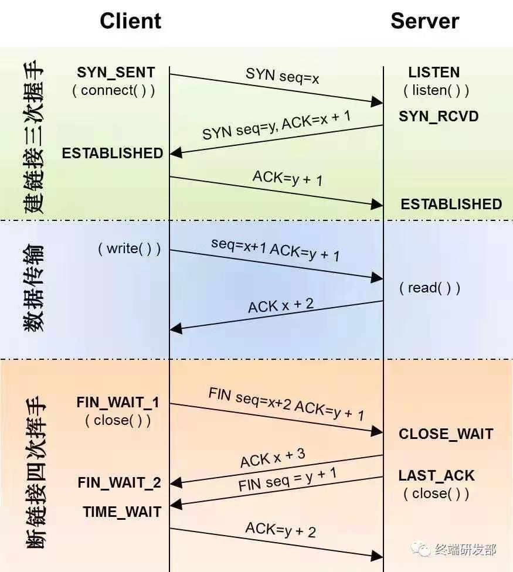
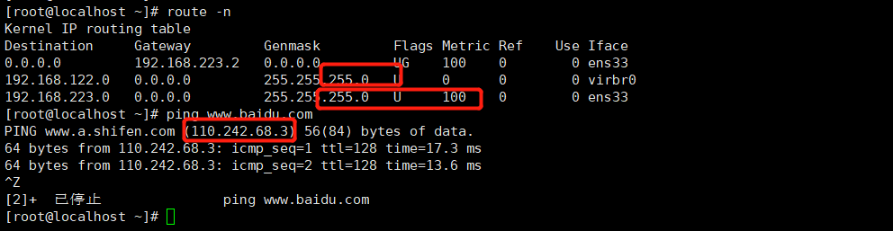
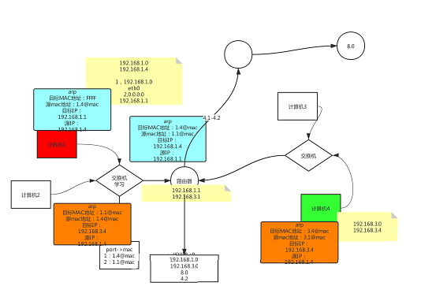

## OSI参考模型


表示层和会话层合并到应用层


### 应用层:
Linux应用层协议的一个演示：
1.cd /proc/$$/fd： $$当前解释器的进程ID，fd：文件描述符
2.使用ll命令查看，0->输入(system.in),1->输出(System.out),2->错误输出(System.err)
3.exec 8<> /dev/tcp/www.baidu.com/80    :创建一个除0，1，2之外文件描述符8，输入输出和百度建立连接
4.8 -> socket:[22856] ： 和百度建立的socket连接
5.ech0 -e 'GET / HTTP/1.0\n' >& 8 :一个应用层的HTTP请求
6.cat 0<& 8 ：查看响应
7.exec 8<& - :关闭这个连接


### 传输层：
三次握手，四次分手
https://mp.weixin.qq.com/s/qKUEFnxfysQpFt9h6pDM4A


TCP是面向连接的，无论哪一方向另一方发送数据之前，都必须先在双方之间建立一条连接。在TCP/IP协议中，TCP协议提供可靠的连接服务，连接是通过三次握手进行初始化的。三次握手的目的是同步连接双方的序列号和确认号并交换 TCP窗口大小信息。
当三次握手完成后，双方才会在内内存开辟线程，开辟对象，开辟描述符，应用层开辟资源之后，拿到io之后发送接受数据。

一台操作系统可用的端口号是65535个，端口的资源是有限的，如果数据传输关闭，需要断开连接，释放资源。
三次握手=》数据传输==》四次分手

netstat命令可查看tcp连接：
```
[root@localhost ~]# netstat -natp
Active Internet connections (servers and established)
Proto Recv-Q Send-Q Local Address           Foreign Address         State       PID/Program name    
tcp        0      0 127.0.0.1:631           0.0.0.0:*               LISTEN      1134/cupsd          
tcp        0      0 127.0.0.1:25            0.0.0.0:*               LISTEN      1243/master         
tcp        0      0 0.0.0.0:111             0.0.0.0:*               LISTEN      1/systemd           
tcp        0      0 192.168.122.1:53        0.0.0.0:*               LISTEN      1384/dnsmasq        
tcp        0      0 0.0.0.0:22              0.0.0.0:*               LISTEN      1132/sshd           
tcp        0      0 192.168.223.128:22      192.168.223.1:59900     ESTABLISHED 4916/sshd: root@pts 
tcp6       0      0 ::1:631                 :::*                    LISTEN      1134/cupsd          
tcp6       0      0 ::1:25                  :::*                    LISTEN      1243/master         
tcp6       0      0 :::111                  :::*                    LISTEN      1/systemd           
tcp6       0      0 :::22                   :::*                    LISTEN      1132/sshd           
[root@localhost ~]#
```

### 网络层:
网络层使用路由表来进行下一跳的判定 ,按位与
使用下一跳机制：每一个互联网的设备内存不需要存全网的数据，只需要存周边一步之内的数据。路由会根据路由表判定

路由表
rout -n: 查看路由
```
[root@localhost ~]# route -n
Kernel IP routing table
Destination     Gateway         Genmask         Flags Metric Ref    Use Iface
0.0.0.0         192.168.223.2   0.0.0.0         UG    100    0        0 ens33
192.168.122.0   0.0.0.0         255.255.255.0   U     0      0        0 virbr0
192.168.223.0   0.0.0.0         255.255.255.0   U     100    0        0 ens33
[root@localhost ~]# 
```
例如： ping www.baidu.com 能得到连接的ip
拿这个ip和路由表的每一个条目的子网掩码按位与运算就能找到下一跳

如下：

百度的ip地址 110.243.68.3和子网掩码255.255.255.0按位与运算得到110.243.68.0和前面目标地址192.168.223.0，192.168.122.0 都无法匹配，这两个都不是下一跳。和默认网关的子网掩码0.0.0.0按位与得到的时0.0.0.0，所以下一跳是192.168.223.2(默认网关) 

如果网关getway是0.0.0.0,那就不需要通过路由找下一条进行通信，再同一个局域网内，可直接通信，不通过路由。



```
[root@localhost ~]# route -n
Kernel IP routing table
Destination     Gateway         Genmask         Flags Metric Ref    Use Iface
0.0.0.0         192.168.223.2   0.0.0.0         UG    100    0        0 ens33
192.168.122.0   0.0.0.0         255.255.255.0   U     0      0        0 virbr0
192.168.223.0   0.0.0.0         255.255.255.0   U     100    0        0 ens33
[root@localhost ~]# ping www.baidu.com
PING www.a.shifen.com (110.242.68.3) 56(84) bytes of data.
64 bytes from 110.242.68.3: icmp_seq=1 ttl=128 time=17.3 ms
64 bytes from 110.242.68.3: icmp_seq=2 ttl=128 time=13.6 ms
^Z
[2]+  已停止               ping www.baidu.com
[root@localhost ~]# 
```


### 链路层
通过网络层找到的下一跳，找到对应的mac地址
对应arp表
arp -a:arp是一个协议，arp解释IP地址和网卡地址的映射，arp是同一个局域网内的MAC地址
```
[root@localhost ~]# arp -a
bogon (192.168.223.1) at 00:50:56:c0:00:08 [ether] on ens33
localhost (192.168.223.254) at 00:50:56:e4:79:1c [ether] on ens33
bogon (192.168.223.2) at 00:50:56:fd:57:f0 [ether] on ens33
[root@localhost ~]# 
```
上面的网关（网络层的下一跳），192.168.223.2的MAC网卡地址是00:50:56:fd:57:f0。

arp包: mac地址（网卡的硬件地址ip）+目标ip地址+目标端口

注: 网络通讯的时候，TCP/IP协议是基于下一跳的机制,IP是端点间，MAC地址是节点间的。
IP由网络号+主机号构成(ip与子网掩码按位可得到网络号)，如192.168.223.14，192.168.223是网络号，14是主机号
同一个局域网内，网关地址一定是这个网络号中的一个主机位，所以获取下一跳的地址走arp协议是走不通的。

刚开机的时候，arp是没有ip和mac的地址的映射列表，计算机1（ip:1.4）和4（ip:3.4）不在同一个局域网想通讯，计算机1会发送一个arp包，目标ip时匹配路由的ip地址（1.1），这个时候的目标mac地址是全f，这个包经过交换机，交换机如果发现这个arp包的mac地址是全F，这个包会被广播给除这个入口之外的其他计算机（计算机2和路由），计算机2发现目标ip地址不是自己地址，会将这个包丢弃
如果是匹配的目标ip（路由），会响应这个arp包，将自己的mac地址的包发回去（发回去的arp包中，目标mac地址是计算机A的mac地址，自己的原mac地址也会封装发回去，目标ip为计算机1的ip）
由于交换机有学习能力，记录端口和mac地址的学习（计算机1发数据时记录了1的端口和mac），再交易换里发给1是有记录的，直接发给计算机1，不再广播。计算机1收到数据后就再arp表中记录一条路由的ip和mac地址


​       


