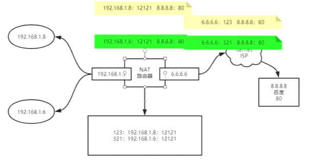
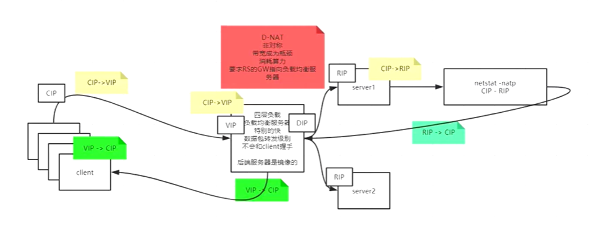
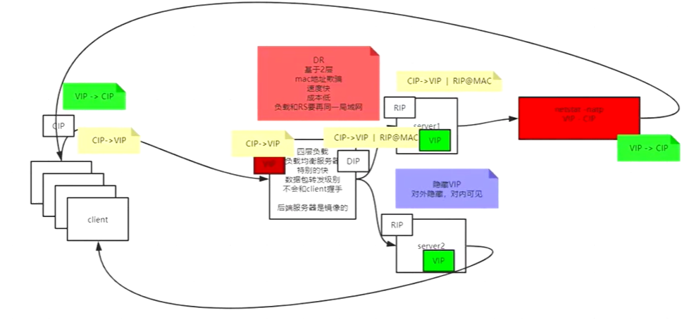
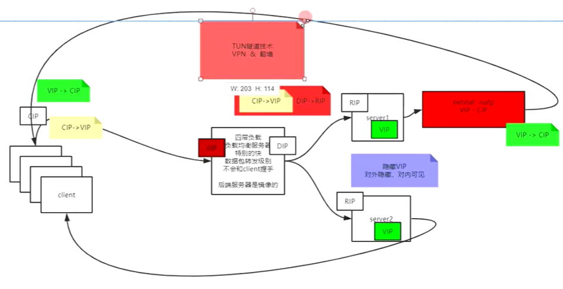

# 推导
名词解析:
1.Director服务器：直接接受用户请求的服务器，是LVS的入口
2.Real-Server:真实服务器，用于处理用户请求的服务器
3.虚拟IP(VIP):对外网暴露的IP地址，客户端可以通过VIP访问LVS集群

## 推导过程
如果同时很多个请求过来，一个tomcat同时处理不了这个多请求，那么可以扩展多个tomcat来处理请求，但是扩展多个tomcat应用，同一网络种ip地址不可能重复出现，
如果中间有个设备，能足够快速的接受过来的流量，然后转给后面的tomcat处理，就可以解决高并发问题。
tomcat慢的原因：
通信角度来说，tomcat是应用层应用，根据7层模型，传输层建立3次握手才能建立连接，然后应用层开辟资源，cpu切换状态。
并且tomcat是基于java语言开发，运行在jvm中，是在linux内核中虚拟出来的，cpu到内核再到虚拟机。
那么，想解决高并发，在网络通讯维度来看，如果这个负载均衡器只进行数据包的转发，不需要和客户端进行tcp的三次握手，那么这个速度就会快很多。这样就找到了一种解决高并发问题的解决方法。这就是四层负载均衡技术。

### NAT（Network Address Translation，网络地址转换）
是将IP 数据包头中的IP 地址转换为另一个IP 地址的过程。在实际应用中，NAT 主要用于实现私有网络访问公共网络的功能。这种通过使用少量的公有IP 地址代表较多的私有IP 地址的方式，将有助于减缓可用IP地址空间的枯竭
#### SNAT模式
Source Network Address Translation 源网络地址转换
局域网用户上网的原理(多个PC机使用ADSL路由器共享上网):

假设内网主机A（192.168.1.8）要和外网主机B（8.8.8.8:80)通信，A向B发出IP数据包，如果没有SNAT对A主机进行源地址转换，A与B主机的通讯会不正常中断，因为当路由器将内网的数据包发到公网IP后，公网IP会给你的私网IP回数据包，这时，公网IP根本就无法知道你的私网IP应该如何走了。所以问它上一级路由器，当然这是肯定的，因为从公网上根本就无法看到私网IP，因此你无法给他通信。为了实现数据包的正确发送及返回，网关必须将A的址转换为一个合法的公网地址，同时为了以后B主机能将数据包发送给A，这个合法的公网地址必须是网关的外网地址，如果是其它公网地址的话，B会把数据包发送到其它网关，而不是A主机所在的网关，A将收不到B发过来的数据包，所以内网主机要上公网就必须要有合法的公网地址，而得到这个地址的方法就是让网关进行SNAT(源地址转换），将内网地址转换成公网址(一般是网关的外部地址），所以大家经常会看到为了让内网用户上公网，我们必须在routeros的firewall中设置snat，俗称IP地址欺骗或伪装（masquerade)

SNAT是指在数据包从网卡发送出去的时候，把数据包中的源地址部分替换为指定的IP，这样，接收方就认为数据包的来源是被替换的那个IP的主机

#### DNAT模型
Destination Network Address Translation)：目标地址转换
有个web服务器放在内网，配置内网ip，前端有个防火墙，配置公网ip，互联网上的访问者使用公网ip来访问这个网站。当访问的时候，客户端发出一个数据包，这个数据包的报头里边，目标地址写的是防火墙的公网ip。防火墙会把这个数据包的报头改写一次，将目标地址改写成web服务器的内网ip，
然后再把这个数据包发送到内网的web服务器上这样，数据包就穿透了防火墙，并从公网ip变成了一个对内网地址的访问了，即DNAT，基于目标的网络地址转换 。

D-NAT模式推导

请求: CIP->VIP,经过DR(director)修改目标地址，CIP->RIP
响应: RIP->CIP,经过DR修改源目标地址，VIP->CIP
Real-server的网关GW必须指向负载均衡服务器

#### DR模型
直接路由模型
在DNAT模式中,请求和响应都需要经过Director，如果响应可以直接给client，那么就可以更快。如何让实现RS直接给client响应呢？请求时CIP->VIP，响应时也应该是VIP->CIP,张扬客户端才能解析这个数据包，如果Real-server中可以有一个VIP，这个VIP仅对内可见，对外隐藏，对外只有Director暴漏的VIP可见，就可以实现。
那Clinet给VIP的数据包怎么给Real-server，Director会将目标的mac地址直接改为Real-server的mac地址，这要求负载均衡器和Real-Server在同一个局域网，基于2层链路层（MAC欺骗）

### 
隧道技术，前面DR模型要求负载均衡器和Real-Server在同一个局域网，如果不在同一个局域网，无法实现，可以使用隧道技术
隧道协议将这些其它协议的数据桢或包重新封装在新的包头中发送。新的包头提供了路由信息，从而使封装的负载数据能够通过互联网络传递。
被封装的数据包在隧道的两个端点之间通过公共互联网络进行路由。被封装的数据包在公共互联网络上传递时所经过的逻辑路径称为隧道。一旦到达网络终点，数据将被解包并转发到最终目的地。

