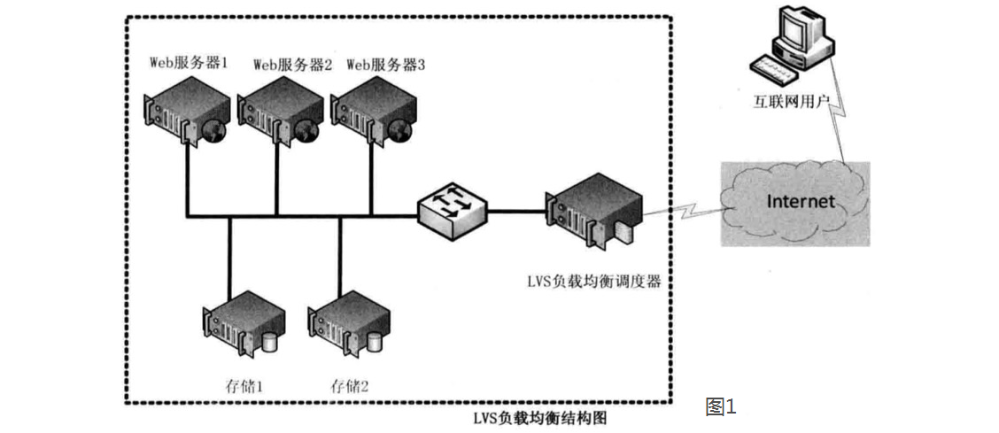
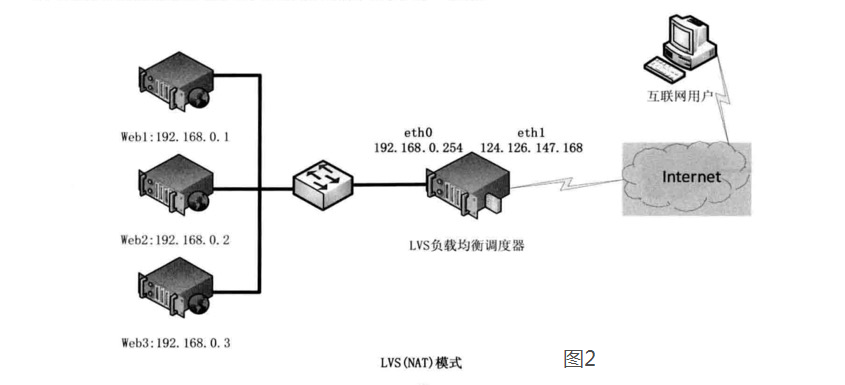
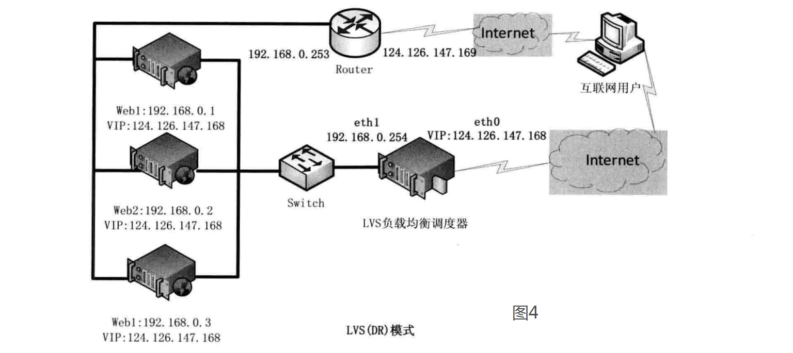

# LVS简介
LVS（Linux virtual Server）：基于四层，性能极高的反向代理服务器
LVS（Linux Virtual Server）即Linux虚拟服务器，是由章文嵩博士主导的开源负载均衡项目，目前LVS已经被集成到Linux内核模块中。
该项目在Linux内核中实现了基于IP的数据请求负载均衡调度方案，其体系结构如图1所示，
终端互联网用户从外部访问公司的外部负载均衡服务器，终端用户的Web请求会发送给LVS调度器，调度器根据自己预设的算法决定将该请求发送给后端的某台Web服务器

链接: https://mp.weixin.qq.com/s/LrTYnp5GHwV1VXfVD5NB9g
https://blog.csdn.net/weixin_40470303/article/details/80541639

LVS的工作原理:
LVS的工作模式:
1.NAT模式(网络地址转换)
2.DR模式(直接路由)
3.TUN（IP隧道）

名词解析:
1.Director服务器：直接接受用户请求的服务器，是LVS的入口
2.Real-Server:真实服务器，用于处理用户请求的服务器
3.虚拟IP(VIP):对外网暴露的IP地址，客户端可以通过VIP访问LVS集群

## LVS的工作模式:
### NAT模式：

NAT（Network Address Translation）即网络地址转换，其作用是通过数据报头的修改，使得位于企业内部的私有IP地址可以访问外网，以及外部用用户可以访问位于公司内部的私有IP主机。VS/NAT工作模式拓扑结构如图2所示，LVS负载调度器可以使用两块网卡配置不同的IP地址，eth0设置为私钥IP与内部网络通过交换设备相互连接，eth1设备为外网IP与外部网络联通。

请求过程说明：
1.client 发送请求到 LVS 的 VIP 上，Director 服务器首先根据 client 的 IP 和端口从连接信息表中查询是否已经存在，如果存在就直接使用当前连接进行处理。否则根据负载算法选择一个 Real-Server（真正提供服务的服务器），并记录连接到连接信息表中，然后把 client 请求的目的 IP 地址修改为 Real-Server 的地址，将请求发给 Real-Server。
2.Real-Server 服务器收到请求包后，发现目的 IP 是自己的 IP，于是处理请求，然后发送回复给 Director 服务器。
3.Director 服务器收到回复包后，修改回复包的源地址为VIP，发送给 client。

### TUN（IP隧道）
在LVS（NAT）模式的集群环境中，由于所有的数据请求及响应的数据包都需要经过LVS调度器转发，如果后端服务器的数量大于10台，则调度器就会成为整个集群环境的瓶颈。
我们知道，数据请求包往往远小于响应数据包的大小。因为响应数据包中包含有客户需要的具体数据，所以LVS（TUN）的思路就是将请求与响应数据分离，让调度器仅处理数据请求，而让真实服务器响应数据包直接返回给客户端。
IP隧道（IP tunning）是一种数据包封装技术，它可以将原始数据包封装并添加新的包头（内容包括新的源地址及端口、目标地址及端口），从而实现将一个目标为调度器的VIP地址的数据包封装，通过隧道转发给后端的真实服务器（Real Server），
通过将客户端发往调度器的原始数据包封装，并在其基础上添加新的数据包头（修改目标地址为调度器选择出来的真实服务器的IP地址及对应端口）
LVS（TUN）模式要求真实服务器可以直接与外部网络连接，真实服务器在收到请求数据包后直接给客户端主机响应数据。
请求过程说明：

### DR模式：
请求过程说明：
1.client 发送请求到 LVS 的 VIP 上，Director 服务器首先根据 client 的 IP 和端口从连接信息表中查询是否已经存在，如果存在就直接使用当前连接进行处理。否则根据负载算法选择一个 Real-Server（真正提供服务的服务器），并记录连接到连接信息表中，然后通过修改请求数据包的目标 MAC 地址为 Real-Server 服务器的 MAC 地址（注意：IP地址不修改），并通过局域网把数据包发送出去。
2.由于 Director 服务器与 Real-Server 服务器在同一局域网中，所以通过数据包的目标 MAC 地址可以找到对应的 Real-Server 服务器（以太网协议），而 Real-Server 服务器接收到数据包后，会对数据包进行处理。
3.Real-Server 服务器处理完请求后，把处理结果直接发送给 client，而不会通过 Director 服务器。
注意：Real-Server 服务器必须设置回环设备的 IP 地址为 VIP 地址，因为如果不设置 VIP，那么 Real-Server 服务器会认为这个数据包发送给本机的，从而丢弃这个数据包。

与隧道模式不同的是，直接路由模式（DR模式）要求调度器与后端服务器必须在同一个局域网内，VIP地址需要在调度器与后端所有的服务器间共享，因为最终的真实服务器给客户端回应数据包时需要设置源IP为VIP地址，目标IP为客户端IP，这样客户端访问的是调度器的VIP地址，回应的源地址也依然是该VIP地址（真实服务器上的VIP），客户端是感觉不到后端服务器存在的。

## 调度算法
上面介绍了 LVS 的工作模式，下面介绍一下 LVS 的调度算法。
由于 LVS 需要选择合适的 Real-Server（RS） 服务器处理请求，所以需要根据不同的需求选择不同的调度算法来选择 Real-Server 服务器。LVS 的调度算法主要有以下几种：
### 1. 轮询调度（Round-Robin,RR）
  最简单的调度算法，按照顺序将请求依次转发给后端的RS。大部分情况下，RS的性能状态都是各不一致的，这种算法显然无法满足合理利用资源的要求。

### 2. 带权重的轮询调度（Weighted Round-Robin,WRR）
  在轮询算法的基础上加上权重设置，权重越高的RS被分配到的请求越多。适用于按照服务器性能高低，配置不同的权重，以达到合理的资源利用。

### 3. 最小连接调度（Least-Connection, LC）
  把新的请求分配给连接数最少的RS。连接数少说明服务器空闲。

### 4. 带权重的最小连接调度（Weight Least-Connection, WLC）
  在最小连接算法的基础上加上权重设置，这样可以人为地控制请求分配。

### 5. 基于局部性的最小连接调度（Locality-Based Least Connection, LBLC）
  针对请求报文目标IP地址的负载均衡调度。目前主要用于Cache集群系统，因为在Cache集群中客户请求报文的目标IP地址是变化的。
  算法的设计目标是在服务器的负载基本平衡情况下，将相同目标IP地址的请求调度到同一台服务器，来提高各台服务器的访问局部性和主存Cache命中率，提升整个集群系统的处理能力。
  LBLC调度算法先根据请求的目标IP地址找出该目标IP地址最近使用的服务器，若该服务器是可用的且没有超载，将请求发送到该服务器；若服务器不存在，或者该服务器超载且有服务器处于其一半的工作负载，则用“最小连接”的原则选出一个可用的服务器，将请求发送到该服务器。

### 6. 带复制的基于局部性最小连接调度（Locality-Based Least Connections with Replication, LBLCR）
  也是针对请求报文目标IP地址的负载均衡调度，与LBLC算法不同之处：LBLC维护一个目标IP到一台服务器的映射，而LBLCR则需要维护一个目标IP到一组服务器的映射。
  LBLCR调度算法先根据请求的目标IP地址找到对应的服务器组，按“最小连接”原则从该服务器组中选出一台服务器，若服务器没有超载，则将请求发送到该服务器；若服务器超载，则按“最小连接”原则从整个集群中选出一台服务器，将该服务器加入到服务组中，将请求发送给这台服务器。同时，当该服务器组有一段时间没有被修改，将最忙的服务器从服务器组中删除，以降低复制的程度。

### 7. 目标地址散列调度（Destination Hashing, DH）
  也是针对请求报文目标IP地址的负载均衡调度，但它是一种静态映射算法，通过一个散列（Hash）函数将一个目标IP地址映射到一台服务器。DH算法先根据请求的目标IP地址，作为散列键（Hash Key）从静态分配的散列表找出对应的服务器，若该服务器是可用的且为超载，将请求发送到该服务器，否则返回空。

### 8. 源地址散列调度（Source Hashing, SH）
  该算法正好与DH调度算法相反，它根据请求的源IP地址，作为散列键从静态分配的散列表找出对应的服务器，若该服务器是可用的且未超载，将请求发送到该服务器，否则返回空。算法流程与目标地址散列调度算法基本相似，只不过将请求的目标IP地址换成请求的源IP地址。